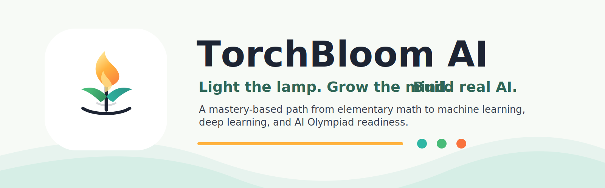

# TorchBloom AI 燃灯智芽

**A mastery-based AI learning path from elementary math to real machine learning, deep learning, and AI Olympiad readiness.**

TorchBloom AI is a long-term learning system for children and motivated young students who want to build the foundations needed to understand modern artificial intelligence. The name combines the idea of passing the torch of intelligence with the image of a young learner growing into frontier knowledge. In Chinese, **燃灯智芽** suggests lighting the lamp, nurturing the first intelligent sprout, and helping the next generation stand on the shoulders of giants.

This project is not simply "AI for kids." It is an attempt to build a serious, adaptive, multi-year pathway from elementary math to real AI implementation.

## Mission

TorchBloom AI's mission is to make advanced AI learning accessible without making it shallow.

The goal is to help young learners build deep mathematical, computational, and scientific habits over time: first through concrete patterns, numbers, visuals, and code, then through increasingly formal ideas in algebra, probability, linear algebra, calculus, machine learning, deep learning, and research-inspired implementation.

TorchBloom AI should feel ambitious, rigorous, warm, and global. It should honor the universal metaphor of illumination, inheritance, growth, and frontier learning.

## Why This Project Exists

There is a gap between playful AI demos and serious AI study.

Many children's AI courses introduce exciting tools but stop at shallow activities: prompts, chatbots, image generation, or black-box APIs. These can spark curiosity, but they do not usually build the math, programming, and reasoning foundations needed to understand how AI systems work.

At the other end, serious machine learning and deep learning resources often assume years of prior knowledge: algebra, calculus, probability, linear algebra, programming, data structures, and research fluency. A motivated child starting around 2nd-grade math has no widely available adaptive path from arithmetic to neural networks.

TorchBloom AI exists to close that gap.

It aims to become a structured pathway where a young learner can progress over multiple years from:

- Arithmetic, patterns, and visual reasoning
- To Python, data, coordinates, functions, and probability
- To classical machine learning and AI Olympiad foundations
- To neural networks, PyTorch, transformers, and research-paper-inspired projects

The ambition is not to make every child master deep learning quickly. The ambition is to make the path visible, adaptive, motivating, and real.

## Core Idea

TorchBloom AI combines a Math Academy-style learning system with a long-range AI curriculum. Its advanced learning targets include [Understanding Deep Learning](https://udlbook.github.io/udlbook/) and [Ilya-30u30](https://github.com/jayxin/Ilya-30u30), but those resources are treated as distant north-star milestones rather than MVP content.

| Component | Role |
| --- | --- |
| Knowledge graph | Maps prerequisite relationships across math, programming, data, ML, DL, and AI competitions. |
| Mastery learning | Requires durable understanding before advancing to dependent ideas. |
| Spaced repetition | Revisits fragile concepts at the right time. |
| Adaptive diagnostics | Finds what the learner knows, what is missing, and what should come next. |
| Math practice | Builds symbolic and quantitative fluency through visual and written tasks. |
| Coding practice | Moves from block-like logic and simple Python to from-scratch implementations. |
| ML/DL projects | Turns concepts into working models, experiments, and explanations. |
| Olympiad-style challenges | Prepares students for reasoning-heavy AI competition problems, including the USAAIO path. |
| Long-term roadmap | Connects Grade 2 math to frontier AI learning targets such as [UDL](https://udlbook.github.io/udlbook/) and [Ilya-30u30](https://github.com/jayxin/Ilya-30u30). |

The system should help learners revisit ideas at increasing depth. A concept first experienced as a picture or game can later become a formula, a program, an optimization problem, and eventually part of a model architecture.

## Current Work

TorchBloom is still curriculum-first, but the repository now contains more than the original vision document. The active durable work is the source-grounded UDL companion pipeline:

| Area | Current Contents |
| --- | --- |
| `assets/brand/` | TorchBloom icon, logo, and README title banner. |
| `docs/` | Durable design notes, runbooks, repository conventions, and Superpowers specs/plans. |
| `raw/udl/` | Private source intake, PDF source material, fused textbook Markdown for the validated chapters, figure crops, structured block sidecars, and answer extracts. |
| `wiki/udl/` | Source-grounded companion pages, chapter guides, math bridges, concept pages, practice indexes, and schema notes. |
| `src/torchbloom/` | Python tooling for UDL source metadata, chapter mapping, OCR parsing, fusion validation/publishing, answer extraction, and wiki validation. |
| `tests/` | Regression tests for the source, OCR, fusion, answer, chapter-map, and wiki-validation contracts. |

There is still no production learner app, backend, curriculum engine, account system, or commercial platform in this repository. The code that exists today supports source intake, artifact validation, and curriculum/wiki preparation.

## Target Learner Journey

The first target learner is an 8-year-old child starting from roughly 2nd-grade math. The system should also support parents, educators, mentors, and older motivated students who want a clear path toward AI foundations.

| Stage | Focus | Example Outcomes |
| --- | --- | --- |
| Stage 0: Early Foundations | Elementary math, patterns, data, visual AI intuition | Count, compare, group, recognize patterns, read simple charts, reason about grids and pixels. |
| Stage 1: First Code and Models | Python basics, tables, charts, coordinates, decision trees, kNN | Write small Python programs, plot simple data, classify points by distance, explain rules. |
| Stage 2: Algebraic Thinking | Pre-algebra, algebra, functions, simple ML models | Use variables, understand functions, fit simple rules, reason about input-output relationships. |
| Stage 3: Data and Probability | Probability, statistics, NumPy, pandas, scikit-learn, USAAIO Round 1 foundations | Analyze datasets, understand randomness, evaluate classifiers, solve foundational AI competition problems. |
| Stage 4: Deep Learning Foundations | Linear algebra, calculus, optimization, PyTorch, neural networks | Implement tensors, gradients, training loops, neural networks, loss functions, and optimization basics. |
| Stage 5: Frontier Learning | Transformers, generative models, UDL, Ilya-30u30-inspired paper reproductions | Read selected advanced materials, reproduce simplified papers, connect architecture choices to mathematical ideas. |

This is designed as a multi-year pathway. Learners may move quickly through some areas and slowly through others. The system should adapt to mastery, not age alone.

## Learning Pillars

TorchBloom AI is built around eight pillars:

1. **Math foundations** - arithmetic, fractions, ratios, algebra, geometry, probability, statistics, linear algebra, calculus, and optimization.
2. **Programming foundations** - Python, variables, loops, functions, debugging, data structures, notebooks, and clean computational thinking.
3. **Data literacy** - tables, charts, datasets, measurement, uncertainty, sampling, bias, and experimental thinking.
4. **Classical machine learning** - k-nearest neighbors, decision trees, regression, classification, clustering, evaluation, and feature engineering.
5. **Deep learning** - tensors, neural networks, loss functions, gradients, backpropagation, PyTorch, CNNs, sequence models, transformers, and generative models.
6. **AI Olympiad preparation** - USAAIO-style reasoning, algorithms, ML concepts, mathematical foundations, and timed problem solving.
7. **Research-paper implementation** - simplified reproductions, model diagrams, ablations, experiments, and written explanations.
8. **Communication and explanation** - helping learners explain ideas clearly through words, diagrams, code comments, presentations, and teaching.

## Conceptual System Architecture

This repository is currently in the vision, source-intake, and curriculum-artifact stage. No production learning system has been implemented yet. A future system may include the following modules:

| Module | Purpose |
| --- | --- |
| Learner profile | Stores age range, goals, current mastery, pacing, preferences, and parent or educator context. |
| Knowledge graph | Represents skills, prerequisites, concept dependencies, and learning objectives across the curriculum. |
| Mastery model | Estimates learner understanding using practice results, diagnostic responses, review history, and project performance. |
| Diagnostic engine | Selects short assessments to identify gaps and place the learner at the right point in the graph. |
| Task recommendation engine | Chooses the next best lesson, practice set, review item, coding task, or project. |
| Practice engine | Delivers math, reasoning, explanation, and coding exercises with feedback and spaced review. |
| Coding sandbox or notebook integration | Lets learners run Python safely, inspect outputs, and build models step by step. |
| Project engine | Guides larger projects such as image classifiers, toy recommendation systems, or from-scratch kNN. |
| Parent dashboard | Shows progress, effort, strengths, gaps, suggested support, and healthy pacing. |
| USAAIO readiness dashboard | Maps learner progress to AI Olympiad-relevant foundations and practice areas. |
| Content authoring tools | Helps curriculum authors create nodes, tasks, hints, diagnostics, and mastery rubrics. |

The architecture should remain curriculum-first. Technology should serve the learning model rather than become the center of the product.

## MVP Proposal: AI Foundations from Grade 2 Math

The first MVP should be **AI Foundations from Grade 2 Math**.

The purpose of the MVP is to prove that a young learner can begin moving from elementary math toward authentic AI ideas without relying on superficial demos. The first version should focus on a small, coherent path that blends math, logic, visual reasoning, and beginner Python.

Initial modules:

| Module | Learning Goal |
| --- | --- |
| Numbers as data | Treat numbers as information that can be counted, compared, sorted, grouped, and measured. |
| Patterns and rules | Identify repeatable structures, describe rules, and predict what comes next. |
| If/else logic | Connect conditions to decisions and simple classifiers. |
| Tables and charts | Read, create, and explain small datasets. |
| Grids and pixels | Understand images as structured arrays of values. |
| Coordinates and distance | Place points on a grid and reason about near, far, clusters, and similarity. |
| Fractions and probability | Build intuition for chance, proportions, uncertainty, and simple predictions. |
| Python basics | Use variables, loops, functions, lists, simple input-output, and clear debugging habits. |
| k-nearest neighbors from scratch | Classify examples using distance and neighbor voting. |
| Linear regression intuition | Explore fitting a line to data through visual error and prediction. |
| Tiny perceptron intuition | Introduce weighted inputs and simple decision boundaries without rushing into full neural networks. |

The MVP should produce a narrow but meaningful learning experience: a child can practice prerequisite math, write small programs, and build a first simple model from scratch.

## Non-Goals for the MVP

The MVP should avoid premature complexity.

It should not yet include:

- Full transformer implementation
- GPU training
- Large language model training
- Full coverage of *Understanding Deep Learning*
- Full coverage of Ilya-30u30
- A polished commercial platform
- User payments or monetization
- A complete parent dashboard
- A complete USAAIO preparation system
- A large content marketplace

The early goal is learning-path validation, not platform scale.

## Design Principles

TorchBloom AI should follow these principles:

- **Depth before demos** - Every exciting project should connect back to concepts the learner can explain.
- **Visual before symbolic** - Math should begin with pictures, motion, grids, groups, and concrete examples before notation.
- **From scratch before high-level libraries** - Learners should implement core ideas manually before using scikit-learn, PyTorch, or other abstractions.
- **Practice plus explanation plus transfer** - Every concept should include exercises, explanation prompts, and tasks in new contexts.
- **Spiral learning** - Learners should revisit important ideas at increasing depth over months and years.
- **Protect curiosity** - The system should challenge learners without turning learning into burnout.
- **Rigorous but child-friendly** - Tone, pacing, visuals, and examples should respect young learners while preserving real intellectual substance.
- **Competition-aware, not competition-only** - USAAIO readiness matters, but the broader goal is durable AI understanding.
- **Global and bilingual-aware** - English should be primary for the repository, while selected Chinese phrases can preserve the spirit of 燃灯智芽.
- **Honest progress** - The product should show what has been mastered, what is fragile, and what is still ahead.

## Example Learning Spiral: Attention

Attention can become a long-term spiral rather than a single advanced topic.

| Level | Learner Experience | Underlying Idea |
| --- | --- | --- |
| Early elementary | "Which clues matter most?" Choose important words or picture regions for a simple decision. | Some inputs are more relevant than others. |
| Coordinates and data | Compare nearby points and choose neighbors that influence a prediction. | Similarity can guide decisions. |
| Fractions and probability | Give different clues different shares of importance. | Weights can distribute attention. |
| Algebra and vectors | Represent items as lists of numbers and compare them. | Vectors can encode features. |
| Linear algebra | Use dot products to measure alignment between vectors. | Similar vectors have stronger interactions. |
| Neural networks | Compute query, key, and value vectors in a small attention layer. | Models can learn what to attend to. |
| Transformers | Implement scaled dot-product attention and inspect attention maps. | Attention enables sequence models to combine information flexibly. |
| Research projects | Reproduce simplified transformer experiments and explain design choices. | Architecture, training, and data shape model behavior. |

The same pattern could also be used for dot products, gradients, loss functions, or probability. A child should not be rushed into notation before intuition has somewhere to land.

## Repository Status

This repository is currently in the **vision, source-intake, and curriculum-artifact stage**.

The project framing is in place, and the first source-grounded UDL companion artifacts are being built and validated. The repository now includes Python tooling, tests, UDL raw-source derivatives, wiki pages, documentation, and brand assets. No production application, backend, frontend, curriculum engine, or learner-facing system has been created yet.

## Proposed Future Repository Structure

The future repository may eventually use a structure like this:

```text
docs/
  product/
  architecture/
  pedagogy/
  research-notes/
curriculum/
  stages/
  modules/
  lesson-blueprints/
knowledge_graph/
  nodes/
  prerequisites/
  mastery-rubrics/
exercises/
  math/
  coding/
  diagnostics/
  review/
projects/
  foundations/
  classical-ml/
  deep-learning/
notebooks/
  learner/
  instructor/
apps/
  web/
  sandbox/
packages/
  curriculum-core/
  mastery-model/
  recommendation-engine/
research/
  udl/
  ilya-30u30/
  paper-reproductions/
assessments/
  placement/
  usaaio-readiness/
  project-rubrics/
```

These future application and curriculum folders should not be created until a concrete implementation plan needs them. The current source-intake and wiki tooling should stay in the existing `raw/`, `wiki/`, `docs/`, `src/`, and `tests/` boundaries.

## First 90-Day Build Plan

| Timeframe | Focus | Concrete Outputs |
| --- | --- | --- |
| Month 1 | Curriculum map and knowledge graph prototype | Define Stage 0 and Stage 1 concepts, create the first prerequisite graph, draft mastery rubrics, and identify diagnostic questions. |
| Month 2 | First learner flow and practice task format | Design the first diagnostic flow, create task templates, build a small set of math and coding exercises, and define review scheduling rules. |
| Month 3 | First project-based MVP prototype | Create the first guided project path, likely k-nearest neighbors from scratch, with prerequisite checks, practice tasks, explanations, and parent-visible progress. |

By the end of 90 days, TorchBloom AI should have a small but coherent proof of direction: a learner can start from elementary math concepts, complete adaptive practice, write beginner code, and build a simple AI model with understanding.

## Founder Notes

TorchBloom AI is inspired by the founder's experience building **Biobloom**, a successful USABO study system created to support his daughter's biology learning.

Biobloom demonstrated that a thoughtful, structured study system can help a motivated learner move through a demanding academic path. TorchBloom AI aims to bring that same seriousness and care to a broader, longer AI learning journey: from early math and programming foundations to machine learning, deep learning, AI Olympiad preparation, and eventually research-paper-inspired implementation.

The spirit of the project is 燃灯智芽: light the lamp, nurture the sprout, and help the next generation grow toward the frontier.
