# Sketching the Derivative of a Function From the Function's Graph

Source: https://www.mathacademy.com/topics/1204?courseId=24
Topic ID: 1204

## Prerequisites

- [Points of Inflection](./1046-points-of-inflection.md)

## Lesson

### Introduction

Suppose we are given the graph of the function $f(x),$ as shown below. The function has critical points at $x=-1,$ $x=2,$ and an inflection point at $x=0.5.$ How can we sketch the graph of the derivative $f'(x)?$

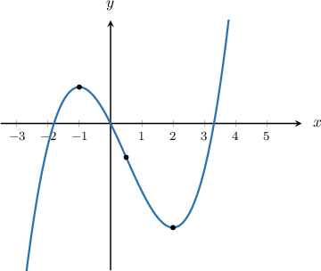

Notice the following:

- At the stationary points, where the tangent line to $y=f(x)$ is parallel to the $x$-axis, we have $f'(x)=0.$

- When $f(x)$ is increasing, we have $f'(x) > 0.$

- When $f(x)$ is decreasing, we have $f'(x) < 0.$

We can now summarize the information from the graph in the table below:

Using this information, we can identify the regions where $f'(x)$ should cross the $x$-axis. According to the table, these are points $(-1,0)$ and $(2,0)\mathbin{:}$

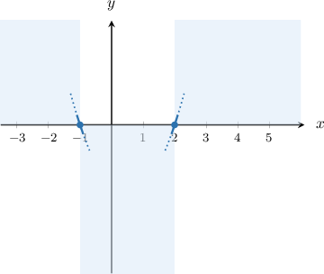

Additionally, we are told that the function has an inflection point at $x = 0.5.$ So $f''(0.5)=0$ and the tangent to the graph of $y=f'(x)$ must be parallel to the $x$-axis.

We don't know the exact value of $f'(0.5)$ but from the graph of $y=f(x),$ we can conclude that at $x = 0.5$ the slope is negative. Therefore, we get a point below the $x$-axis:

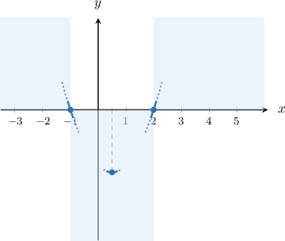

Finally, connecting up the parts of the graph above, we get an approximate sketch of $f'(x)\mathbin{:}$

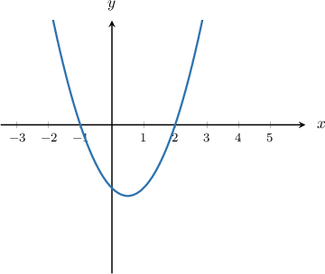

### Example: Sketching the Derivative of a Quadratic Function

#### Question

Consider the graph of $y=f(x)$ below. Sketch the graph of $y=f'(x)$, the derivative of $f(x).$

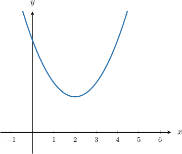

#### Explanation

Notice the following:

- At the stationary points, where the tangent line to $y=f(x)$ is parallel to the $x$-axis, we have $f'(x)=0.$

- When $f(x)$ is increasing, we have $f'(x)>0.$

- When $f(x)$ is decreasing, we have $f'(x) < 0.$

We can now summarize the information from the graph in the table below. Note that the stationary point was identified (approximately) from the graph of $y=f(x)$:

Additionally, from the graph of $y=f(x),$ we can conclude that there are no inflection points. The graph of $y=f(x)$ is concave up in $(-\infty,\infty).$ So, $f''(x) > 0$ and $y=f'(x)$ is increasing.

Therefore, the graph of $y=f'(x)$ may look as shown below.

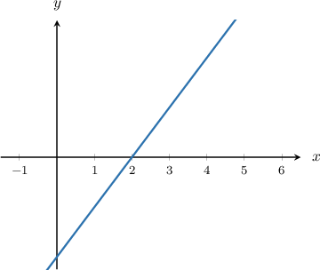

### Example: Sketching the Derivative of a Smooth Function

#### Question

The graph of the function $f(x)$ is shown below. Sketch the graph of $f'(x).$

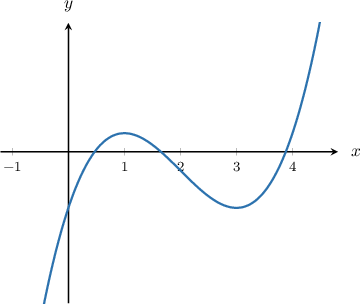

#### Explanation

Notice the following:

- At the stationary points, where the tangent line to $y=f(x)$ is parallel to the $x$-axis, we have $f'(x)=0.$

- When $f(x)$ is increasing, we have $f'(x)>0.$

- When $f(x)$ is decreasing, we have $f'(x) < 0.$

We can now summarize the information from the graph in the table below. Note that the stationary points were identified (approximately) from the graph of $y=f(x)$:

Additionally, the function has an inflection point at $x \approx 2.$ So $f''(2)\approx0$ and the tangent to the graph of $y=f'(x)$ must be parallel to the $x$-axis.

We don't know the exact value of $f'(2)$ but from the graph of $y=f(x),$ we can conclude that at $x \approx 2,$ the slope is negative.

Therefore, the graph of $y=f'(x)$ may look as shown below.

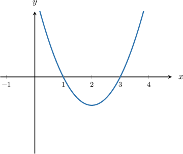

### Example: Sketching the Derivative of a Piecewise-Differentiable Function

#### Question

Consider the graph of $y=f(x)$ below. Sketch the graph of $y=f'(x)$, the derivative of $f(x).$

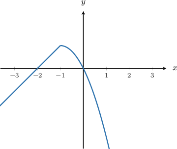

#### Explanation

Notice the following:

- When $f(x)$ is increasing, we have $f'(x)>0.$

- When $f(x)$ is decreasing, we get $f'(x) < 0.$

We can now summarize the information from the graph in the table below.

From the graph of $y=f(x),$ we can conclude that there are no inflection points. Also:

- For $x \in (-\infty,-1),$ the graph of $y=f(x)$ is an increasing straight line. So, $y=f'(x)$ will be a positive constant on this interval.

- For $x \in (-1,\infty),$ the graph of $y=f(x)$ is concave down. So, $f''(x) < 0$ and $y=f'(x)$ is decreasing on this interval.

Additionally, we have a rapid change of the slope of the tangent line when we pass through $x=-1$ from left to right. This means that the derivative is not defined at $x=-1,$ and we obtain a jump discontinuity at this point for the graph of $y=f'(x).$

Therefore, the graph of $y=f'(x)$ may look as shown below.

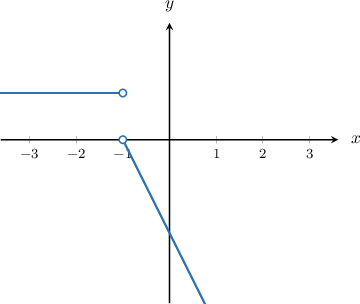

### Example: Sketching the Second Derivative of a Function

#### Question

The graph of the function $y=f'(x)$, the derivative of $y=f(x)$, is shown below. Sketch the graph of $y=f''(x).$

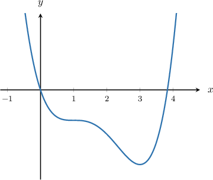

#### Explanation

First, if we denote $g(x) = f'(x)$ then $f''(x)=g'(x).$ So, we need to sketch the graph of $y=g'(x)$ given the graph of $y=g(x),$ as usual.

Notice the following:

- At the critical points, where the tangent line to $y=f(x)$ is parallel to the $x$-axis, we have $g'(x)=0.$

- When $f(x)$ is increasing, we have $g'(x)>0.$

- When $f(x)$ is decreasing, we have $g'(x) < 0.$

We can now summarize the information from the graph in the table below. Note that the critical points were identified (approximately) from the graph of $y=g(x)$:

Additionally, the function has an inflection point at $x \approx 1$ and $x\approx 2.25.$ At the inflection points, we have $g''(x)=0,$ so the tangent to the graph of $y=g'(x)$ must be parallel to the $x$-axis at $x\approx 1$ and $x\approx 2.25.$

We don't know the exact value of $g'(1)$ and $g'(2.25),$ but from the graph of $y=g(x),$ we can conclude that at $x \approx 1$ and $x\approx 2.25$ the slope is zero and negative, respectively.

Therefore, the graph of $y=g'(x)=f''(x)$ may look as shown below.

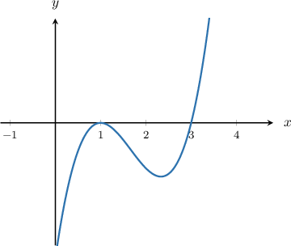
