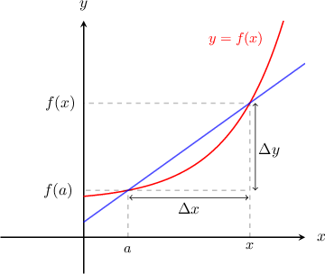
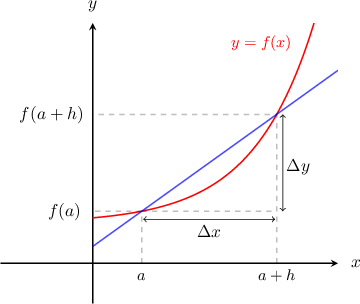

# The Average Rate of Change of a Function over a Varying Interval

Source: https://www.mathacademy.com/topics/1208?courseId=24
Topic ID: 1208

## Prerequisites

- [The Average Rate of Change of a Function](../../../high-school/traditional/lessons/algebra-ii/336-the-average-rate-of-change-of-a-function.md)
- [Solving Quadratic Equations with No Constant Term](../../../high-school/traditional/lessons/algebra-i/393-solving-quadratic-equations-with-no-constant-term.md)
- [Solving Quadratic Equations Using a Difference of Squares](../../../high-school/traditional/lessons/algebra-i/394-solving-quadratic-equations-using-a-difference-of-squares.md)
- [Solving Quadratic Equations with Leading Coefficients by Factoring](../../../high-school/traditional/lessons/algebra-i/1422-solving-quadratic-equations-with-leading-coefficients-by-factoring.md)
- [Simplifying Rational Expressions Using Polynomial Factorization](../../../high-school/traditional/lessons/algebra-ii/1676-simplifying-rational-expressions-using-polynomial-factorization.md)

## Lesson

### Introduction

Recall that the average rate of change of a function $y=f(x)$ over the interval $[a,b]$ is given by

$$

\dfrac{\Delta y}{\Delta x} = \dfrac{f(b) - f(a)}{b-a}.

$$

If we want the formula for the average rate of change of $y=f(x)$ between the point $(a,f(a))$ and some other *general* point $(x,f(x))$, we write $b = x$ in the above formula, and we get

$$

\dfrac{\Delta y}{\Delta x} = \dfrac{f(x) - f(a)}{x-a}.

$$

Geometrically, the formula above gives the slope of the secant line that intersects the curve at $(a,f(a))$ and $(x,f(x)).$ As $x$ varies, the slope of the secant varies as well.

### Example: Calculating the Average Rate of Change of a Curve Over a Varying Interval

#### Question

What is the average rate of change of the function $y = x^2$ over the interval $x\in[1,t],$ where $t>1$ is a parameter?

#### Explanation

Let $f(x)=x^2.$ Notice that the interval $[1,t]$ varies with $t$, so we use

$$

\dfrac{\Delta y}{\Delta x} = \dfrac{f(x) - f(a)}{x-a},

$$

with $a=1$ and $x=t.$ Substituting into the formula and simplifying gives

$$

\begin{aligned}\frac{Δ𝑦}{Δ𝑥} & =\frac{𝑓(𝑥)−𝑓(𝑎)}{𝑥−𝑎} \\ & =\frac{𝑓(𝑡)−𝑓(1)}{𝑡−1} \\ & =\frac{𝑡^{2}−1^{2}}{𝑡−1} \\ & =\frac{(𝑡−1)(𝑡+1)}{𝑡−1} \\ & =\frac{(𝑡−1)(𝑡+1)}{𝑡−1} \\ & =𝑡+1.\end{aligned}

$$

### An Alternative Formula for the Average Rate of Change

Let's consider our diagram of the curve $y=f(x)$ and the secant line once more. But this time, the secant will intersect the curve at the points where $x=a$ and $x=a+h,$ as shown below.

This is pretty much *exactly* the same scenario that we had before, except now we're defining the second point in terms of $h.$ We can think of $h$ as being the length of the interval $[a,a+h].$

In this scenario, we can define the average rate of change $\dfrac{\Delta y}{\Delta x}$ as

$$

\begin{aligned}\frac{Δ𝑦}{Δ𝑥} & =\frac{𝑓(𝑎+ℎ)−𝑓(𝑎)}{(𝑎+ℎ)−𝑎} \\ & =\frac{𝑓(𝑎+ℎ)−𝑓(𝑎)}{ℎ}\,.\end{aligned}

$$

When computing the average rate of change of a function, it *doesn't matter* which formula we use, as both will give the same result. But it's a good idea to learn both.

### Example: Calculating the Average Rate of Change Over a Varying Interval where the Parameter Represents Distance

#### Question

Find the average rate of change of the function $y = x^2$ over the interval $x\in[3,3+h]$, where $h>0$ is a parameter.

#### Explanation

Let $f(x)=x^2.$ Notice that we are given the length $h$ of the interval, so we use

$$

\dfrac{\Delta y}{\Delta x} = \dfrac{f(a+h) - f(a)}{h}

$$

with $a=3.$ Substituting into the formula gives

$$

\begin{aligned}\frac{Δ𝑦}{Δ𝑥} & =\frac{𝑓(𝑎+ℎ)−𝑓(𝑎)}{ℎ} \\ & =\frac{(3+ℎ)^{2}−(3)^{2}}{ℎ} \\ & =\frac{9+6ℎ+ℎ^{2}−9}{ℎ} \\ & =\frac{6ℎ+ℎ^{2}}{ℎ} \\ & =\frac{(6+ℎ)ℎ}{ℎ} \\ & =\frac{(6+ℎ)ℎ}{ℎ} \\ & =6+ℎ.\end{aligned}

$$

### Example: Determining the Interval Over Which the Average Rate of Change of a Function is a Given Number

#### Question

A function $f(x) = 2 x^3 - x^2$ is defined on an interval $[0,c]$ where $c$ is a positive parameter. Calculate $c$ such that the average rate of change over $[0,c]$ is equal to $28.$

#### Explanation

Let's calculate the average rate of change of $f(x)$ over the interval $[0,c]$ using the formula

$$

\begin{aligned}\frac{Δ𝑦}{Δ𝑥}=\frac{𝑓(𝑏)−𝑓(𝑎)}{𝑏−𝑎}.\end{aligned}

$$

Note that for the interval $[0,c],$ we have $a=0$ and $b= c.$ So, we have

$$

\begin{aligned}\frac{Δ𝑦}{Δ𝑥} & =\frac{𝑓(𝑐)−𝑓(0)}{𝑐−0} \\ & =\frac{(2𝑐^{3}−𝑐^{2})−(2(0)^{3}−(0)^{2})}{𝑐−0} \\ & =\frac{2𝑐^{3}−𝑐^{2}}{𝑐} \\ & =2𝑐^{2}−𝑐.\end{aligned}

$$

We're told that the average rate of change is $28,$ so we must have

$$

\begin{aligned}\frac{Δ𝑦}{Δ𝑥} & =28 \\ 2𝑐^{2}−𝑐 & =28 \\ 2𝑐^{2}−𝑐−28 & =0 \\ (2𝑐+7)(𝑐−4) & =0,\end{aligned}

$$

which gives the solutions $c=-\dfrac 7 2$ and $c=4.$

Since $c>0,$ we conclude that $c = 4$ and therefore the required interval is $[0,4].$
