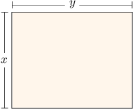
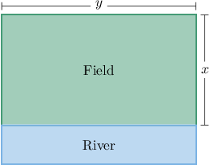
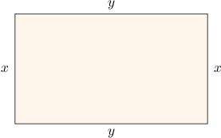

# Solving Optimization Problems Using Derivatives

Source: https://www.mathacademy.com/topics/1211?courseId=24
Topic ID: 1211

## Prerequisites

- [The Second Derivative Test](./339-the-second-derivative-test.md)
- [Finding Intersections of Lines and Reciprocal Functions](../../../high-school/traditional/lessons/algebra-ii/434-finding-intersections-of-lines-and-reciprocal-functions.md)
- [Areas of Rectangles and Squares](../../../middle-school/lessons/grade-7/1352-areas-of-rectangles-and-squares.md)

## Lesson

### Introduction

Suppose that we're creating a rectangular fence, and we have a total of $80$ meters worth of fencing. What are the dimensions of the rectangle that gives the largest area?

We introduce two variables $x$ and $y$ to represent the dimensions of the rectangle, as shown in the following picture:

We want the area

$$

A = xy

$$

to be as large as possible. This quantity that we're trying to maximize is called the **objective function**.

The rectangle's perimeter must be equal to $80.$ We can use this **constraint** to eliminate one variable. Starting from

$$

2x+2y = 80,

$$

we solve for $y$ in terms of $x$:

$$

\begin{aligned}2𝑥+2𝑦 & =80 \\ 2𝑦 & =80−2𝑥 \\ 𝑦 & =40−𝑥.\end{aligned}

$$

Now substitute $y=40-x$ into $A=xy$:

$$

A(x) = x(40-x) = 40x-x^2.

$$

On the next slide, we’ll maximize $A(x)$ using derivatives to find the rectangle with the largest area.

### Using Differentiation to Maximize the Area

To maximize

$$

A(x) = 40x-x^2,

$$

we set the derivative equal to zero:

$$

A'(x)=40-2x.

$$

So, we solve

$$

\begin{aligned}𝐴^{′}(𝑥) & =0 \\ 40−2𝑥 & =0 \\ 𝑥 & =20.\end{aligned}

$$

To confirm this is a maximum, we use the second derivative test:

$$

A''(x)=-2 \quad \Longrightarrow \quad A''(20)=-2<0,

$$

so $x=20$ gives a local maximum area.

Finally, using $y=40-x,$ we get

$$

y=40-20=20.

$$

So, the rectangle with the largest area is a square with side lengths $20$ m and $20$ m, and its area is

$$

A = 20\cdot 20 = 400\,\text{m}^2.

$$

### A General Strategy for Solving Optimization Problems

We can use this method to find the maxima and minima of all sorts of things. The general strategy is outlined below:

1. Draw a diagram of the situation, introducing variables where necessary.

2. Write down the equation of the quantity that we're trying to maximize or minimize. This is called the **objective function**, and it might include more than one variable.

3. Write down the constraint equation.

4. Use the constraint equation to write the objective function in terms of a single variable only.

5. Differentiate the objective function, set it equal to zero, and solve for the stationary points.

6. Test each stationary point using the second derivative test. Or you can use the first derivative test if it's easier.

Let's see how we can use this general strategy in a slightly different scenario.

### Example: Optimizing the Area of a Rectangle

#### Question

A farmer has $500$ meters of fencing and wants to fence off a rectangular field that borders a straight river. He needs no fence along the river. Find $x+y,$ where $x$ and $y$ are the dimensions of the field with the largest area that the farmer can fence off.

#### Explanation

****: We draw a diagram, and introduce variables for the length and width of the fencing.

****: We need to find the values of $x$ and $y$ such as the area

$$

A = xy

$$

is the greatest possible value.

****: This is subject to the constraint that the perimeter is $500\,\text{m}.$ This gives the equation

$$

2x+y = 500.

$$

****: We make one of the variables the subject in the constraint equation:

$$

\begin{aligned}2𝑥+𝑦 & =500 \\ 𝑦 & =500−2𝑥\end{aligned}

$$

Then, we substitute $y = 500-2x$ in the expression $A=xy$ and get

$$

\begin{aligned}𝐴 & =𝑥(500−2𝑥) \\ 𝐴 & =500𝑥−2𝑥^{2}.\end{aligned}

$$

****: We solve the equation $A'(x)=0.$ Taking the derivative, we have

$$

A'(x) = 500 - 4x,

$$

and solving for the stationary points, we get

$$

\begin{aligned}𝐴^{′}(𝑥) & =0 \\ 500−4𝑥 & =0 \\ 4𝑥 & =500 \\ 𝑥 & =\frac{500}{4} \\ 𝑥 & =125.\end{aligned}

$$

****: We confirm that $x=125$ is a maximum using the second derivative test. The second derivative is

$$

A''(x) = -4 \quad \Longrightarrow \quad A''(125) = -4 < 0.

$$

Since $A''(125)$ is negative, we conclude that $x=125$ is indeed a maximum of $A(x).$

Finally, when $x=125$, we have

$$

y=500-2(125)=250.

$$

Therefore, the dimensions of the field with the largest area are $x=125\,\text{m}$ and $y=250\,\text{m},$ and we conclude that

$$

x+y=375\,\text{m}.

$$

### Example: Optimizing the Perimeter of a Rectangle

#### Question

Among all rectangles with area $25\,\text{m}^2,$ what are the dimensions of the rectangle with the smallest perimeter?

#### Explanation

****: Let us call $x$ and $y$ the dimensions of the rectangle.

****: We need to find the ** value of the perimeter

$$

P = 2(x + y).

$$

****: The constraint is that the area is exactly $25\,\text{m}^2.$ This gives the equation

$$

xy = 25.

$$

****: Solving the above constraint equation for $y$ gives

$$

\begin{aligned}𝑦 & =\frac{25}{𝑥}.\end{aligned}

$$

We substitute the above into our expression for $P$ and get

$$

\begin{aligned}𝑃(𝑥) & =2(𝑥+\frac{25}{𝑥}) \\ & =2𝑥+\frac{50}{𝑥}.\end{aligned}

$$

****: We solve the equation $P'(x)=0.$ Taking the derivative, we have

$$

P'(x) = 2 -\frac{50}{x^2},

$$

and solving for the stationary points, we get

$$

\begin{aligned}𝑃^{′}(𝑥) & =0 \\ 2−\frac{50}{𝑥^{2}} & =0 \\ 2𝑥^{2} & =50 \\ 𝑥^{2} & =25 \\ 𝑥 & =5.\end{aligned}

$$

****: We confirm that $x=5$ is a minimum using the second derivative test. The second derivative is

$$

P''(x) = \dfrac{100}{x^3} \quad \Longrightarrow \quad P''(5) = \dfrac{100}{5^3} = \dfrac 4 5 > 0\,.

$$

Since $P''(5)$ is positive, we conclude that $x=5$ is indeed a local minimum of the function $P(x).$

Finally, when $x=5,$ we have

$$

\begin{aligned}𝑦 & =\frac{25}{5}=5.\end{aligned}

$$

Therefore, the dimensions of the rectangle with the smallest perimeter are $x=5\,\text{m}$ and $y=5\,\text{m}.$ In other words, the rectangle with the smallest perimeter is a square with sides of length $5\,\text{m}.$
