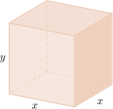
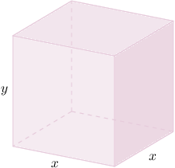
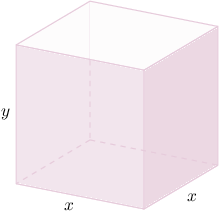
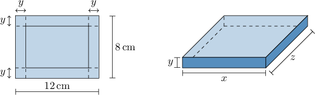

# Optimization Problems Involving Boxes and Trays

Source: https://www.mathacademy.com/topics/1213?courseId=24
Topic ID: 1213

## Prerequisites

- [Surface Areas of Rectangular Solids](../../../high-school/traditional/lessons/geometry/674-surface-areas-of-rectangular-solids.md)
- [Solving Optimization Problems Using Derivatives](./1211-solving-optimization-problems-using-derivatives.md)
- [Volumes of Rectangular Solids](../../../high-school/traditional/lessons/geometry/1753-volumes-of-rectangular-solids.md)

## Lesson

### Introduction

Let's remind ourselves of the general strategy for optimization problems:

1. Draw a diagram of the situation, introducing variables where necessary.

2. Write down the equation of the quantity that you're trying to maximize or minimize. This is called the **objective function**, and it might include more than one variable.

3. Write down the constraint equation.

4. Use the constraint equation to write the objective function in terms of a single variable only.

5. Differentiate the objective function, set it equal to zero, and solve for the stationary points.

6. Test each stationary point using the second derivative test. Or you can use the first derivative test if it's easier.

We can use differentiation to solve optimization problems involving boxes and trays, such as maximizing a box's volume given a fixed amount of material.

### Example: Maximizing the Volume of a Box With a Fixed Surface Area

#### Question

Suppose that we want to make a box with a square base and without a lid using metal sheets. We have only $4 \, \text{m} ^ 2$ of sheet metal to create the box. Given that the volume of the box has been maximized, find the value of $x.$

#### Explanation

****: We need to find the values of $x$ and $y$ such that the volume

$$

V = x\cdot x\cdot y = x^2 y

$$

is the greatest possible value.

****: The surface area is $4 \, \text{m} ^ 2$. So, we have the constraint equation

$$

\begin{aligned} S &= \text{(area of the base) } + 4 \, \text{(area of one side) } \\[5pt] 4 &= x^2 + 4 x y.\end{aligned}

$$

****: We make $y$ the subject in the constraint equation:

$$

y = \dfrac{1}{x} - \dfrac{x}{4}

$$

Then, we substitute $y = \dfrac{1}{x} - \dfrac{x}{4}$ in the expression $V=x^2y,$ and we get

$$

\begin{aligned} V(x) &= x^2 \left( \dfrac{1}{x} - \dfrac{x}{4}\right) \\[5pt] &= x - \dfrac{x^3}{4}. \end{aligned}

$$

****: We solve the equation $V'(x)=0.$ Taking the derivative, we have

$$

V'(x) = 1 - \dfrac{3x^2}{4},

$$

and solving for the stationary points, we get

$$

\begin{aligned} V'(x) &= 0 \\[5pt] 1 - \dfrac{3x^2}{4} &=0 \\[5pt] x^2 &= \dfrac{4}{3} \\[5pt] x &= \dfrac{2\sqrt{3}}{3}. \end{aligned}

$$

Note that in the last step, we only considered the positive root because the side length $x$ must be positive.

****: We confirm that $x=\dfrac{2\sqrt{3}}{3}$ is a maximum using the second derivative test. The second derivative is

$$

V''(x) = -\dfrac{3}{2}x \quad \Longrightarrow \quad V''\left(\dfrac{2\sqrt{3}}{3}\right) = -\sqrt{3} < 0.

$$

Since $V''\left(\dfrac{2\sqrt{3}}{3}\right)$ is negative, we conclude that $x=\dfrac{2\sqrt{3}}{3}$ is indeed a maximum of $V(x).$

Therefore, the box with the largest possible volume has side length $x= \dfrac{2\sqrt{3}}{3}\,\mathrm{m}.$

### Example: Minimizing the Surface Area of a Box With a Fixed Volume

#### Question

Consider a box with a square base with side lengths $x$ and height $y,$ as shown below. The volume of the box is $1$ cubic unit. Given that the surface area of the box has been minimized, find the value of $x.$

#### Explanation

****: We need to find the value of $x$ such that the surface area

$$

S = 2x^2 + 4xy

$$

is the smallest possible value.

****: The volume is exactly $1$ cubic unit. So, we have the constraint equation

$$

\begin{aligned}𝑉 & =𝑥⋅𝑥⋅𝑦 \\ 1 & =𝑥^{2}𝑦.\end{aligned}

$$

****: We make $y$ the subject of the constraint equation:

$$

\begin{aligned}𝑥^{2}𝑦 & =1 \\ 𝑦 & =\frac{1}{𝑥^{2}}\end{aligned}

$$

Then, we substitute the above into our expression for $S,$ and we get

$$

\begin{aligned}𝑆 & =2𝑥^{2}+4𝑥𝑦 \\ & =2𝑥^{2}+4𝑥⋅\frac{1}{𝑥^{2}} \\ & =2𝑥^{2}+\frac{4}{𝑥}.\end{aligned}

$$

****: We solve the equation $S'(x)=0.$ Taking the derivative, we have

$$

S'(x) = 4x - \dfrac{4}{x^2},

$$

and solving for the stationary points, we get

$$

\begin{aligned}𝑆^{′}(𝑥) & =0 \\ 4𝑥−\frac{4}{𝑥^{2}} & =0 \\ 4𝑥 & =\frac{4}{𝑥^{2}} \\ 4𝑥^{3} & =4 \\ 𝑥^{3} & =1 \\ 𝑥 & =1.\end{aligned}

$$

****: We confirm that $x=1$ is a minimum using the second derivative test. The second derivative is

$$

S''(x) = 4 + \frac{8}{x^3} \quad \Longrightarrow \quad S''(1) = 4 + 8 = 12 > 0.

$$

Since $S''\left(1\right)$ is positive, we conclude that $x=1$ is indeed a minimum of $S(x).$

Therefore, the box with the smallest possible surface area has side length $x= 1$ unit.

### Example: Optimizing the Cost of Building a Box

#### Question

A box with no lid and a square base has a manufacturing cost that depends on two materials. The material for the base costs $4$ per square meter, and the material for the lateral faces costs $2$ per square meter. The box must have a volume of $8\,\mathrm{m^3}.$

What is the value of $x$ for the box that has the smallest production cost?

#### Explanation

****: We need to find the value of $x$ such that the manufacturing cost

$$

\begin{aligned}𝐶 & =4𝑥^{2}+2⋅4𝑥𝑦 \\ & =4𝑥^{2}+8𝑥𝑦\end{aligned}

$$

is the smallest possible value.

****: The volume must be $8\,\mathrm{m^3}.$ So, we have the constraint equation

$$

\begin{aligned}𝑉 & =𝑥⋅𝑥⋅𝑦 \\ 8 & =𝑥^{2}𝑦.\end{aligned}

$$

****: We make $y$ the subject of the constraint equation:

$$

\begin{aligned}𝑥^{2}𝑦 & =8 \\ 𝑦 & =\frac{8}{𝑥^{2}}\end{aligned}

$$

Then, we substitute the above into our expression for $C,$ and get

$$

\begin{aligned}𝐶 & =4𝑥^{2}+8𝑥𝑦 \\ 𝐶 & =4𝑥^{2}+8𝑥⋅\frac{8}{𝑥^{2}} \\ 𝐶 & =4𝑥^{2}+\frac{64}{𝑥}.\end{aligned}

$$

****: We solve the equation $C'(x)=0.$ Taking the derivative, we have

$$

C'(x) = 8x - \frac{64}{x^2},

$$

and solving for the stationary points, we get

$$

\begin{aligned}𝐶^{′}(𝑥) & =0 \\ 8𝑥−\frac{64}{𝑥^{2}} & =0 \\ 8𝑥^{3} & =64 \\ 𝑥^{3} & =8 \\ 𝑥 & =2.\end{aligned}

$$

****: We confirm that $x=2$ is a minimum using the second derivative test. The second derivative is

$$

C''(x) = 8 + \dfrac{128}{x^3} \quad \Longrightarrow \quad C''\left(2\right) > 0.

$$

Since $C''\left(2\right)$ is positive, we conclude that $x=2$ is indeed a minimum of $C(x).$

### Example: Maximizing the Volume of a Tray

#### Question

A piece of cardboard measures $12\,\mathrm{cm}\times 8\, \mathrm{cm}.$ A tray of height $y\,\text{cm}$ is formed by cutting a $y\times y \,\text{cm}^2$ square from each of the corners and folding up the sides, as shown in the diagram. Determine the height of the box that gives the maximum possible volume. Round your answer to two decimal places.

#### Explanation

****: We need to find the values of $x, y,$ and $z$ such that the volume

$$

V = xyz

$$

is the greatest possible value.

****: Notice that the width $x$ and the depth $z$ of the tray are given by

$$

x=12 - 2y,\qquad z=8-2y.

$$

Since $x > 0$ and $z > 0,$ we must have that $12-2y > 0$ and $8-2y >0$, hence $y< 4.$ Therefore, the range of validity for $y$ is $0 < y < 4.$

****: Substituting the above into the expression for $V,$ we get

$$

\begin{aligned}𝑉 & =𝑥𝑦𝑧 \\ & =(12−2𝑦)(𝑦)(8−2𝑦) \\ & =4𝑦^{3}−40𝑦^{2}+96𝑦.\end{aligned}

$$

****: We solve the equation $V'(y) = 0.$ Taking the first derivative, we have

$$

V'(y) = 12y^2 - 80y + 96,

$$

and solving for the stationary points, we get

$$

\begin{aligned}𝑉^{′}(𝑦) & =0 \\ 12𝑦^{2}−80𝑦+96 & =0 \\ 3𝑦^{2}−20𝑦+24 & =0 \\ 𝑦 & =\frac{10±2\sqrt{7}}{3}.\end{aligned}

$$

We discard $\dfrac{10 + 2\sqrt{7}}{3}$ since we already know that $0 < y < 4.$

****: We confirm that $\dfrac{10 - 2\sqrt{7}}{3}$ is a maximum using the second derivative test. The second derivative is

$$

V''(y) = 24y -80 .

$$

Since $V'' \left(\dfrac{10 - 2\sqrt{7}}{3}\right)$ is negative, we conclude that $\dfrac{10-2\sqrt{7}}{3}$ is indeed a maximum of $V(y).$

Therefore, the stationary point $y=\dfrac{10- 2\sqrt{7}}{3} \approx 1.57$ gives the maximum possible volume.
