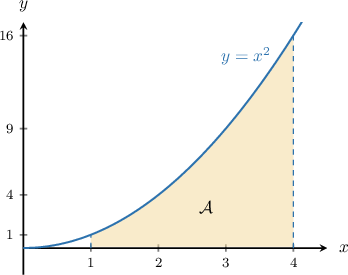
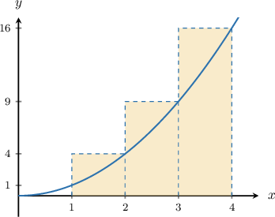
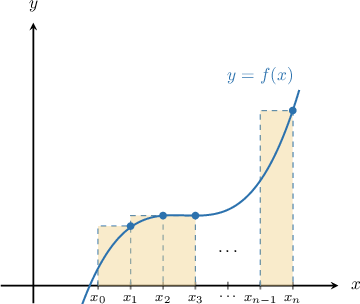
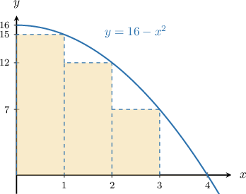
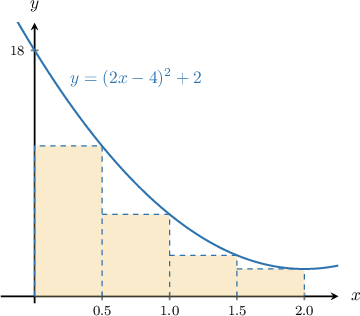
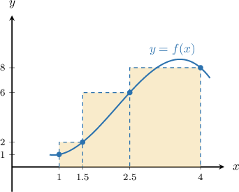

# Approximating Areas With the Right Riemann Sum

Source: https://www.mathacademy.com/topics/1281?courseId=24
Topic ID: 1281

## Prerequisites

- [Graphs of General Quadratic Functions](../../../high-school/traditional/lessons/algebra-i/84-graphs-of-general-quadratic-functions.md)
- [Areas of Rectangles and Squares](../../../middle-school/lessons/grade-7/1352-areas-of-rectangles-and-squares.md)
- [Increasing and Decreasing Functions](../../../high-school/traditional/lessons/algebra-i/1628-increasing-and-decreasing-functions.md)

## Lesson

### Introduction

Suppose that we wish to find the area $\mathcal{A}$ under the curve $y=x^2$ between the $x$-values $x=1$ and $x=4,$ as shown below.

We can approximate the area using, for instance, the area of three rectangles, each with a width equal to $1.$

So, we find the area of each rectangle and then add them all together.

$$

\begin{aligned}A & ≈\overset{\overset{\,\overset{\overset{𝑓(2)}{}}{height}\,⋅\,\underset{base}{\underset{}{1}}\,}{}}{1st rectangle}+\overset{\overset{\,\overset{\overset{𝑓(3)}{}}{height}\,⋅\,\underset{base}{\underset{}{1}}\,}{}}{2nd rectangle}+\overset{\overset{\,\overset{\overset{𝑓(4)}{}}{height}\,⋅\,\underset{base}{\underset{}{1}}\,}{}}{3rd rectangle} \\ & =[2^{2}⋅1]+[3^{2}⋅1]+[4^{2}⋅1] \\ & =4+9+16 \\ & =29\end{aligned}

$$

Here, we approximated the area using a **right Riemann sum**, which means that the top-*right* corner of each rectangle touches the curve.

Because the function is *strictly increasing* over the interval $[1,4],$ the rectangles reach *above* the function, which means our approximation is an *overestimate* of the actual area (see the picture above).

### A General Formula for the Right Riemann Sum

In general, the area $\mathcal{A}$ under the curve $y=f(x)$ over the interval $[a,b]$ can be approximated using a right Riemann sum by calculating the area of each rectangle and adding them together.

In the image, we assume that $x_0=a$ and $x_n=b.$

The resulting area can be calculated as

$$

\mathcal{A} \approx f(x_1)\Delta x+f(x_2)\Delta x+f(x_3)\Delta x+ \cdots + f(x_n) \Delta x,

$$

where $n$ is the number of rectangles and the step size $\Delta x$ is given by

$$

\Delta x=\dfrac{b-a}{n}.

$$

We can simplify by factoring out the $\Delta x,$ which gives the following general formula:

$$

heights

$$

### Example: Using the Right Riemann Sum With Regular Step Size

#### Question

Estimate the area under the curve $y=(2x-4)^2+2$ over the interval $[0,2]$ using a right Riemann sum with step size $\Delta x=0.5.$

#### Explanation

Let's sketch our situation.

The area $\mathcal{A}$ can be approximated using the formula

$$

\mathcal A\approx(\overbrace{{\color{red}{f(0.5)}}+{\color{red}{f(1)}}+{\color{red}{f(1.5)}}+{\color{red}{f(2)}}}^{\color{red}{\large\text{heights}}})\cdot \underbrace{\color{blue}\Delta x}_{\color{blue}{\large\text{width}}}.

$$

So, we now set up a table with the values of $f(x)$ at each point:

Finally, we obtain the following approximation for our area:

$$

\begin{aligned}A & ≈(11+6+3+2)⋅0.5 \\ & =22⋅0.5 \\ & =11\end{aligned}

$$

### Example: Solving for an Unknown Given the Value of a Right Riemann Sum With Regular Step Size

#### Question

The table below gives some values of a continuous function $f(x)$ on the closed interval $[-4,2].$ The right Riemann sum approximation to the area under the curve $y=f(x)$ with $3$ equal subintervals has a value of $12.$ What must be the value of $k?$

#### Explanation

The area $\mathcal{A}$ under the graph can be approximated using the formula for the right Riemann sum:

$$

\mathcal A\approx(\overbrace{{\color{red}{f(-2)}}+{\color{red}{f(0)}}+{\color{red}{f(2)}}}^{\color{red}{\large\text{heights}}})\cdot \underbrace{\color{blue}\Delta x}_{\color{blue}{\large\text{width}}}

$$

So, we set up a table with the values of $f(x)$ at each point:

Now, we obtain the following approximation for the area:

$$

\begin{aligned}A & ≈(3+𝑘+2)⋅2 \\ & =(𝑘+5)⋅2 \\ & =2𝑘+10\end{aligned}

$$

Since we are given that $\mathcal A$ must be $12,$ we obtain

$$

\begin{aligned} 2k+10 & =12\\\[5pt] 2k &= 12-10\\\[5pt] k &= \dfrac{2}{2}\\\[5pt] k &= 1. \end{aligned}

$$

### Overestimates and Underestimates

Whether the right Riemann sum underestimates or overestimates the actual area under a function depends on whether the function is increasing or decreasing.

- If the function $f(x)$ is increasing, then the rectangles reach *above* the function, which means the right Riemann sum gives an *overestimate* of the actual area under the curve $y=f(x).$

- If the function $f(x)$ is decreasing, then the rectangles fall *below* the function, which means the right Riemann sum gives an *underestimate* of the actual area under the curve $y=f(x).$

### Example: Determining Whether a Right Riemann Sum is an Overestimate or Underestimate

#### Question

Estimate the area under the curve $y=(2x-4)^2+2$ over the interval $[0,2]$ using a right Riemann sum with step size $\Delta x=0.5.$ Is this an overestimate or an underestimate?

#### Explanation

Let's sketch our situation.

The area $\mathcal{A}$ can be approximated using the formula

$$

\mathcal A\approx(\overbrace{{\color{red}{f(0.5)}}+{\color{red}{f(1)}}+{\color{red}{f(1.5)}}+{\color{red}{f(2)}}}^{\color{red}{\large\text{heights}}})\cdot \underbrace{\color{blue}\Delta x}_{\color{blue}{\large\text{width}}}.

$$

So, we now set up a table with the values of $f(x)$ at each point:

Finally, we obtain the following approximation for our area:

$$

\begin{aligned}A & ≈(11+6+3+2)⋅0.5 \\ & =22⋅0.5 \\ & =11\end{aligned}

$$

Because the function is ** over the interval $[0,2],$ the rectangles reach ** the function, which means our approximation is an ** of the correct area.

### Right Riemann Sums with Irregular Step Size

In the last few examples, the step size $\Delta{x}$ was the same for each of the rectangles. In these cases, we say that the step size is **regular**.

There are situations where the step size can vary, which we call an **irregular step size**. But we can still use a right Riemann sum to approximate the area.

For example, let's use a right Riemann sum to approximate the area under the curve of the continuous function $y=f(x)$ whose data is given in the table below.

The first thing we note is that the domain of the function $y=f(x)$ is *partitioned* as

$$

\begin{aligned} [1,4] &= [1, 1.5] \cup [1.5, 2.5] \cup [2.5, 4]. \end{aligned}

$$

Let's plot what this function might look like, using the values given in the table.

We've drawn some rectangles to help us calculate our right Riemann sum, and we have chosen the heights of each rectangle to be calculated using the right endpoint of each interval.

By calculating the area of each rectangle, we obtain the following approximation for our area:

$$

1

$$

Plugging our numbers into the above, we find

$$

\begin{aligned} \mathcal{A} &\approx {\color{red}2} \cdot ({\color{blue}1.5-1}) + {\color{red}6} \cdot ({\color{blue}2.5-1.5}) + {\color{red}8} \cdot ({\color{blue}4-2.5}) \\&= {\color{red}2} \cdot {\color{blue}0.5} +{\color{red}6} \cdot {\color{blue}1}+ {\color{red}8} \cdot {\color{blue}1.5} \\&=1+6+12\\&= 19. \end{aligned}

$$

### Example: Using the Right Riemann Sum With Irregular Step Size

#### Question

The following table shows the values of a continuous function $f(x)$ over the interval $[1,4].$

Use the right Riemann sum, with the four subintervals indicated by the data, to approximate the area under the curve $y=f(x)$ over the interval $[1,4].$

#### Explanation

In this case, we have $n=4$ rectangles. Using the right Riemann sum, the area is computed as

$$

\mathcal{A} \approx f(2)\Delta x_1+f(3)\Delta x_2+f(3.5)\Delta x_3+f(4)\Delta x_4,

$$

where each $\Delta x_i$ is calculated by considering the step between a particular $x$-value and the previous one, i.e.,

$$

\Delta x_i = x_{i}-x_{i-1}.

$$

We set up a table of values that include the $\Delta x$'s.

Finally, we plug in the numbers to approximate the area under the curve, and get

$$

\begin{aligned}A & ≈4⋅1+8.5⋅1+10⋅0.5+8⋅0.5 \\ & =4+8.5+5+4 \\ & =21.5.\end{aligned}

$$
