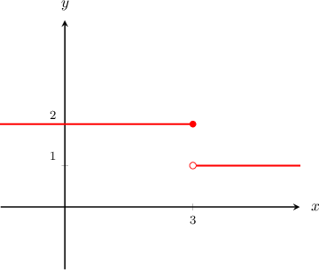
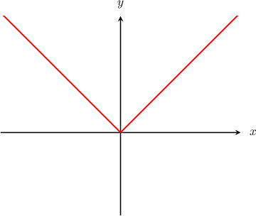
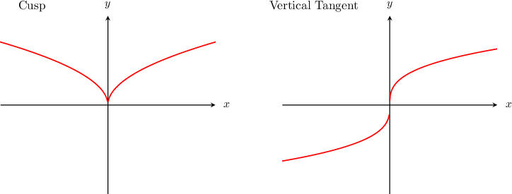
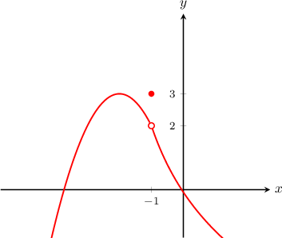
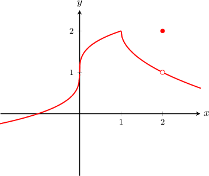

# Continuity and Differentiability of Functions

Source: https://www.mathacademy.com/topics/1691?courseId=24
Topic ID: 1691

## Prerequisites

- [Defining the Derivative Using Derivative Notation](./812-defining-the-derivative-using-derivative-notation.md)
- [Continuity of Functions](./2006-continuity-of-functions.md)

## Lesson

### Introduction

A function $f(x)$ is said to be **differentiable** at a point $x=a$ if the derivative $f'(a)$ exists.

In general:

- If a function is not continuous at some point, then it is not differentiable at that point either.

- If a function is differentiable at some point, then it must be continuous at that point.

For example, suppose we are given a step function $y=f(x)$ that has a jump discontinuity at $x=3,$ given below. We will verify that $f(x)$ is not differentiable at $x=3$ by showing that $f'(3)$ does not exist.

The value $f'(3)$ is a limit, so to check whether it exists, we need to compute the left and right-sided limits.

$$

\begin{aligned}𝑓^{′}(3)=\underset{𝑥→3}{lim}\frac{𝑓(𝑥)−𝑓(3)}{𝑥−3}\end{aligned}

$$

As $x$ approaches $3$ from the left, we have that $f(x) = 2.$ So the left-sided limit is

$$

\begin{aligned}\underset{𝑥→3^{−}}{lim}\frac{𝑓(𝑥)−𝑓(3)}{𝑥−3} & =\underset{𝑥→3^{−}}{lim}\frac{2−2}{𝑥−3}=0.\end{aligned}

$$

On the other hand, as $x$ approaches $3$ from the right, we have that $f(x)=1.$ So the right-sided limit is

$$

\begin{aligned}\underset{𝑥→3^{+}}{lim}\frac{𝑓(𝑥)−𝑓(3)}{𝑥−3} & =\underset{𝑥→3^{+}}{lim}\frac{1−2}{𝑥−3}=\underset{𝑥→3^{+}}{lim}\frac{−1}{𝑥−3}=−∞.\end{aligned}

$$

Because the left and right-sided limits are not equal, the overall limit does not exist.

$$

\begin{aligned}𝑓^{′}(3)=\underset{𝑥→3}{lim}\frac{𝑓(𝑥)−𝑓(3)}{𝑥−3}=DNE\end{aligned}

$$

Consequently, $f(x)$ is not differentiable at $x=3.$

### Continuity Does Not Imply Differentiability

If a function is continuous, that does *not* mean that it's differentiable!

To demonstrate, let's consider the function $f(x)=|x|.$ The function $f(x)$ is continuous everywhere, including the point $x=0.$ But is $f(x)$ also differentiable everywhere?

For $x < 0,$ the graph consists of a downwards-sloping line with slope $-1.$ For $x > 0,$ the graph consists of an upward-sloping line with slope $1.$ So, the derivative of the absolute value function is given by

$$

\begin{aligned}−1\, & 𝑥<0, \\ 1\, & 𝑥>0.\end{aligned}

$$

Therefore, the derivative of $f(x)=|x|$ does not exist at $x=0.$ This is because the limit of the slope as we approach $x=0$ from the left is not equal to the limit as we approach from the right.

In general, a continuous function $f(x)$ is not differentiable at $x=a$ if the function $f(x)$ has any of the following features:

- A **corner point** at $x=a.$ For example, $f(x)=|x|$ at $x=0.$

- A **cusp** at $x=a.$ For example, $f(x) = \sqrt{|x|}$ at $x=0.$

- A **vertical tangent** at $x=a.$ For example, $f(x)=\sqrt[3]{x}$ at $x=0.$

### Example: Determining Whether a Function is Differentiable at a Point Given a Graph

#### Question

Is the function $y=f(x),$ plotted below, differentiable at $x=-1?$

#### Explanation

The function $y=f(x)$ is not differentiable at $x=-1.$

The function has a removable discontinuity at $x=-1.$ Since it is not continuous at $x=-1,$ it is also not differentiable there.

### Example: Determining the Points at Which a Function is Not Differentiable

#### Question

Consider the function $y = f(x)$ whose graph is plotted below. At which points is the function $f(x)$ **** differentiable?

#### Explanation

The function is not differentiable wherever it has a discontinuity, corner, cusp, or vertical tangent.

- At $x=0$ the function has a vertical tangent, so it's not differentiable there.

- At $x=1$ the function has a cusp, so it's not differentiable there.

- At $x=2$ the function has a removable discontinuity, so it's not differentiable there.

Therefore, the function $f(x)$ is not differentiable at $x=0, 1, 2.$

### Example: Determining Which Functions are Differentiable at a Given Point From the Function Expressions

#### Question

Which of the following functions are differentiable at the point $x=-1?$

- $f(x) = x^5+1$

- $g(x) = \dfrac{2}{x+1}$

#### Explanation

Let's analyze each function individually.

- The function $f(x)$ is a polynomial and is therefore differentiable and continuous for all $x.$

- The function $g(x)$ has an essential discontinuity at $x=-1,$ so it is not differentiable at $x=-1$ either.

In conclusion, only $f(x)$ is differentiable at the point $x=-1.$
