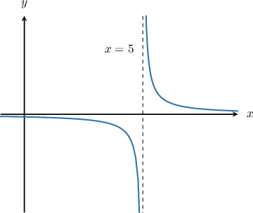
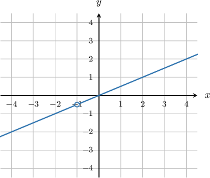

# Vertical Asymptotes of Rational Functions

Source: https://www.mathacademy.com/topics/1815?courseId=24
Topic ID: 1815

## Prerequisites

- [Combining Graph Transformations of Reciprocal Functions](../../../high-school/traditional/lessons/algebra-ii/455-combining-graph-transformations-of-reciprocal-functions.md)
- [Simplifying Rational Expressions Using Polynomial Factorization](../../../high-school/traditional/lessons/algebra-ii/1676-simplifying-rational-expressions-using-polynomial-factorization.md)
- [Adding Rational Expressions With No Common Factors in the Denominator](../../../high-school/traditional/lessons/algebra-ii/3739-adding-rational-expressions-with-no-common-factors-in-the-denominator.md)

## Lesson

### Introduction

To determine the vertical asymptotes of a rational function, we first cancel any common factors in the numerator and denominator. Then, we set the denominator equal to zero and solve for $x$.

For example, let's try to find the vertical asymptotes of the rational function $y=\dfrac{2}{x-5}.$

Now, there are no common factors in the numerator and denominator, and so we set the denominator equal to zero:

$$

\begin{aligned}0 & =𝑥−5 \\ 𝑥 & =5\end{aligned}

$$

Therefore, there is a vertical asymptote at $x=5.$

This matches up with what we see in the graph of the function:

### Example: Determining Vertical Asymptotes of a Rational Function

#### Question

Find the vertical asymptotes of $y=f(x)=\dfrac{1}{x^2-16}.$

#### Explanation

Let's simplify the expression by factoring the denominator. We get

$$

\begin{aligned}𝑦 & =\frac{1}{𝑥^{2}−16} \\ & =\frac{1}{(𝑥^{2}−4^{2})} \\ & =\frac{1}{(𝑥+4)(𝑥−4)}.\end{aligned}

$$

There are no common factors in the numerator and denominator. So, we find the vertical asymptotes by setting the denominator equal to zero:

$$

(x+4)(x-4) = 0\qquad \Longrightarrow\qquad x=\pm 4.

$$

Consequently, both $x=4$ and $x=-4$ are vertical asymptotes of $y=f(x).$

### Example: Determining Vertical Asymptotes of Rational Functions by Factoring the Numerator and Denominator

#### Question

Find the vertical asymptotes of $y = \dfrac{x^2+x-6}{x^2-5x+6}.$

#### Explanation

We start by factoring the function as much as possible and canceling the common factors:

$$

\begin{aligned}\frac{𝑥^{2}+𝑥−6}{𝑥^{2}−5𝑥+6} & =\frac{(𝑥−2)(𝑥+3)}{(𝑥−2)(𝑥−3)} \\ & =\frac{(𝑥−2)(𝑥+3)}{(𝑥−2)(𝑥−3)} \\ & =\frac{𝑥+3}{𝑥−3}.\end{aligned}

$$

We now set the denominator equal to zero:

$$

x-3 = 0\qquad \Longrightarrow\qquad x=3.

$$

So the ** vertical asymptote is at $x=3.$

### Example: Identifying When a Rational Function has no Vertical Asymptotes

#### Question

Find the vertical asymptotes of $y=f(x)=\dfrac{x^2+x}{2x+2}.$

#### Explanation

Let's simplify the expression by factoring both the numerator and the denominator:

$$

\begin{aligned}\frac{𝑥^{2}+𝑥}{2𝑥+2} & =\frac{𝑥(𝑥+1)}{2(𝑥+1)} \\ & =\frac{𝑥(𝑥+1)}{2(𝑥+1)} \\ & =\frac{𝑥}{2}.\end{aligned}

$$

Since the denominator is never zero, we conclude that this function has no vertical asymptotes. A plot of the function is below. Note that it is not defined at $x=-1.$

### Example: Determining the Vertical Asymptotes for the Sum of Two Rational Functions

#### Question

Find the vertical asymptotes of $y=\dfrac{1}{x}+\dfrac{1}{x+1}.$

#### Explanation

First, let's put the two terms over a common denominator:

$$

\begin{aligned}\frac{1}{𝑥}+\frac{1}{𝑥+1} & =\frac{(𝑥+1)}{𝑥(𝑥+1)}+\frac{𝑥}{𝑥(𝑥+1)} \\ & =\frac{𝑥+1+𝑥}{𝑥(𝑥+1)} \\ & =\frac{2𝑥+1}{𝑥(𝑥+1)}.\end{aligned}

$$

There are no common factors in the numerator and denominator, so we proceed to set the denominator equal to zero and get

$$

x(x+1) = 0\qquad \Longrightarrow\qquad x=0,-1.

$$

Therefore, the vertical asymptotes are at $x=0$ and $x=-1.$
