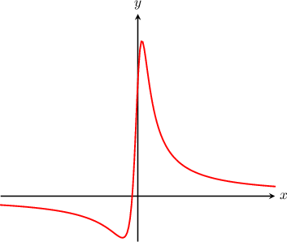

# Limits at Infinity and Horizontal Asymptotes of Rational Functions

Source: https://www.mathacademy.com/topics/1903?courseId=24
Topic ID: 1903

## Prerequisites

- [Horizontal Asymptotes of Rational Functions](../../../high-school/traditional/lessons/precalculus/808-horizontal-asymptotes-of-rational-functions.md)
- [Limits of Reciprocal Functions](./1905-limits-of-reciprocal-functions.md)

## Lesson

### Introduction

To calculate the limit at infinity of a rational function, such as

$$

\lim\limits_{x\rightarrow \infty}\left(\dfrac{x^4}{x^5-x^2}\right),

$$

we apply the following procedure:

**Step 1:** Divide both the numerator and the denominator by the highest power of $x$ in the *denominator*.

$$

\begin{aligned}\underset{𝑥→∞}{lim}(\frac{𝑥^{4}}{𝑥^{5}−𝑥^{2}}) & =\underset{𝑥→∞}{lim}(\frac{𝑥^{4}÷𝑥^{5}}{(𝑥^{5}−𝑥^{2})÷𝑥^{5}}) \\ & =\underset{𝑥→∞}{lim}\frac{\frac{𝑥^{4}}{𝑥^{5}}}{𝑥^{5}} \\ & =\underset{𝑥→∞}{lim}\frac{\frac{1}{𝑥}}{𝑥}\end{aligned}

$$

**Step 2:** Apply the rule that if $n$ is any positive integer then $\displaystyle \lim\limits_{x\rightarrow \infty}\left(\dfrac{1}{x^n}\right)=0.$ Evaluate the remaining expression to obtain the answer.

$$

\begin{aligned}\underset{𝑥→∞}{lim}(\frac{𝑥^{4}}{𝑥^{5}−𝑥^{2}}) & =\underset{𝑥→∞}{lim}\frac{\frac{1}{𝑥}}{𝑥} \\ & =\frac{0}{1−0} \\ & =\frac{0}{1} \\ & =0\end{aligned}

$$

### Example: Evaluating a Limit at Infinity: Rational Solutions

#### Question

Evaluate $\lim\limits_{x\rightarrow \infty} \dfrac{3x^4+9x}{6x^4-x^3}.$

#### Explanation

First, we divide both the numerator and the denominator by the highest power of $x$ in the denominator, which is $x^4.$ Then, by noting that the reciprocals shrink to $0$ in the limit, we can then evaluate the resulting expression.

$$

\begin{aligned}\underset{𝑥→∞}{lim}\frac{3𝑥^{4}+9𝑥}{6𝑥^{4}−𝑥^{3}} & =\underset{𝑥→∞}{lim}\frac{(\frac{3𝑥^{4}}{𝑥^{4}}+\frac{9𝑥}{𝑥^{4}})}{𝑥^{4}} \\ & =\underset{𝑥→∞}{lim}\frac{(3+\frac{9}{𝑥^{3}})}{𝑥^{3}} \\ & =\frac{3+0}{6−0} \\ & =\frac{1}{2}.\end{aligned}

$$

### Example: Evaluating a Limit at Infinity: Infinite Solutions

#### Question

Calculate $\lim\limits_{x\rightarrow -\infty} \dfrac{4-5x-2x^3}{x^2+3}.$

#### Explanation

First, we divide both the numerator and the denominator by the highest power of $x$ in the denominator, which is $x^2.$ Then, by noting that the reciprocals shrink to $0$ in the limit, we can then evaluate the resulting expression.

$$

\begin{aligned}\underset{𝑥→−∞}{lim}\frac{4−5𝑥−2𝑥^{3}}{𝑥^{2}+3} & =\underset{𝑥→−∞}{lim}\frac{(\frac{−2𝑥^{3}}{𝑥^{2}}−\frac{5𝑥}{𝑥^{2}}+\frac{4}{𝑥^{2}})}{𝑥^{2}} \\ & =\underset{𝑥→−∞}{lim}\frac{(−2𝑥−\frac{5}{𝑥}+\frac{4}{𝑥^{2}})}{𝑥} \\ & =\underset{𝑥→−∞}{lim}(\frac{−2𝑥+0+0}{1+0}) \\ & =\underset{𝑥→−∞}{lim}(−2𝑥) \\ & =∞.\end{aligned}

$$

### Horizontal Asymptotes of Rational Functions

The horizontal asymptotes of a rational function $y=f(x)$ coincide with the infinite limits of $f(x).$

For example, we can use the same procedure as before to find the horizontal asymptote of $y=f(x) = \dfrac{x+1}{x^2+2}.$ As a result, we get

$$

\begin{aligned}\underset{𝑥→∞}{lim}𝑓(𝑥) & =\underset{𝑥→∞}{lim}\frac{𝑥+1}{𝑥^{2}+2} \\ & =\underset{𝑥→∞}{lim}\frac{(\frac{𝑥}{𝑥^{2}}+\frac{1}{𝑥^{2}})}{𝑥^{2}} \\ & =\underset{𝑥→∞}{lim}\frac{(\frac{1}{𝑥}+\frac{1}{𝑥^{2}})}{𝑥} \\ & =\frac{0+0}{1+0} \\ & =0.\end{aligned}

$$

So the horizontal asymptote of the graph $y=f(x)$ is $y=0$, as shown below.

### Example: Identifying the Horizontal Asymptote of a Rational Function

#### Question

What is the horizontal asymptote of $y=f(x)$ with $f(x)=\dfrac{2x^3+1}{x^3-15x}?$

#### Explanation

The horizontal asymptote is $y=\lim\limits_{x \rightarrow \infty} f(x).$ To find the horizontal asymptote, we apply the usual procedure of dividing the numerator and denominator by the highest power of $x$ in the denominator, which is $x^3.$

$$

\begin{aligned}\underset{𝑥→∞}{lim}𝑓(𝑥) & =\underset{𝑥→∞}{lim}\frac{2𝑥^{3}+1}{𝑥^{3}−15𝑥} \\ & =\underset{𝑥→∞}{lim}\frac{(\frac{2𝑥^{3}}{𝑥^{3}}+\frac{1}{𝑥^{3}})}{𝑥^{3}} \\ & =\underset{𝑥→∞}{lim}\frac{(2+\frac{1}{𝑥^{3}})}{𝑥^{3}} \\ & =\frac{2+0}{1−0} \\ & =2\end{aligned}

$$

Therefore, the horizontal asymptote is $y=2.$

### Example: Identifying When a Rational Function has No Horizontal Asymptote

#### Question

Find the horizontal asymptote of $y=f(x)$ where $f(x)=\dfrac{x^5-10}{x^3-8x^2}.$

#### Explanation

The horizontal asymptote is $y=\lim\limits_{x \rightarrow \infty} f(x).$ To find the horizontal asymptote, we apply the usual procedure of dividing the numerator and denominator by the highest power of $x$ in the denominator, which is $x^3.$

$$

\begin{aligned}\underset{𝑥→∞}{lim}𝑓(𝑥) & =\underset{𝑥→∞}{lim}\frac{𝑥^{5}−10}{𝑥^{3}−8𝑥^{2}} \\ & =\underset{𝑥→∞}{lim}\frac{(\frac{𝑥^{5}}{𝑥^{3}}−\frac{10}{𝑥^{3}})}{𝑥^{3}} \\ & =\underset{𝑥→∞}{lim}\frac{(𝑥^{2}−\frac{10}{𝑥^{3}})}{𝑥^{3}} \\ & =\underset{𝑥→∞}{lim}(\frac{𝑥^{2}−0}{1−0}) \\ & =\underset{𝑥→∞}{lim}𝑥^{2} \\ & =∞.\end{aligned}

$$

The limit does not come out to a finite number. Therefore, there is no horizontal asymptote.
