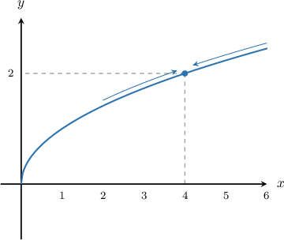
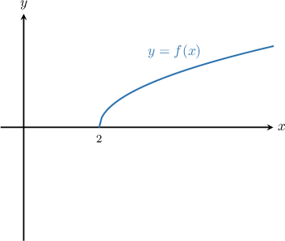
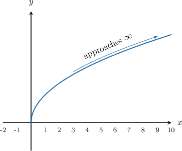
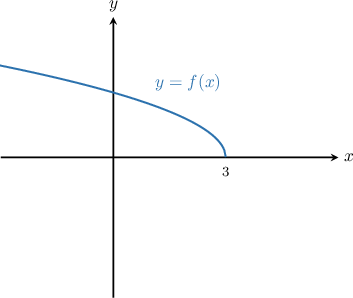
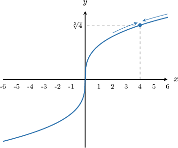
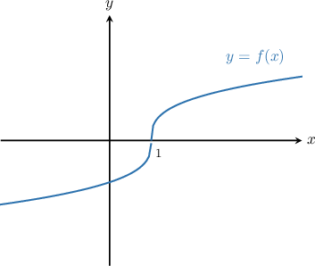

# Limits of Radical Functions

Source: https://www.mathacademy.com/topics/1986?courseId=24
Topic ID: 1986

## Prerequisites

- [The Power and Root Rules for Limits](./37-the-power-and-root-rules-for-limits.md)
- [The Domain of a Transformed Radical Function](../../../high-school/traditional/lessons/algebra-ii/1600-the-domain-of-a-transformed-radical-function.md)
- [Limits at Infinity from Graphs](./1873-limits-at-infinity-from-graphs.md)
- [The Range of a Transformed Radical Function](../../../high-school/traditional/lessons/algebra-ii/3741-the-range-of-a-transformed-radical-function.md)

## Lesson

### Introduction

Consider the graph of $y=\sqrt{x}$ below. We will use this graph to compute $\lim\limits_{x \to \, 4} \sqrt{x} \,.$

From the graph, we see that as $x$ approaches $4,$ the value of $y$ approaches $\sqrt{4}.$ Therefore,

$$

\lim\limits_{x\to 4} \sqrt{x} = \sqrt{4} = 2.

$$

The limit of the square root function at a point is equal to the value of the square root function at that point, and this is true for any point *that is greater than $0.$* However, for points that are less than or equal to $0,$ the limit does not exist:

$$

\begin{aligned}\underset{𝑥→\,𝑐}{lim}\sqrt{√𝑥}=\begin{aligned}\sqrt{√𝑐} & if 𝑐>0 \\ DNE & if 𝑐≤0\end{aligned}\end{aligned}

$$

Why doesn't the limit exist for $c \leq 0$?

- For $c < 0,$ the limit $\lim\limits_{x \to \, c} \sqrt{x}$ does not exist because the square root function $f(x) = \sqrt{x}$ is not defined for negative inputs.

- Although $\sqrt{x}$ is defined at $x=0,$ the left limit $\lim\limits_{x \to \, 0^-} \sqrt{x}$ does not exist because $\sqrt{x}$ is undefined left of $x=0.$ Consequently, the overall limit $\lim\limits_{x \to \, 0} \sqrt{x}$ does not exist either.

### Example: Evaluating the Limit of a Square Root Function

#### Question

Calculate $\lim_\limits{x \to 2} \sqrt{x-2}.$

#### Explanation

Let $f(x)= \sqrt{x-2}$. Notice that

$$

\begin{aligned}𝑓(2) & =\sqrt{√2−2} \\ & =\sqrt{√0} \\ & =0.\end{aligned}

$$

So, the graph of $y=f(x)$ "starts" at $x=2.$ Let's sketch the graph of $y=f(x)$ as follows:

From the graph, we notice that the left-sided limit is

$$

\lim_\limits{x \to 2^-} f(x) = \textrm{DNE},

$$

while the right-sided limit is

$$

\lim_\limits{x \to 2^+} f(x) = 0.

$$

Since the two limits are not equal, we conclude that

$$

\lim_\limits{x \to 2} f(x)= \textrm{DNE}.

$$

### The Limits at Infinity of the Square Root Function

Let's go back to our plot of $y=\sqrt x$ and work out its limits at infinity.

As $x \to \infty,$ the square root function increases without bound. So, we have

$$

\lim_{x\to \infty}\sqrt{x} = \infty.

$$

On the other hand, when computing the limit as $x \to -\infty,$ remember that the square root function isn't defined for $x<0.$ Therefore,

$$

\lim_{x\to -\infty}\sqrt{x} = \textrm{DNE}.

$$

### Example: Evaluating a Limit at Infinity of a Square Root Function

#### Question

Evaluate $\lim_\limits{x \rightarrow -\infty} \sqrt{3-x}.$

#### Explanation

Let $f(x)= \sqrt{3-x}.$ First, let's sketch the graph of $y=f(x)\mathbin{:}$

From the graph, we see that the function increases without bound as $x$ decreases. Therefore,

$$

\lim_\limits{x \to -\infty} f(x)= \infty.

$$

### Limits of Cube Root Functions

Consider the graph of the cube root function $y=\sqrt[3]{x}$ below.

Unlike the square root function, the cube root is defined for all real $x.$ As $x$ approaches any finite number $a,$ the limit of the cube root function can be obtained by simply substituting $x=a$ into the cube root:

$$

\lim_{x\to a} \sqrt[3]{x} = \sqrt[3]{a}

$$

Additionally, we can see from the graph that the limits at infinity are

$$

\lim_{x\to \infty} \sqrt[3]{x} = \infty \qquad \textrm{and}\qquad \lim_{x\to -\infty} \sqrt[3]{x} = -\infty.

$$

### Example: Evaluating the Limit of a Cube Root Function

#### Question

Calculate $\lim_\limits{x \to -3} \sqrt[3]{3x-2x^2}.$

#### Explanation

We substitute $x=-3$ into the expression, and get

$$

\begin{aligned}\underset{𝑥→−3}{lim}\sqrt[√3𝑥−2𝑥^{2}]{3} & =\sqrt[√3(−3)−2(−3)^{2}]{3} \\ & =\sqrt[√−9−18]{3} \\ & =\sqrt[√−27]{3} \\ & =−3.\end{aligned}

$$

### Example: Evaluating the Limit at Infinity of a Cube Root Function

#### Question

Compute $\lim_\limits{x \to \infty} \sqrt[3]{x-1}.$

#### Explanation

Let $f(x)= \sqrt[3]{x-1}.$ Let's sketch the graph of $y=f(x)\mathbin{:}$

From the graph, we see that the function increases without bound as $x$ increases. Therefore,

$$

\lim_\limits{x \to \infty} f(x)= \infty.

$$
