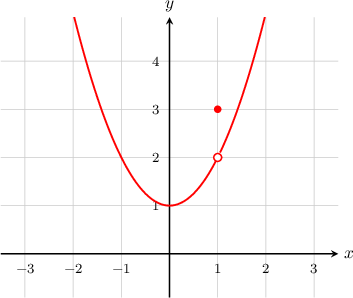
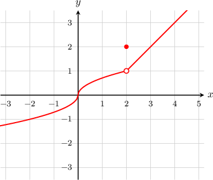
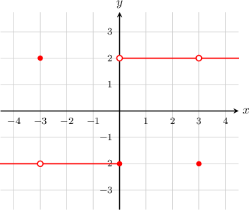

# Point Discontinuities

Source: https://www.mathacademy.com/topics/2002?courseId=24
Topic ID: 2002

## Prerequisites

- [Defining Continuity at a Point](./314-defining-continuity-at-a-point.md)

## Lesson

### Introduction

Let's take a look at the function $y=f(x)$, plotted below.

The function has a discontinuity at $x=1$, but can we classify it?

Notice that when we check our continuity conditions, we find that

- $f(1) = 3$, so $f(1)$ exists $\,{\color{green}{\checkmark}}$

- $\displaystyle \lim_{x\to 1} f(x) = 2$, so $\displaystyle \lim_{x\to 1} f(x)$ exists $\,{\color{green}{\checkmark}}$

- $\displaystyle \lim_{x\to 1} f(x) \neq f(1)$ $\,{\color{red}{\times}}$

So the first two conditions passed, yet the third failed. When this happens, we have a **point discontinuity**. We also call this a **removable discontinuity**.

In general, a function $f(x)$ has a removable discontinuity at $x=c$ if

- $f(c)$ exists $\,{\color{green}{\checkmark}}$

- $\displaystyle\lim_{x\to c} f(x)$ exists $\,{\color{green}{\checkmark}}$

- $\displaystyle\lim_{x\to c} f(x) \neq f(c)$\,{\color{red}{\times}}$

In addition, both $f(c)$ and $\displaystyle \lim_{x\to c}f(x)$ should be finite.

### Example: Identifying a Point Discontinuity on a Graph

#### Question

For which points does the function $y=f(x)$ below have a point discontinuity?

#### Explanation

The function has a discontinuity at $x=2.$ Checking our continuity conditions, we have

- $f(2)= 2$ exists $\,\,{\color{green}{\checkmark}}$

- $\displaystyle \lim_{x\to 2}f(x)= 1$ exists $\,\,{\color{green}{\checkmark}}$

- $\displaystyle \lim_{x\to 2}f(x) \neq f(2)$ $\,\,{\color{red}{\times}}$

So it's the third condition that failed, which tells us that $x=2$ is a point discontinuity.

### Example: Identifying Point Discontinuities on a Graph when Multiple Types of Discontinuities Exist

#### Question

For which points does the function $y=f(x)$ below have a removable discontinuity?

#### Explanation

The function has a discontinuity at $x=-3.$ Checking our continuity conditions, we have

- $f(-3)= 2$ exists $\,\,{\color{green}{\checkmark}}$

- $\displaystyle \lim_{x\to -3}f(x)= -2$ exists $\,\,{\color{green}{\checkmark}}$

- $\displaystyle \lim_{x\to -3}f(x) \neq f(3)$ $\,\,{\color{red}{\times}}$

So it's the third condition that failed, which tells us that $x=-3$ is a removable discontinuity. A similar argument applies for $x=3$, which is also a removable discontinuity. So, the function has removable discontinuities at $x=-3, 3.$

Note that the function also has a discontinuity at $x=0,$ but it is not a removable discontinuity. Checking the conditions, we find that

- $f(0)= -2$ exists $\,\,{\color{green}{\checkmark}}$

- $\displaystyle \lim_{x\to 0}f(x)$ does not exist $\,\,{\color{red}{\times}}$

So this time, the second condition failed, and therefore $x=0$ is not a removable discontinuity.

### Example: Identifying Properties Related to Point Discontinuities Given a Function Expression

#### Question

Given the function $f(x),$ defined by

$$

\begin{aligned}𝑥+3, & 𝑥<0 \\ 0, & 𝑥=0 \\ 3−𝑥, & 𝑥>0,\end{aligned}

$$

which of the following statements are true?

1. $\lim\limits_{x\to 0^+} f(x)=\lim\limits_{x\to 0^-} f(x)$

2. $\lim\limits_{x\to 0} f(x)=f(0)$

3. $f(x)$ has a removable discontinuity at $x=0$

#### Explanation

Let's check our continuity conditions:

- $f(0)=0$ exists $\,\,{\color{green}{\checkmark}}$

- The left and right-sided limits are Since the left and right-sided limits are equal, we conclude that statement I is true and

- The value of the limit is $\displaystyle\lim\limits_{x\to 0} f(x) = 3,$ while the value of the function is $f(0)=0.$ So, statement II is false and

Since the third condition failed, the function has a removable discontinuity at $x=0,$ and statement III is true.

In conclusion, only statements I and III are true.
