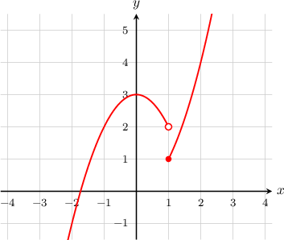
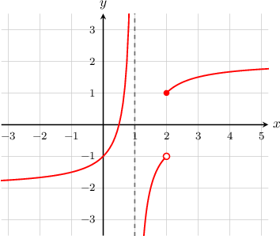

# Jump Discontinuities

Source: https://www.mathacademy.com/topics/2003?courseId=24
Topic ID: 2003

## Prerequisites

- [Defining Continuity at a Point](./314-defining-continuity-at-a-point.md)

## Lesson

### Introduction

Let's consider the graph $y=f(x),$ shown below.

We see that the function has a discontinuity at $x=1.$ Can we classify it?

Let's start by going through our continuity checklist:

- $f(1) = 1$ exists $\,\,{\color{green}{\checkmark}}$

- $\displaystyle \lim_{x\to 1}f(x)$ does not exist $\,\,{\color{red}{\times}}$

So the second condition failed. It failed because the left and right-sided limits are not equal:

$$

\lim_{x\to 1^-}f(x) = 2, \qquad\qquad \lim_{x\to 1^+}f(x) = 1.

$$

Therefore, the function has a discontinuity at $x=1.$ In particular, this type of discontinuity is called a **jump discontinuity**.

In general, a function $f(x)$ has a jump discontinuity at $x=c$ if

- $f(c)$ exists and is finite $\,\,{\color{green}{\checkmark}}$

- Both $\displaystyle \lim_{x\to c^-}f(x)$ and $\displaystyle \lim_{x\to c^+}f(x)$ exist and are finite, but they are not equal, so $\displaystyle \lim_{x\to c}f(x)$ doesn't exist $\,\,{\color{red}{\times}}$

### Example: Identifying a Jump Discontinuity on a Graph

#### Question

For which points does the function $y=f(x)$ plotted below have a jump discontinuity?

#### Explanation

The function has a jump discontinuity at $x=0.$ Checking our conditions, we see that

- $f(0) = -2$ exists $\,\,{\color{green}{\checkmark}}$

- $\displaystyle \lim_{x\to 0}f(x)$ does not exist $\,\,{\color{red}{\times}}$

So the second condition failed. It failed because the left and right-sided limits are not equal:

$$

\lim_{x\to 0^-}f(x) = -2, \qquad \qquad \lim_{x\to 0^+}f(x) = 2.

$$

These limits both exist and are finite, yet they are not equal. Therefore, the discontinuity at $x=0$ is a jump discontinuity.

Note that there are also discontinuities at $x=-3$ and $x=3,$ but they are removable discontinuities, ** jump discontinuities.

### Example: Identifying Jump Discontinuities on a Graph when Multiple Types of Discontinuity Exist

#### Question

For which points does the function $y=f(x)$ below have a jump discontinuity?

#### Explanation

The function has a jump discontinuity at $x=2.$ Checking our continuity conditions, we have

- $f(2)= 1$ exists $\,\,{\color{green}{\checkmark}}$

- $\displaystyle \lim_{x\to 2}f(x)$ does not exist $\,\,{\color{red}{\times}}$

So the second condition failed. It failed because the left and right-sided limits are not equal:

$$

\lim_{x\to 2^-}f(x) = -1, \qquad \qquad \lim_{x\to 2^+}f(x) = 1.

$$

These limits both exist and are finite, yet they are not equal. Therefore, the discontinuity at $x=2$ is a jump discontinuity.

Note that there is also a discontinuity at $x=1,$ but this is not a jump discontinuity.

### Example: Identifying a Jump Discontinuity Given a Function Definition

#### Question

Does the function $f(x)$ below have a jump discontinuity at $x=0?$

$$

\begin{aligned}𝑥^{2}+1, & 𝑥≤0 \\ 2𝑥−1, & 𝑥>0\end{aligned}

$$

#### Explanation

Let's go through our continuity checklist:

- $f(0)=1$ exists $\,\,{\color{green}{\checkmark}}$

- Let's now check the left and right limits. We see that while So both the left and right limits exist and are finite, but they are not equal. $\,\,{\color{red}{\times}}$

Therefore, $f(x)$ has a jump discontinuity at $x=0.$
