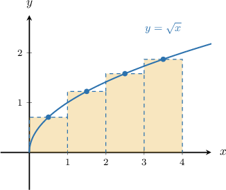
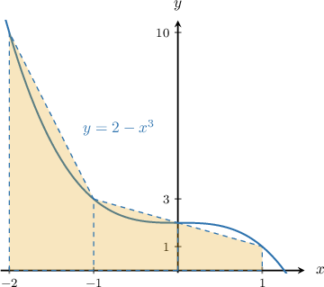

# Midpoint and Trapezoidal Rules in Sigma Notation

Source: https://www.mathacademy.com/topics/2611?courseId=24
Topic ID: 2611

## Prerequisites

- [Approximating Areas With the Midpoint Riemann Sum](./944-approximating-areas-with-the-midpoint-riemann-sum.md)
- [Approximating Areas With the Trapezoidal Rule](./945-approximating-areas-with-the-trapezoidal-rule.md)
- [Left and Right Riemann Sums in Sigma Notation](./1042-left-and-right-riemann-sums-in-sigma-notation.md)

## Lesson

### Introduction

Recall that the formula for the midpoint Riemann sum for $y=f(x)$ over the interval $[a,b]$ is

$$

({\color{red}f(x_1^\ast)} + {\color{red}f(x_2^\ast)} + \ldots + {\color{red}f(x_m^\ast)}) \cdot {\color{blue}\Delta x},

$$

where $m$ is the number of rectangles, $x_i^\ast$ is the midpoint of the $i$th subinterval, and $\Delta x$ is the step size.

This midpoint Riemann sum in sigma notation is

$$

\sum_{i=1}^{m} {\color{red}f(x_i^\ast)}{\color{blue}\Delta x},

$$

where $x_i^\ast = a + \left(i-\dfrac{1}{2}\right) \Delta x$ and $\Delta x = \dfrac{b-a}{m}.$

Notice that the formula for $x_i^\ast$ is slightly different from the formula for $x_i$ that we encountered before. This is because $x_i$ is the left endpoint of the $i$th subinterval, while $x_{i}^*$ is the *midpoint* of the $i$th subinterval.

### Example: Expressing a Midpoint Riemann Sum in Sigma Notation With a Fixed Step Size

#### Question

The area under the curve $y = \sqrt{x}$ between $x=0,$ $x=4,$ and the $x$-axis is approximated by a midpoint Riemann sum, as shown below. What is the expression for the Riemann sum in sigma notation?

**

#### Explanation

The midpoint Riemann sum for $y=f(x)$ with a regular step size in sigma notation is

$$

\sum_{i=1}^{m} f(x^*_i)\Delta x,

$$

where $x^*_i = a + \left(i - \dfrac12 \right) \Delta{x},$ $\Delta x = \dfrac{b-a}{m},$ and $m$ is the number of subintervals.

From the diagram, we're given that $m = 4.$ The endpoints indicate that $a=0$ and $b=4,$ so the step size is

$$

\Delta x = \dfrac{4-0}{4} = 1.

$$

Therefore, using sigma notation, the midpoint Riemann sum can be expressed as

$$

\begin{aligned}\underset{\underset{𝑖=1}{∑}}{\overset{}{𝑚}}𝑓(𝑥_{∗𝑖})Δ𝑥 & =\underset{\underset{𝑖=1}{∑}}{\overset{}{4}}𝑓(𝑥_{∗𝑖})Δ𝑥 \\ & =\underset{\underset{𝑖=1}{∑}}{\overset{}{4}}𝑓(0+(𝑖−\frac{1}{2})⋅1)⋅1 \\ & =\underset{\underset{𝑖=1}{∑}}{\overset{}{4}}𝑓(𝑖−\frac{1}{2}) \\ & =\underset{\underset{𝑖=1}{∑}}{\overset{}{4}}\sqrt{𝑖−\frac{1}{2}}\,.\end{aligned}

$$

### Example: Expressing a Midpoint Riemann Sum in Sigma Notation With a General Step Size

#### Question

The area under the curve $y={x+1}$ between $x=0,$ $x=2,$ and the $x$-axis is approximated by a midpoint Riemann sum using $m$ subintervals of equal length. What is the expression for the Riemann sum in sigma notation?

#### Explanation

The midpoint Riemann sum for $y=f(x)$ with a regular step size in sigma notation is

$$

\sum_{i=1}^{m} f(x^*_i)\Delta x,

$$

where $x^*_i = a + \left(i - \dfrac{1}{2} \right) \Delta{x},$ $\Delta x = \dfrac{b-a}{m},$ and $m$ is the number of subintervals.

The endpoints indicate that $a=0$ and $b=2,$ so the step size is

$$

\Delta x = \dfrac{2-0}{m} = \dfrac2m.

$$

Therefore, using sigma notation, we can express the midpoint Riemann sum as

$$

\begin{aligned}\underset{\underset{𝑖=1}{∑}}{\overset{}{𝑚}}𝑓(𝑥_{∗𝑖})Δ𝑥 & =\underset{\underset{𝑖=1}{∑}}{\overset{}{𝑚}}𝑓(0+(𝑖−\frac{1}{2})⋅\frac{2}{𝑚})⋅\frac{2}{𝑚} \\ & =\underset{\underset{𝑖=1}{∑}}{\overset{}{𝑚}}\frac{2}{𝑚}⋅𝑓(\frac{2𝑖−1}{𝑚}) \\ & =\underset{\underset{𝑖=1}{∑}}{\overset{}{𝑚}}\frac{2}{𝑚}⋅(\frac{2𝑖−1}{𝑚}+1) \\ & =\underset{\underset{𝑖=1}{∑}}{\overset{}{𝑚}}\frac{2}{𝑚}⋅(\frac{2𝑖−1+𝑚}{𝑚}) \\ & =\underset{\underset{𝑖=1}{∑}}{\overset{}{𝑚}}\frac{4𝑖−2+2𝑚}{𝑚^{2}}.\end{aligned}

$$

### Trapezoidal Rule in Sigma Notation

Recall the formula for the trapezoidal rule for $y=f(x)$ over the interval $[a,b]$ is

$$

\dfrac{1}{2} [{\color{red}f(a)} + 2({\color{red}f(x_1)} + {\color{red}f(x_2)} +\ldots +{\color{red}f(x_{n-1})}) +{\color{red}f(b)}] \cdot {\color{blue}\Delta x}.

$$

This trapezoidal rule in sigma notation is

$$

\dfrac{\color{blue}\Delta x}{2}\left[ {\color{red}f(a)} +2\left( \sum_{j=1}^{n-1} {\color{red}f(x_j)}\right) +{\color{red}f(b)}\right] ,

$$

where $x_j = a + j\Delta x$, $\Delta x = \dfrac{b-a}{n}$, and $n$ is the number of subintervals.

### Example: Expressing the Trapezoidal Rule Sum in Sigma Notation With a Fixed Step Size

#### Question

The area under the curve $y=2-x^3$ between $x=-2,$ $x=1,$ and the $x$-axis is approximated using the trapezoidal rule, as shown below. What is the expression for the trapezoidal rule in sigma notation?

#### Explanation

The area under the curve for $y=f(x)$ using the trapezoidal rule with a regular step size in sigma notation is

$$

\dfrac{\Delta x}{2}\left[f(a)+2\left(\sum_{j=1}^{n-1} f(x_j) \right)+f(b)\right],

$$

where $x_j = a + j\Delta x$ and $\Delta x = \dfrac{b-a}{n}.$

From the diagram, we're given that $n=3.$ The endpoints indicate that $a=-2$ and $b=1.$ So, the step size is

$$

\Delta x = \dfrac{1-(-2)}{3} = \dfrac 3 3 = 1.

$$

Therefore, using sigma notation, the trapezoidal rule sum can be expressed as

$$

\begin{aligned}\frac{Δ𝑥}{2}[𝑓(𝑎)+2(\underset{\underset{𝑗=1}{∑}}{\overset{}{𝑛−1}}𝑓(𝑥_{𝑗}))+𝑓(𝑏)] & =\frac{1}{2}[𝑓(−2)+2(\underset{\underset{𝑗=1}{∑}}{\overset{}{3−1}}𝑓(−2+𝑗⋅1))+𝑓(1)] \\ & =\frac{1}{2}[10+2(\underset{\underset{𝑗=1}{∑}}{\overset{}{2}}𝑓(𝑗−2))+1] \\ & =\frac{1}{2}[11+2\underset{\underset{𝑗=1}{∑}}{\overset{}{2}}𝑓(𝑗−2)] \\ & =\frac{1}{2}[11+2\underset{\underset{𝑗=1}{∑}}{\overset{}{2}}(2−(𝑗−2)^{3})] \\ & =\frac{11}{2}+\underset{\underset{𝑗=1}{∑}}{\overset{}{2}}(2−(𝑗−2)^{3}).\end{aligned}

$$

### Example: Expressing the Trapezoidal Rule Sum in Sigma Notation With a General Step Size

#### Question

The area under the curve $y=x^3$ between $x=0$ and $x=1$ and the $x$-axis is approximated by the trapezoidal rule using $n$ subintervals of equal length. What is the expression for the trapezoidal rule in sigma notation?

#### Explanation

The area under the curve for $y=f(x)$ using the trapezoidal rule with a regular step size in sigma notation is

$$

\dfrac{\Delta x}{2}\left[f(a)+2\left(\sum_{i=1}^{n-1} f(x_i) \right)+f(b)\right]

$$

where $x_i = a + i \cdot \Delta x$, with $\Delta x = \dfrac{b-a}{n}.$

The endpoints indicate that $a=0$ and $b=1.$ So, the step size is

$$

\Delta x = \dfrac{1-0}{n} = \dfrac 1 n.

$$

Therefore, using sigma notation, the trapezoidal rule sum can be expressed as

$$

\begin{aligned}\frac{Δ𝑥}{2}[𝑓(𝑎)+2(\underset{\underset{𝑖=1}{∑}}{\overset{}{𝑛−1}}𝑓(𝑥_{𝑖}))+𝑓(𝑏)] & =\frac{1}{2}⋅\frac{1}{𝑛}[𝑓(0)+2(\underset{\underset{𝑖=1}{∑}}{\overset{}{𝑛−1}}𝑓(0+𝑖⋅\frac{1}{𝑛}))+𝑓(1)] \\ & =\frac{1}{2𝑛}[0+2(\underset{\underset{𝑖=1}{∑}}{\overset{}{𝑛−1}}𝑓(\frac{𝑖}{𝑛}))+1] \\ & =\frac{1}{2𝑛}[1+2\underset{\underset{𝑖=1}{∑}}{\overset{}{𝑛−1}}(\frac{𝑖}{𝑛})^{3}]\end{aligned}

$$
