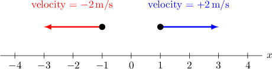
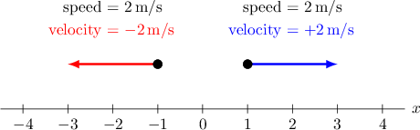

# Calculating Velocity for Straight-Line Motion Using Differentiation

Source: https://www.mathacademy.com/topics/284?courseId=24
Topic ID: 284

## Prerequisites

- [Interpreting the Meaning of the Derivative in Context](./296-interpreting-the-meaning-of-the-derivative-in-context.md)
- [Selecting Procedures for Calculating Derivatives](./1115-selecting-procedures-for-calculating-derivatives.md)
- [Distance-Time Graphs](../../../high-school/traditional/lessons/algebra-i/1589-distance-time-graphs.md)

## Lesson

### Introduction

Why do we study derivatives? It turns out that we can use derivatives to understand many practical situations, like the motion of a particle.

Suppose we're given the position $x$ of a particle as a function of time, so $x = x(t).$ The **velocity** $v(t)$ of the particle is the rate of change of its position with respect to time.

So, we can compute the velocity by taking the derivative of $x(t)$ with respect to time:

$$

v(t) = \frac{\textrm{d}x}{\textrm{d}t}

$$

The velocity of a particle represents how fast the particle is going at any moment in time, and the direction in which it is traveling (positive or negative).

### Example: Calculating the Velocity of a Particle

#### Question

The position $x$ of a particle at time $t$ is given by $x(t) = 3t^2 +3t +1.$ Calculate the velocity at time $t.$

#### Explanation

The velocity is the derivative of the position function $x(t)$ with respect to time:

$$

\begin{aligned}𝑣(𝑡) & =\frac{d𝑥}{d𝑡} \\ & =\frac{d}{d𝑡}(3𝑡^{2}+3𝑡+1) \\ & =6𝑡+3\end{aligned}

$$

### Intuition Behind the Definition

Let's build some more intuition for why velocity is defined as the derivative of position.

If a car is moving at a constant velocity, and it travels a distance of $\Delta x=100\,\textrm{m}$ in a time interval $\Delta t=10\,\textrm{s},$ then we know that its velocity is given by

$$

\begin{aligned}𝑣 & =\frac{Δ𝑥}{Δ𝑡} \\ & =\frac{100}{10} \\ & =10\,m/s.\end{aligned}

$$

But what if the velocity itself changes with time? Perhaps the car accelerates for a couple of seconds in the beginning, thereby increasing its velocity. In that case, the formula above only gives us the average velocity.

However, if we take a smaller time interval, we can get more precise information about the velocity at a given time $t.$ To get the instantaneous velocity of the car, we need to take the limit as $\Delta t\to 0.$ When we do this, we get the derivative:

$$

\begin{aligned}𝑣(𝑡) & =\underset{Δ𝑡→0}{lim}\frac{Δ𝑥}{Δ𝑡} \\ & =\frac{d𝑥}{d𝑡}\end{aligned}

$$

The instantaneous velocity is the number that you read on the speedometer of cars.

### Example: Calculating the Velocity of a Particle at a Particular Moment

#### Question

The position $x,$ measured in meters, of a particle at time $t$ is given by $x(t) = 6t^4 -3t^2 +t,$ where $t$ is the time in seconds. Calculate the velocity at time $t=1$.

#### Explanation

First, we calculate the velocity function by differentiating the position function:

$$

\begin{aligned}𝑣(𝑡) & =\frac{d𝑥}{d𝑡} \\ & =\frac{d}{d𝑡}(6𝑡^{4}−3𝑡^{2}+𝑡) \\ & =24𝑡^{3}−6𝑡+1\end{aligned}

$$

To calculate the velocity at $t=1,$ we substitute $t=1$ into the velocity function above:

$$

\begin{aligned}𝑣(1) & =24(1)^{3}−6(1)+1 \\ & =24−6+1 \\ & =19\end{aligned}

$$

Therefore, the velocity of the particle is $19\,\textrm{m/s}.$

### Speed vs Velocity

**Velocity** is a vector. It has both magnitude and direction, and can be negative. For motion along a straight line (i.e. along the $x$-axis), negative velocity means that it's moving to the left, in the negative direction.

**Speed**, however, is a scalar quantity with no direction. It is the magnitude of the velocity, given by $|v|$. The speed is always positive or zero, and is never negative.

For example, if a particle moving along the $x$-axis has a velocity of $-2 \, \textrm{m/s},$ then it is moving left (in the negative direction) with a speed of $|{-2}|=2 \, \textrm{m/s}.$

The reason why we take the absolute value when computing speed is that speed is directionless (unlike velocity, which can be positive or negative depending on the direction of motion).

### Example: Calculating the Speed of a Particle at a Particular Moment

#### Question

The position $s(t)$ of a particle (in meters) at time $t$ seconds is given by

$$

s(t) = t^2 - 36t,\quad t\geq 0.

$$

Calculate the speed of the particle when $t=1\,\textrm{s}$.

#### Explanation

First, we calculate the velocity function by differentiating the position function:

$$

\begin{aligned}𝑣(𝑡) & =\frac{d𝑠}{d𝑡} \\ & =\frac{d}{d𝑡}(𝑡^{2}−36𝑡) \\ & =2𝑡−36\end{aligned}

$$

When $t=1,$ the velocity is

$$

v(1) = 2(1) - 36 = -34.

$$

Therefore, the speed is $|{-34}| = 34\, \textrm{m/s}.$
