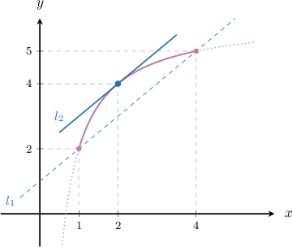
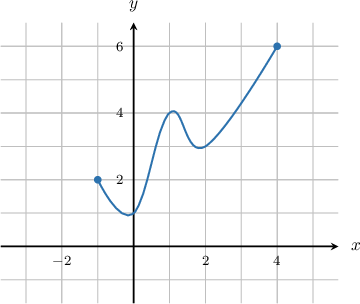
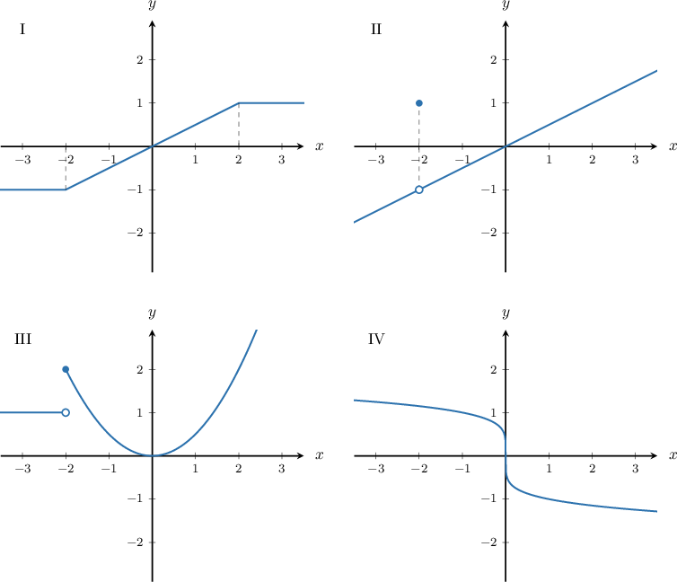

# The Mean Value Theorem

Source: https://www.mathacademy.com/topics/288?courseId=24
Topic ID: 288

## Prerequisites

- [Solving Radical Equations](../../../high-school/traditional/lessons/algebra-i/116-solving-radical-equations.md)
- [Differentiating Logarithmic Functions](./1116-differentiating-logarithmic-functions.md)
- [Continuity and Differentiability of Functions](./1691-continuity-and-differentiability-of-functions.md)

## Lesson

### Introduction

The **mean value theorem** states that for any function that is continuous and differentiable on some interval, there is some point where the derivative of the function is equal to the slope between the endpoints. More precisely, that is:

*If $f(x)$ is a function that's continuous on $[a,b]$ and differentiable on $(a,b)$, then there exists a point $c\in (a,b)$ such that*

$$

f'(c) = \dfrac {f(b) - f(a)} {b-a}.

$$

Let's illustrate this idea with an example. Consider the graph of the function

$$

y = f(x) = 6 - \dfrac 4 x

$$

that's defined on the closed interval $[1,4].$

The line $l_1$ is the secant line that intersects the curve at the endpoints of the interval. The mean value theorem guarantees that there is some special point inside the interval where the tangent line has the same slope as $l_1.$

In the diagram above, the special point is $(2,4),$ and the tangent line $l_2$ at this point is parallel to the secant line $l_1.$

To double-check that $l_1$ and $l_2$ are parallel, we can compute their slopes. The line $l_1$ passes through the points $(1,f(1))$ and $(4,f(4)),$ so its slope is given by

$$

m=\dfrac{f(4)-f(1)}{4-1} = \dfrac{5-2}{4-1} = 1.

$$

On the other hand, the slope of the line $l_2$ can be found by calculating $f'(2).$

$$

f'(x) = \dfrac{4}{x^2}\quad\Longrightarrow\quad f'(2) = 1

$$

Since the lines $l_1$ and $l_2$ have the same slope, they are parallel.

### Example: Completing the Mean Value Theorem Statement From the Graph of a Function

#### Question

The function $y=f(x)$ below is continuous on $[-1,4]$ and differentiable on $(-1,4).$ Complete the sentence below.

**

#### Explanation

Given that $f(x)$ is continuous on $[a,b]$ and differentiable on $(a,b),$ the mean value theorem states the following:

**

In our case, we have $a = -1$ and $b=4,$ so the above statement becomes

$$

\begin{aligned}𝑓^{′}(𝑐) & =\frac{𝑓(4)−𝑓(−1)}{4−(−1)} \\ & =\frac{6−2}{4+1} \\ & =\frac{4}{5}.\end{aligned}

$$

Therefore, the complete sentence is as follows:

** $f'(c) =\dfrac {4}{5}.$

### Example: Identifying Points That Satisfy the Mean Value Theorem

#### Question

Find the values of $c$ that satisfy the mean value theorem for $f(x) = x^2$ on the interval $[0,2].$

#### Explanation

The function $f(x)$ is a polynomial, so it is continuous on $[0,2]$ and differentiable on $(0,2).$

So, the mean value theorem states that there exists a $c \in (0,2)$ such that

$$

f'(c) = \dfrac{f(b) - f(a)}{b-a}.

$$

Plugging in $a=0$ and $b=2$ into the above gives

$$

\begin{aligned}𝑓^{′}(𝑐) & =\frac{𝑓(2)−𝑓(0)}{2−(0)} \\ & =\frac{2^{2}−0^{2}}{2} \\ & =2.\end{aligned}

$$

Differentiating the function, we get

$$

\begin{aligned}𝑓^{′}(𝑥) & =\frac{d}{d𝑥}(𝑥^{2})=2𝑥\end{aligned}

$$

Therefore,

$$

f'(c) = 2c.

$$

Finally, we have

$$

\begin{aligned}2𝑐 & =2 \\ 𝑐 & =1.\end{aligned}

$$

### Example: Identifying Functions Presented Graphically That Satisfy the Mean Value Theorem

#### Question

Which of the following functions satisfies the conditions of the mean value theorem over the interval $[−2,2]?$

#### Explanation

For a function to satisfy the conditions of the mean value theorem over the interval $[-2,2],$ the function must be continuous on $[-2,2]$ and differentiable on $(-2,2).$

Let's check each function individually.

- The function shown in diagram $\text{I}$ is continuous on $[-2,2]$ and differentiable on $(-2,2)$, so it satisfies the conditions of the mean value theorem. Note that the sharp corners at $x=\pm 2$ are not in $(-2,2).$

- The function shown in diagram $\text{II}$ has a removable discontinuity at $x=-2.$ So it is not continuous on $[-2,2],$ and therefore it does not satisfy the conditions of the mean value theorem.

- The function shown in diagram $\text{III}$ is continuous on $[-2,2]$ and differentiable on $(-2,2),$ so it satisfies the conditions of the mean value theorem. Note that although the function has a jump discontinuity at $x=-2,$ it is right-continuous at $x=-2.$

- The function shown in diagram $\text{IV}$ is continuous on $[−2,2]$ but has a vertical tangent at $x=0.$ So, it is not differentiable at $x=0,$ which means it is not differentiable on $(−2,2).$ Therefore, it does not satisfy the conditions of the mean value theorem.

In conclusion, only diagrams $\text{I}$ and $\text{III}$ show functions that satisfy the conditions of the mean value theorem over the interval $[-2,2].$

### Example: Identifying Functions That Satisfy the Mean Value Theorem

#### Question

Which of the following functions satisfies the conditions of the mean value theorem over the interval $[0,1]?$

1. $f(x)= 3^{x} - 1$

2. $g(x)= x^3 - x^2 + 1$

3. $h(x) = \dfrac{1}{x}$

#### Explanation

For a function to satisfy the conditions of the mean value theorem over the interval $[0,1],$ the function must be continuous on $[0,1]$ and differentiable on $(0,1).$

Let's check each function individually.

- The function $f(x) = 3^{x} - 1$ is continuous and differentiable on $(-\infty, \infty).$ In particular, it is continuous on $[0,1]$ and differentiable on $(0,1).$ Therefore, $f(x)$ satisfies the conditions of the mean value theorem.

- The function $g(x)= x^3 - x^2 + 1$ is continuous and differentiable on $(-\infty, \infty).$ In particular, it is continuous on $[0,1]$ and differentiable on $(0,1).$ Therefore, $g(x)$ satisfies the conditions of the mean value theorem.

- The function $h(x) = \dfrac{1}{x}$ is not defined at $x = 0,$ hence, it is not continuous at $x = 0,$ and so it is not continuous on $[0,1].$ Therefore, $h(x)$ does not satisfiy the conditions of the mean value theorem.

Therefore, only the functions I and II satisfy the conditions for the mean value theorem over the interval $[0,1].$
