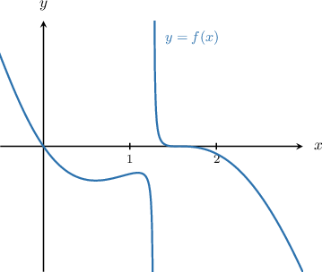
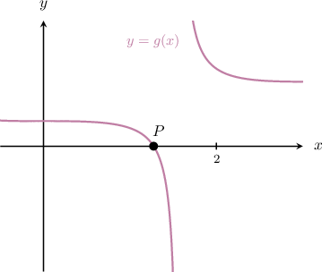
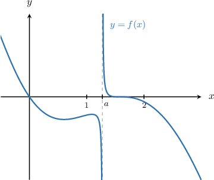
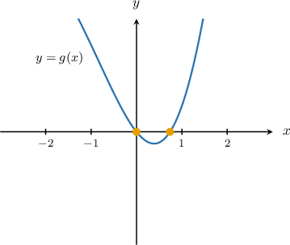
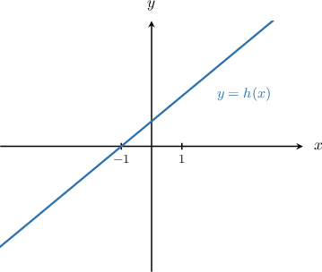
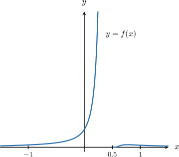
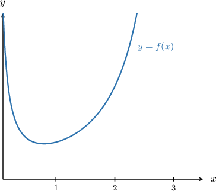
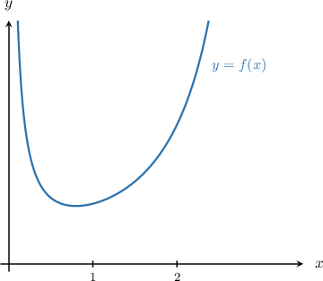
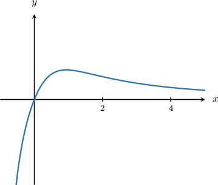
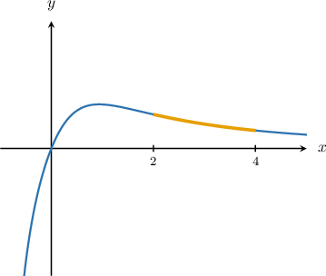

# Exploring Functions Using Technology

Source: https://www.mathacademy.com/topics/3213?courseId=24
Topic ID: 3213

## Prerequisites

- [Finding Derivatives Using a Graphing Calculator](./3172-finding-derivatives-using-a-graphing-calculator.md)
- [Finding Definite Integrals Using a Graphing Calculator](./4080-finding-definite-integrals-using-a-graphing-calculator.md)

## Lesson

### Introduction

Technology is especially useful when we wish to explore a function's behavior, yet the usual algebraic techniques we often use cannot help us.

For example, let's consider the following function:

$$

f(x) = \dfrac{x \sin{x} - x}{2 + x - \tan{x}}

$$

Plotting this function on our graphing calculator, we get the following.

This function has a vertical asymptote in the interval $x\in[1,2].$ How can we use our graphing calculator to find a good approximation of this asymptote's location?

The discontinuities of $f(x)$ occur at the points where the denominator equals zero. In other words, they correspond to the solutions of the equation

$$

2+x-\tan x = 0.

$$

This equation is difficult to solve using our usual algebraic techniques. So, instead, let's use our calculator to find a numerical approximation.

To do this, we define a function $g(x)$ as

$$

g(x) = 2 + x - \tan{x}.

$$

Our goal is to approximate the roots of $g(x).$ We start by plotting its graph:

The root we wish to find is the $x$-coordinate of the point $P.$

Using our graphing calculator's root-finding function in the usual way, we find that the root of $g(x)$ on $x\in [1,2]$ is given by

$$

x \approx 1.274\,39.

$$

rounded to $5$ decimal places.

Therefore, we conclude that $f(x)$ has a discontinuity at $x = a\approx 1.274\,39.$ Let's add this vertical asymptote to our original diagram.

### Example: Locating Infinite Discontinuities

#### Question

Consider the function $f(x),$ defined as

$$

f(x) = \dfrac{\sin{x} - x}{x^2 - x \cos{x}}.

$$

Find all the discontinuities of $f(x)$ on the interval $x \in [-3,3].$ Round you answer to $2$ decimal places.

#### Explanation

The function $f(x)$ has discontinuities at points where the denominator $g(x) = x^2 - x \cos{x}$ is equal to zero.

First, we plot $y=g(x)$ using a graphing calculator, zooming or adjusting the window ranges to better view the roots.

In our case, the appropriate window ranges could be the following:

- for the horizontal axis, $x \in [-3, 3]$

- for the vertical axis, $y \in [-2,2]$

This gives us the following graph:

The graph shows two roots that lie inside the intervals $x \in [-1,0.5]$ and $x \in [0.5, 1].$

Using our graphing calculator's root-finding function, we find that the roots of $g(x)$ are

$\qquad$ $x = 0 \quad$ and $\quad x \approx 0.74$

rounded to $2$ decimal places.

Therefore, we conclude that $f(x)$ has discontinuities ar $x=0$ and $x\approx 0.74.$

### Different Types of Discontinuity

Let's revisit the function $f(x)$ we saw earlier.

$$

f(x) = \dfrac{x \sin{x} - x}{2 + x - \tan{x}}

$$

The graph of this function is shown below.

Recall that the vertical asymptote is $x=a\approx 1.274\,39$ to five decimal places.

We can express the behavior of $f(x)$ in the neighborhood of $x=a$ using limits, as follows:

$$

\begin{aligned}\underset{𝑥→\,𝑎^{−}}{lim}𝑓(𝑥)=−∞,\,\underset{𝑥→\,𝑎^{+}}{lim}𝑓(𝑥)=∞.\end{aligned}

$$

Discontinuities that are not infinite can be hard to spot on a graphing calculator. For example, consider the following function:

$$

h(x) = \dfrac{x^2-1}{x-1}

$$

This function has a discontinuity at $x=1$ since the numerator and denominator both equal zero at this point. However, if we plot this function on a graphing calculator, we get the following:

Notice that the calculator doesn't appear to register the discontinuity at $x=1.$ Nonetheless, it is there! And we need to be mindful of it.

### Example: Exploring Limits of Functions Near Discontinuities

#### Question

$$

f(x) =\dfrac{e^{1/(1-2x) }\sin x}{ x \ln(4x^2 - 4x + 2)}

$$

The function $f(x)$ has discontinuities at $a=0$ and $b =0.5.$ Which of the following statements are true?

1. $\lim\limits_{x \to \, 0^+} f(x) = \infty$

2. $\lim\limits_{x \to \, 0.5^-} f(x) = \infty$

3. $\lim\limits_{x \to \, 0.5^+} f(x) = 0$

#### Explanation

We can plot the graph of $y=f(x)$ using a graphing calculator, zooming or adjusting the window ranges to get a better view of the local behavior, as shown below.

In our case, the appropriate window ranges could be the following:

- for the horizontal axis, $x \in [-1.5, 1.5]$

- for the vertical axis, $y \in [0,30]$

This gives us the following graph:

Let's now examine the graph.

- Statement I is false. The limit at $x=0$ is finite.

- Statement II is true. To the left of $x=0.5,$ the graph increases to $\infty.$

- Statement III is true. To the right of $x=0.5,$ the graph approaches $0.$

Therefore, the correct answer is "II and III only."

### Computing the Derivative of a Function at a Point From Its Graph

We've already seen how to approximate the derivative of a function using a graphing calculator's $\boxed{\color{gray}\,\text{nDeriv}\,}$ option (or equivalent).

We can also compute the derivative of a function by plotting it on a graphing calculator and then finding the derivative directly from the graph.

To see how this is done, consider the following function:

$$

f(x) = \dfrac{x^2+1}{3\sin{x}}

$$

The graph of $y=f(x)$ is shown below.

The window settings shown above are as follows:

- for the horizontal axis, $x \in [0,3]$

- for the vertical axis, $y \in [0,3]$

Let's compute $f'(1)$ directly from the graph. To do this, we follow these steps:

- First, we press $\boxed{\color{gray}\,2\text{nd}\,}$ (or $\boxed{\color{gray}\,\text{shift}\,}$), then $\boxed{\color{gray}\,\text{calc}\,}$ and select the $\boxed{\color{gray}\,\dfrac{\text{d}y}{\text{d}x}\,}$ option.

- Then, we need to enter the point at which to compute the derivative. So, we press $\boxed{\color{gray}X,T,\theta,n},$ type $X=1,$ and then press $\boxed{\color{gray}\,\text{enter}\,}.$

Following this process gives

$$

\dfrac{\textrm d y}{\textrm d x} = 0.283\,556\,8.

$$

Rounding the answer to three decimal places, we conclude that $f'(1) \approx 0.284.$

### Computing the Definite Integral of a Function From Its Graph

We can also approximate definite integrals of functions directly from their graphs.

Let's consider the following function once more.

$$

f(x) = \dfrac{x^2+1}{3\sin{x}}

$$

The graph of this function is shown again below.

As before, the window settings are:

- for the horizontal axis, $x \in [0,3]$

- for the vertical axis, $y \in [0,3]$

Let's compute the following integral directly from the graph:

$$

\int_1^2 f(x)\,\textrm d x

$$

- First, we press $\boxed{\color{gray}\,2\text{nd}\,}$ (or $\boxed{\color{gray}\,\text{shift}\,}$), then $\boxed{\color{gray}\,\text{calc}\,}$ and select the $\displaystyle\boxed{\color{gray}\,\int f(x)\,\textrm d x\,}$ option.

- Then, we select the lower limit. So, we press $\boxed{\color{gray}X,T,\theta,n},$ type $X=1,$ and then press $\boxed{\color{gray}\,\text{enter}\,}.$

- Next, we select the upper limit. So, we press $\boxed{\color{gray}X,T,\theta,n},$ type $X=2,$ and then press $\boxed{\color{gray}\,\text{enter}\,}.$

Following this process gives

$$

\int_1^2 f(x)\,\textrm d x = 1.158

$$

rounded to three decimal places.

### Example: Determining Various Properties of Functions From Their Graphs

#### Question

Consider the function $f(x),$ defined as

$$

f(x) = \dfrac{\ln(x^2 + 1)}{x^2 + x}.

$$

Which of the following statements are true?

1. The function is increasing on $x \in (2,4)$

2. Rounded to three decimal places, $f'(3) \approx -0.062$

3. Rounded to three decimal places, $\displaystyle\int_{2}^{4} f(x)\,\textrm d x \approx 0.393$

#### Explanation

We can plot the graph of $y=f(x)$ using a graphing calculator, zooming or adjusting the window ranges for each statement to get a better view of the local behavior.

In this case, appropriate window ranges could be the following:

- for the horizontal axis, $x \in [-1,5]$

- for the vertical axis, $y \in [-1,1]$

This gives the graph below.

Let's examine our statements in turn.

- Statement I is false. The graph below shows that the function is decreasing on $x \in (2,4).$

- Statement II is true. To find the derivative, follow these steps: First, we press $\boxed{\color{gray}\,2\text{nd}\,}$ (or $\boxed{\color{gray}\,\text{shift}\,}$), then $\boxed{\color{gray}\,\text{calc}\,}$ and select the $\boxed{\color{gray}\,\dfrac{\text{d}y}{\text{d}x}\,}$ option. Then, we need to enter the point at which to compute the derivative. So, we press $\boxed{\color{gray}X,T,\theta,n},$ type $X=3,$ and then press $\boxed{\color{gray}\,\text{enter}\,}.$ Following this process gives Rounding the answer to three decimal places, we conclude that $f'(3) \approx -0.062.$

- Statement III is true. To find the integral, follow these steps: First, we press $\boxed{\color{gray}\,2\text{nd}\,}$ (or $\boxed{\color{gray}\,\text{shift}\,}$), then $\boxed{\color{gray}\,\text{calc}\,}$ and select the $\displaystyle \boxed{\color{gray}\,\int f(x)\,\textrm d x\,}$ option. Then, we select the lower limit. So, we press $\boxed{\color{gray}X,T,\theta,n},$ type $X=2,$ and then press $\boxed{\color{gray}\,\text{enter}\,}.$ Next, we select the upper limit. So, we press $\boxed{\color{gray}X,T,\theta,n},$ type $X=4,$ and then press $\boxed{\color{gray}\,\text{enter}\,}.$ Following this process gives Rounding the answer to three decimal places, we conclude that $\displaystyle\int_{2}^{4} f(x)\,\textrm d x \approx 0.393.$

Therefore, the correct answer is "II and III only."
