# Slope Fields for Directly Integrable Differential Equations

Source: https://www.mathacademy.com/topics/3276?courseId=24
Topic ID: 3276

## Prerequisites

- [Qualitative Analysis of First-Order ODEs](./2976-qualitative-analysis-of-first-order-odes.md)

## Lesson

### Introduction

Consider the following differential equation:

$$

\dfrac{\textrm d y}{\textrm d x} = 2x^3

$$

Let's try to understand what the solution curves look like *without* solving the equation. We can do this by plotting the **slope field** of this equation. The slope field is a graphical representation of the solution at a finite number of points in the domain.

We start by creating a table of values. Let's pick a few integer values of $x$ and $y$ near the origin.

We then calculate the slope at each point and record each answer in the table. For example, the slope at the point $(1,1)$ is

$$

\left.\dfrac{\textrm d y}{\textrm d x}\right|_{({\color{red}{1}},1)} = 2({\color{red}{1}})^3 = {\color{blue}{2}}.

$$

Filling in our table gives the following set of results:

We're now able to plot the slope field. Let's set up our points in the Cartesian plane:

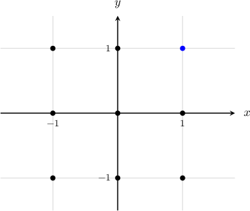

To plot the slope field, we draw a small line segment at each point. The slope of each segment should equal the slope that we calculated for that point. This gives the following picture:

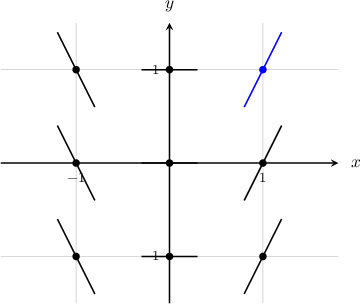

And that's it! We have successfully sketched the slope field at these points.

Finally, note that the general solution to our original equation is $y=\dfrac12x^4 + C.$ If we add a few solution curves to our picture, we see that the slope field indeed depicts the solutions at our chosen points.

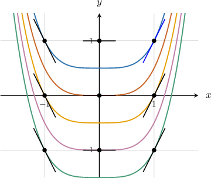

### Example: Sketching the Slope Field of a Differential Equation at Some Isolated Points

#### Question

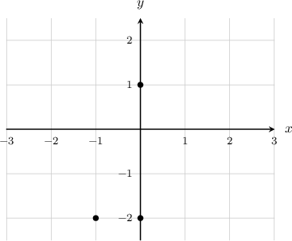

Sketch the slope field of the differential equation $\dfrac{\textrm d y}{\textrm d x} = 4x+2$ at the points indicated in the diagram above.

#### Explanation

We have to sketch the slope fields at the points $(-1,-2), (0,-2),$ and $(0,1).$

To sketch the slope field at the given points, we substitute their coordinates into the right-hand side of the differential equation:

$$

\begin{aligned} & \frac{d𝑦}{d𝑥}_{(−1,−2)}=4(−1)+2=−2 \\ & \frac{d𝑦}{d𝑥}_{(0,−2)}=4(0)+2=2 \\ & \frac{d𝑦}{d𝑥}_{(0,1)}=4(0)+2=2\end{aligned}

$$

Setting up our points and drawing our line segments, we get the following:

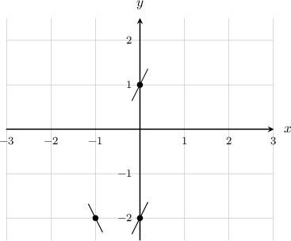

### Properties of Slope Fields of Directly Integrable Equations

Let's go back to our original differential equation:

$$

\dfrac{\textrm d y}{\textrm d x} = 2x^3

$$

The right-hand side is a function of $x$ only. In other words, the slope (derivative) at each point in the slope field is *independent of the value of $y$ at that point.*

Let's remind ourselves of the slope field for this differential equation:

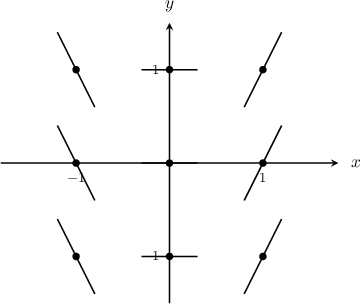

If we draw a fixed vertical line, the slopes touching the line do not vary as we go up and down the line.

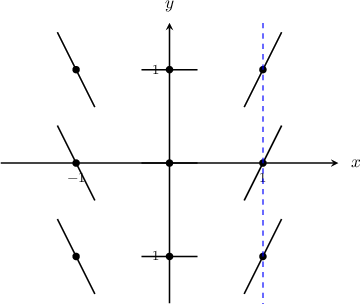

In general, for any differential equation of the form

$$

\dfrac{\textrm d y}{\textrm d x} = f(x),

$$

the slope field does not vary with $y$ (for a fixed value of $x$).

### Example: Identifying True Statements Regarding Slope Fields

#### Question

Consider the differential equation $\dfrac{\textrm{d}y}{\textrm{d}x} = x^2 + 2x$ and its slope field. Which of the following statements are true?

1. At every point along the line $x=-1,$ the slope of the slope field does not vary

2. At every point along the line $x=0,$ the slope field is horizontal

3. At every point along the line $y=1,$ the slope of the slope field does not vary

#### Explanation

Notice that we are given an equation of the form

$$

\dfrac{\textrm d y}{\textrm d x} = f(x).

$$

The right-hand side is a function of $x$ only. This means that, for a fixed value of $x,$ the slope does not vary with $y.$

Now, let's check each statement:

- Statement I is true. Consider a point of the form $(-1,y)$ where $y$ is arbitrary. We have and this implies that the slope of the slope field at the point $(-1, y)$ is equal to $-1$ for any $y.$

- Statement II is true. Consider a point of the form $(0,y)$ where $y$ is arbitrary. We have and this implies that the slope at the point $(0,y)$ is horizontal for any $y.$

- Statement III is false. Consider a point of the form $(x,1)$ where $x$ is arbitrary. We have and this implies that the slope of the slope field at the point $(x,1)$ depends on $x.$

We can use the information given by the true statements to begin sketching the slope field, as shown below.

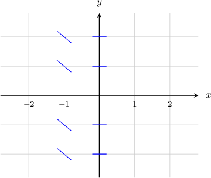

### Example: Identifying a Possible Slope Field Based on the Type of Equation

#### Question

Which of the following could be the slope field for the differential equation $\dfrac{\textrm d y}{\textrm d x} = f(x)?$

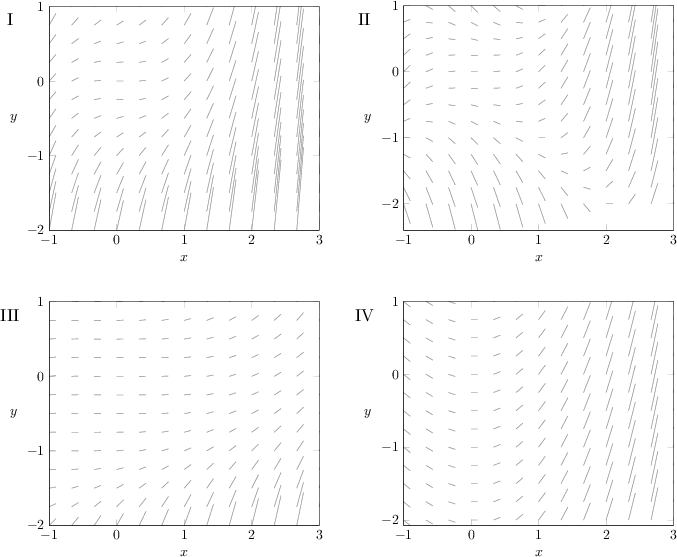

#### Explanation

Notice that we are given an equation of the form

$$

\dfrac{\textrm d y}{\textrm d x} = f(x).

$$

The right-hand side is a function of $x$ only. This means that, for a fixed value of $x,$ the slope field does not vary with $y.$

Of the given slope fields, the only one that does not vary with $y$ for a fixed value of $x$ is the following:

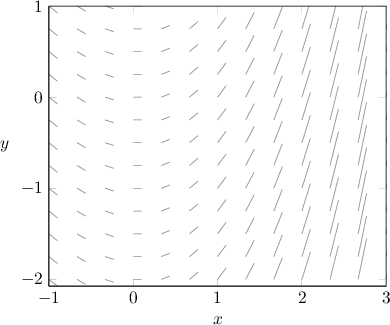

To see this more clearly, notice that if we draw a vertical line, the slopes touching the line do not vary as we go up and down the line.

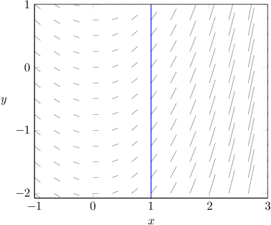
