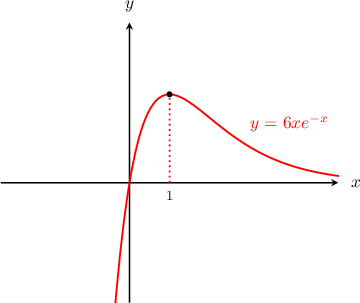

# The Second Derivative Test

Source: https://www.mathacademy.com/topics/339?courseId=24
Topic ID: 339

## Prerequisites

- [Using the First Derivative Test to Classify Local Extrema](./1360-using-the-first-derivative-test-to-classify-local-extrema.md)
- [Relating Concavity to the Second Derivative](./3846-relating-concavity-to-the-second-derivative.md)

## Lesson

### Introduction

We can use the **second derivative test** to determine whether a stationary point is a local (or relative) maximum or a local (or relative) minimum.

The second derivative test involves the following two steps.

**Step 1:** Find the stationary points of the function, that is, the points where $f'(x)=0.$

**Step 2:** Find the second derivative $f''(x)$ and use it to classify the stationary points according to the "second derivative test" as follows:

- If $f''(x)< 0$ at a stationary point, then that stationary point is a local maximum (because a concave-down function looks like a downward-opening parabola near the stationary point).

- If $f''(x) > 0$ at the stationary point, then that stationary point is a local minimum (because a concave-up function looks like an upward-opening parabola near the stationary point).

In essence, the second derivative test uses the function's concavity at the stationary point to decide whether it's a local maximum or a local minimum.

Let's use the second derivative test to determine the local maxima and minima of $f(x)= 6xe^{-x}.$

**Step 1:** Find the stationary points of the function. In this case, we have

$$

\begin{aligned}𝑓^{′}(𝑥) & =0 \\ (6𝑥𝑒^{−𝑥})^{′} & =0 \\ 6𝑒^{−𝑥}−6𝑥𝑒^{−𝑥} & =0 \\ −6𝑒^{−𝑥}(𝑥−1) & =0 \\ 𝑥−1 & =0 \\ 𝑥 & =1.\end{aligned}

$$

So, we have a single stationary point $x=1.$

**Step 2:** Find the second derivative $f''(x)$ and use it to classify the stationary points according to the second derivative test. Computing the second derivative, we have

$$

\begin{aligned}𝑓^{″}(𝑥) & =(−6𝑒^{−𝑥}(𝑥−1))^{′} \\ & =6𝑒^{−𝑥}(𝑥−1)−6𝑒^{−𝑥} \\ & =6𝑒^{−𝑥}(𝑥−2) \\ 𝑓^{″}(1) & =−\frac{6}{𝑒}<0.\end{aligned}

$$

Since $f''(1)< 0,$ we conclude that $f$ has a **local maximum** at $x=1.$ Indeed, this matches up with what we see in the graph:

**Warning**: Sometimes, the second derivative test gives $f''(x) = 0$ at the stationary point. When this happens, it means that the second derivative test has *failed*, and we should use the first derivative test instead.

### Example: Classifying a Given Critical Point Using the Second Derivative Test

#### Question

Consider the function $f(x) = x^3-6x^2-15x.$ Given that $f'(5) = 0,$ which of the following statements are true?

1. $f''(5) > 0$

2. $f(x)$ has a relative minimum at $x=5$

3. $f(x)$ has a relative maximum at $x=5$

#### Explanation

We're given that $x=5$ is a stationary point of $f(x).$ We will use the second derivative test to classify this stationary point.

Calculating the first derivative for the function $f(x)= x^3-6x^2-15x,$ we get

$$

f'(x) = 3x^2-12x-15

$$

We're given that $f'(5) = 0.$ Indeed, we can see that $f'(5) = 3(5)^2 - 12(5) - 15 = 0.$

Calculating the second derivative, we get

$$

\begin{aligned}𝑓^{″}(𝑥) & =6𝑥−12\end{aligned}

$$

Substituting $x=5,$ we get

$$

\begin{aligned}𝑓^{″}(5) & =6(5)−12 \\ & =30−12 \\ & =18>0\end{aligned}

$$

Since the second derivative is positive, we conclude that $f(x)$ has a relative minimum at $x=5.$

Therefore, the correct answer is "I and II only."

### Example: Finding Critical Points and Then Classifying Them Using the Second Derivative Test

#### Question

Find the $x$-values of the stationary points of $f(x) = x^4 - 8 x ^ 2 + 2$ and classify each point.

#### Explanation

First, we need to identify the critical points. Differentiating $f(x) = x^4 - 8 x ^ 2 + 2,$ we get

$$

f'(x) = 4x^3 - 16 x,

$$

and solving $f'(x)=0,$ we get

$$

\begin{aligned}4𝑥^{3}−16𝑥 & =0 \\ 𝑥^{3}−4𝑥 & =0 \\ 𝑥(𝑥^{2}−4) & =0 \\ 𝑥(𝑥+2)(𝑥−2) & =0 \\ 𝑥 & =0,±2.\end{aligned}

$$

So we have stationary points at $x=0$ and $x=\pm 2.$

Next, we need to determine the sign of $f''(x)$ at the critical points. Computing $f''(x),$ we get

$$

f''(x)= 12 x^2 - 16,

$$

and evaluating $f''(x)$ at each critical point, we get

$$

\begin{aligned}𝑓^{″}(−2) & =12(−2)^{2}−16=32>0 \\ 𝑓^{″}(0) & =12(0)^{2}−16=−16<0 \\ 𝑓^{″}(2) & =12(2)^{2}−16=32>0.\end{aligned}

$$

The second derivative is negative at $x=0,$ so this is a relative maximum. On the other hand, the second derivative is positive at $x=\pm 2,$ so these are relative minima.
