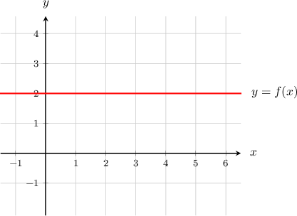

# The Power Rule for Differentiation

Source: https://www.mathacademy.com/topics/35?courseId=24
Topic ID: 35

## Prerequisites

- [Writing Radical Expressions Using Fractional Exponents](../../../high-school/traditional/lessons/algebra-i/380-writing-radical-expressions-using-fractional-exponents.md)
- [Defining the Derivative Using Derivative Notation](./812-defining-the-derivative-using-derivative-notation.md)

## Lesson

### Introduction

We know how to differentiate a function like $f(x)=x^2$ using the definition of the derivative. However, there is a trick to do it faster!

The trick is called the **power rule**, and it states that for a general power function in the form $f(x) = x^n,$ the derivative is given by

$$

f'(x) = nx^{n-1}.

$$

The function $f(x)=x^2$ takes the form $f(x)=x^n$ with $n=2,$ so we can use the power rule to compute its derivative:

$$

\begin{aligned}𝑓^{′}(𝑥) & =𝑛𝑥^{𝑛−1} \\ & =2𝑥^{2−1} \\ & =2𝑥^{1} \\ & =2𝑥\end{aligned}

$$

This result agrees with what we would get if we used the definition of the derivative. However, using the power rule, the computations are much easier!

### Example: Computing the Derivative of a Power Function Using the Power Rule

#### Question

Find $f'(x)$ when $f(x)=x^3.$

#### Explanation

The power rule states that if $f(x) = x^n,$ then $f'(x) = nx^{n-1}.$

For the function $f(x)=x^3,$ we have $n=3.$ So

$$

\begin{aligned}𝑓^{′}(𝑥) & =3⋅𝑥^{3−1}=3𝑥^{2}.\end{aligned}

$$

### Example: Computing the Derivative of a Negative Power Function Using the Power Rule

#### Question

Calculate the derivative of $f(x)=\dfrac{1}{x^2}.$

#### Explanation

Here, we can rewrite the function as

$$

f(x)= \dfrac{1}{x^2} = x^{-2}.

$$

Applying the power rule with $n=-2,$ we get

$$

\begin{aligned}𝑓^{′}(𝑥) & =(−2)⋅𝑥^{−2−1} \\ & =−2𝑥^{−3} \\ & =−\frac{2}{𝑥^{3}}.\end{aligned}

$$

### The Differential Operator

For a function $f(x),$ we can express the derivative as $f'(x).$

Recall that we can also express the derivative using the **differential operator**, as follows:

$$

\dfrac{\mathrm{d}f}{\mathrm{d}x}

$$

We can use the differential operator while computing the derivative, too. For example, the power rule can be expressed as

$$

\dfrac{\mathrm{d}}{\mathrm{d}x} \left( x^n \right) = nx^{n-1}.

$$

In general, $\dfrac{\textrm d}{\textrm d x}\big(\cdots\big)$ just means that we need to differentiate whatever is inside $\big(\cdots\big)$ with respect to $x.$

### Example: Computing the Derivative of a Fractional Power Function Using the Power Rule

#### Question

Find $\dfrac{\textrm{d}y}{\textrm{d}x}$ when $y=\sqrt{x}.$

#### Explanation

Writing the radical as a rational exponent, we have

$$

y=\sqrt{x}=x^{1/2}.

$$

Applying the power rule with $n=\dfrac{1}{2},$ we get

$$

\begin{aligned}\frac{d𝑦}{d𝑥} & =\frac{d}{d𝑥}(𝑥^{1/2}) \\ & =\frac{1}{2}𝑥^{1/2−1} \\ & =\frac{1}{2}𝑥^{−1/2} \\ & =\frac{1}{2\sqrt{√𝑥}}.\end{aligned}

$$

### The Derivative of the Constant Function

In general, if $f(x) = k$ where $k$ is a constant, then $f'(x) = 0.$ There are a couple ways to see why this is.

First, let's take the constant function $f(x)=2$ but write it a little differently:

$$

f(x) = 2 \cdot 1 = 2x^0.

$$

To differentiate the function above, we can use the power rule with $n=0.$ Applying the power rule gives

$$

\begin{aligned}𝑓^{′}(𝑥) & =0⋅2𝑥^{0−1} \\ & =0⋅2𝑥^{−1} \\ & =0.\end{aligned}

$$

There's nothing special about the number $2.$ The same result would hold for *any* constant function.

We can also think about this geometrically. The function $y=f(x)=2$ is a horizontal line, and it does not rise or fall as we change $x.$ So, its slope is zero everywhere, and therefore $f'(x) = 0$ everywhere.

### Example: Computing the Derivative of a Constant Function Using the Power Rule

#### Question

Find $f'(x)$ if $f(x) = 12.$

#### Explanation

Since $f(x)$ is constant, its derivative is zero. Therefore, $f'(x)=0.$
