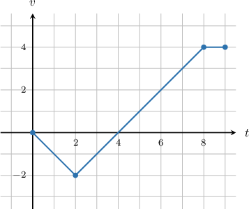

# Calculating the Displacement of a Particle Using Integration

Source: https://www.mathacademy.com/topics/3576?courseId=24
Topic ID: 3576

## Prerequisites

- [The Integral as an Accumulation Function](./333-the-integral-as-an-accumulation-function.md)
- [Calculating the Position Function of a Particle Using Integration](./335-calculating-the-position-function-of-a-particle-using-integration.md)

## Lesson

### Introduction

The **total displacement** $d$ of a particle over the time interval $t \in [a,b]$ is the difference in the position of the particle between $t=a$ and $t=b.$

$$

d = x(b) - x(a).

$$

Now, the fundamental theorem of calculus states that

$$

d = x(b) - x(a) = \int_a^b x'(t) \, \textrm dt

$$

and since $x'(t) = v(t),$ we can find the total displacement of a particle by integrating the velocity:

$$

d = x(b) - x(a) = \int_a^b v(t) \, \textrm dt

$$

To summarize, the total displacement of a particle over the time interval $t \in [a,b]$ can be found by integrating the velocity $v(t)$ over the time interval $t\in[a,b].$

$$

\begin{aligned}𝑑 & =∫_{𝑏𝑎}^{}𝑣(𝑡)\,d𝑡\end{aligned}

$$

### Example: Finding the Total Displacement of a Particle Given Its Velocity

#### Question

A particle $P$ moves along the $x$-axis and its velocity at time $t$ is given by $v(t) = 2t + 3t^2.$ What is the total displacement of the particle between $t=1$ and $t=3?$

#### Explanation

We find the total displacement by calculating the definite integral of the velocity.

Let $d$ be the total displacement. Then, we have

$$

\begin{aligned}𝑑 & =∫_{31}^{}(2𝑡+3𝑡^{2})\,d𝑡 \\ & =(𝑡^{2}+𝑡^{3})_{31}^{} \\ & =[3^{2}+3^{3}]−[1^{2}+1^{3}] \\ & =[9+27]−[1+1] \\ & =36−2 \\ & =34.\end{aligned}

$$

So the total displacement between $t=1$ and $t=3$ is $34.$

### Example: Finding the Final Position of a Particle

#### Question

A particle $P$ moves along the $x$-axis and its velocity at time $t>0$ is given by $v(t) = 6t^2 +4t.$ At time $t=2$ the particle is located at the position $x=-20.$ What is the position of the particle at time $t=4?$

#### Explanation

The position of the particle at $t=4$ is equal to its position at $t=2$ plus the total displacement over $t\in[2,4].$ Therefore, we can calculate it as follows:

$$

x(4) = x(2) + \int_2^4 v(t)\,\textrm{d}t

$$

Carrying out the computations, we get

$$

\begin{aligned}𝑥(4) & =−20+∫_{42}^{}(6𝑡^{2}+4𝑡)\,dt \\ & =−20+[2𝑡^{3}+2𝑡^{2}]_{42}^{} \\ & =−20+([2(4)^{3}+2(4)^{2}]−[2(2)^{3}+2(2)^{2}]) \\ & =−20+([128+32]−[16+8]) \\ & =−20+(160−24) \\ & =−20+136 \\ & =116.\end{aligned}

$$

So the position of the particle at $t=4$ is $x=116.$

### Example: Finding the Final Position of a Particle Given a Velocity-Time Graph

#### Question

The graph above shows the velocity of an object moving in a straight line along the $x$-axis. At time $t=2$ the particle is located at the position $x=-1.$ What is the position of the particle at time $t=8?$

#### Explanation

The position of the particle at $t = 8$ is equal to its position at $t=2$ plus the total displacement over $t\in [2,8].$ Therefore, we can calculate it as follows:

$$

x(8) = x(2)+ \int_2^8 v(t) \, \textrm d t

$$

We are told that $x(2)=-1$, and we can compute the integral $\displaystyle\int_2^8 v(t) \, \textrm dt$ by finding the signed area under the graph from $t=2$ to $t=8.$ Computing the signed area, we get

$$

\int_2^8 v(t) \, \textrm dt = 6.

$$

Therefore,

$$

x(8) = -1+ 6 = 5

$$

So the position of the particle at $t=8$ is $x=5.$
