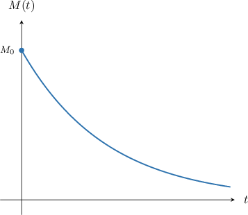
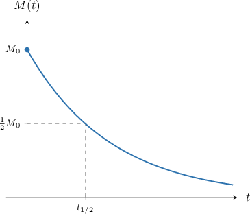
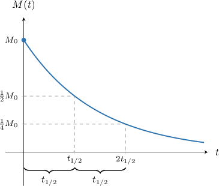
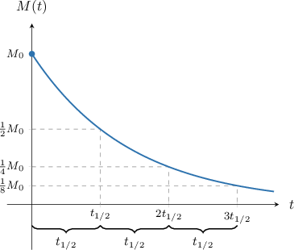

# Exponential Growth and Decay Models With First-Order ODEs: Half-Life Problems

Source: https://www.mathacademy.com/topics/3673?courseId=24
Topic ID: 3673

## Prerequisites

- [Exponential Growth and Decay Models With First-Order ODEs: Calculating Unknown Times and Initial Values](./3672-exponential-growth-and-decay-models-with-first-order-odes-calculating-unknown-times-and-initial-values.md)

## Lesson

### Introduction

Some substances emit **radiation,** meaning that they release energy, often in the form of small particles, into the surrounding environment. If a substance emits radiation, it is **radioactive**.

Since radioactive substances are continually losing particles to the surrounding environment, the mass of a radioactive substance will decrease over time.

The mass $M(t)$ of a radioactive sample is governed by the differential equation

$$

M'(t) = -kM(t), \qquad M(0) = M_0,

$$

where $t$ is the time, $M_0$ is the initial mass of the sample, and the constant $k$ is dependent upon the type of substance.

The general solution to this initial value problem is

$$

M(t) = M_0 e^{-kt}.

$$

A graph showing how the mass of a typical radioactive substance varies with time is shown below.

Every type of radioactive substance has a value of $k$ associated with it. However, rather than working with $k,$ physicists and chemists tend to prefer working with the **half-life** of a substance. The half-life of a particular substance is the time it takes for a sample of that substance to decrease by a factor of one-half.

The half-life of a substance is denoted $t_{1/2},$ and is the time indicated in the diagram below.

The half-life also tells us how long it takes for the mass of the substance to halve once again.

And again.

This pattern of continually halving in mass continues indefinitely.

### Deriving a Formula for the Half-Life

The mass $M(t)$ of a radioactive substance is given by

$$

M(t) = M_0 e^{-kt}.

$$

The half-life of a substance is the time taken for the mass of a sample to reduce by a factor of one-half. Therefore, it is the solution to the equation

$$

\dfrac12 M_0 = M_0 e^{-kt}.

$$

We can solve this equation for $t,$ as follows:

$$

\begin{aligned}\frac{1}{2}𝑀_{0} & =𝑀_{0}𝑒^{−𝑘𝑡} \\ \frac{1}{2}𝑀_{0} & =𝑀_{0}𝑒^{−𝑘𝑡} \\ \frac{1}{2} & =𝑒^{−𝑘𝑡} \\ ln⁡(\frac{1}{2}) & =ln⁡(𝑒^{−𝑘𝑡}) \\ ln⁡1−ln⁡2 & =−𝑘𝑡 \\ −ln⁡2 & =−𝑘𝑡 \\ 𝑡 & =\frac{ln⁡2}{𝑘}.\end{aligned}

$$

Therefore, the half-life of a substance is given by the formula

$$

t_{1/2} = \dfrac{\ln 2}{k}.

$$

Every radioactive substance has a half-life associated with it. It depends only on the substance itself and is independent of its initial mass of the sample (we know this because we were able to cancel $M_0$ in our derivation of $t_{1/2}$).

It's worth noting that half-lives show significant variation in magnitude across different substances. Some substances that decay very rapidly have half-lives on the order of nanoseconds. On the other hand, some substances that decay very slowly have half-lives that are on the order of billions of years.

### Example: Using the Half-Life Formula

#### Question

The mass $M(t),$ in grams, of a sample of iron-60 is given by

$$

M(t) = 100 e^{-kt},

$$

where $t$ is the time, in millions of years. The half-life of iron-60 is $2.6$ million years. Rounded to three significant figures, what is the value of $k?$

#### Explanation

The mass $M(t)$ of a radioactive substance at time $t$ can be modeled by the differential equation

$$

M'(t) = -kM(t), \qquad M(0) = M_0.

$$

The general solution to this equation is

$$

M(t) = M_0e^{-kt}.

$$

The half-life $t_{1/2}$ is the time taken for the mass of the substance to reduce by one half and is given by

$$

t_{1/2} = \dfrac{\ln 2}{k}.

$$

Since we know that $t_{1/2} = 2.6$ million years, we have

$$

2.6 = \dfrac{\ln 2}{k}\quad\Rightarrow\quad k = \dfrac{\ln 2}{2.6} \approx 0.267.

$$

### Example: Solving Problems Involving Radioactive Decay Given the Half-Life of a Substance

#### Question

The half-life of bismuth-210 is $5.012$ days. How long does it take for a $1\,280\,\textrm g$ sample of bismuth-210 to reduce to $5\,\textrm g?$

#### Explanation

The mass $M(t)$ of a radioactive substance at time $t$ can be modeled by the differential equation

$$

M'(t) = -kM(t), \qquad M(0) = M_0.

$$

The general solution to this equation is

$$

M(t) = M_0e^{-kt}.

$$

The half-life $t_{1/2}$ is the time taken for the mass of the substance to reduce by one half and is given by

$$

t_{1/2} = \dfrac{\ln 2}{k}.

$$

There are two methods that we can use to solve this problem. We describe each of them below.

****

Since we know that $t_{1/2} = 5.012$ days we have

$$

5.012 = \dfrac{\ln 2}{k}\quad\Rightarrow\quad k = \dfrac{\ln 2}{5.012}

$$

Also, since $M_0 = 1\,280\,\textrm g,$ we have the particular solution

$$

M(t) = 1\,280 e^{-t\ln 2/5.012}.

$$

We wish to calculate the time $t$ such that $M(t) = 5\,\textrm g.$ So, we set up our equation as follows:

$$

5 = 1\,280 e^{-t\ln 2/5.012}

$$

Solving this equation for $t,$ we get

$$

\begin{aligned}5 & =1\,280𝑒^{−𝑡ln⁡2/5.012} \\ \frac{5}{1\,280} & =𝑒^{−𝑡ln⁡2/5.012} \\ \frac{1}{256} & =𝑒^{−𝑡ln⁡2/5.012} \\ ln⁡(\frac{1}{256}) & =ln⁡(𝑒^{−𝑡ln⁡2/5.012}) \\ ln⁡1−ln⁡256 & =−\frac{𝑡ln⁡2}{5.012} \\ −ln⁡256 & =−\frac{𝑡ln⁡2}{5.012} \\ 𝑡 & =\frac{5.012⋅ln⁡256}{ln⁡2} \\ 𝑡 & ≈40.\end{aligned}

$$

Therefore, we conclude that it takes approximately $40$ days for the mass of the substance to reduce to $5\,\textrm g.$

****

We wish to calculate the time $t$ such that $M(t) = 5\,\textrm g.$ Notice that

$$

\begin{aligned}\frac{𝑀(𝑡)}{𝑀(0)} & =\frac{5\,g}{1\,280\,g} \\ & =\frac{1}{256} \\ & =(\frac{1}{2})^{8},\end{aligned}

$$

or equivalently

$$

M(t) = \left(\dfrac{1}{2}\right)^8\cdot M(0).

$$

From this equation, we see that $8$ half-lives must have occurred for the mass to reduce from $1\,280\,\textrm g$ to $5\,\textrm g.$ Hence,

$$

t = 8\cdot t_{1/2} =8 \cdot 5.012 \approx 40.

$$

Therefore, we conclude that it takes approximately $40$ days for the mass of the substance to reduce to $5\,\textrm g.$

### Example: Using Radioactive Dating to Estimate the Age of an Object

#### Question

At a geological site, an object is found with $65\%$ of its original chlorine-36 content. Given that the half-life of chlorine-36 is $301$ thousand years, approximately how old is the object?

#### Explanation

The mass $M(t)$ of a radioactive substance at time $t$ can be modeled by the differential equation

$$

M'(t) = -kM(t), \qquad M(0) = M_0.

$$

The general solution to this equation is

$$

M(t) = M_0e^{-kt}.

$$

The half-life $t_{1/2}$ is the time taken for the mass of the substance to reduce by one half and is given by

$$

t_{1/2} = \dfrac{\ln 2}{k}.

$$

Since we know that $t_{1/2} = 301$ thousand years, we have

$$

301 = \dfrac{\ln 2}{k}\quad\Rightarrow\quad k = \dfrac{\ln 2}{301}.

$$

So, we have

$$

M(t) = M_0 e^{-t\ln 2/301}.

$$

We wish to calculate the time $t$ such that $M(t) = 0.65 M_0.$ So, we set up our equation as follows:

$$

0.65M_0 = M_0 e^{-t\ln 2/301}

$$

Solving this equation for $t,$ we get

$$

\begin{aligned}0.65𝑀_{0} & =𝑀_{0}𝑒^{−𝑡ln⁡2/301} \\ 0.65𝑀_{0} & =𝑀_{0}𝑒^{−𝑡ln⁡2/301} \\ 0.65 & =𝑒^{−𝑡ln⁡2/301} \\ ln⁡(0.65) & =ln⁡(𝑒^{−𝑡ln⁡2/301}) \\ ln⁡(0.65) & =−\frac{𝑡ln⁡2}{301} \\ 𝑡 & =−\frac{301⋅ln⁡(0.65)}{ln⁡2} \\ 𝑡 & ≈187.\end{aligned}

$$

Therefore, we conclude that the object is approximately $187$ thousand years old.
