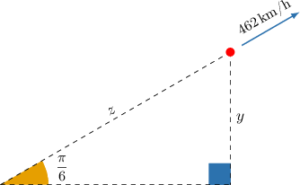
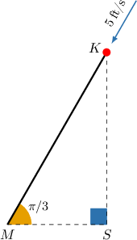
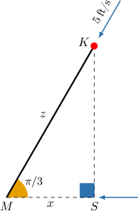
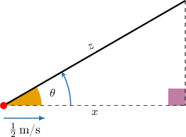
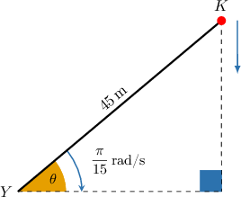
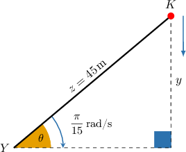
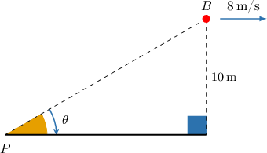
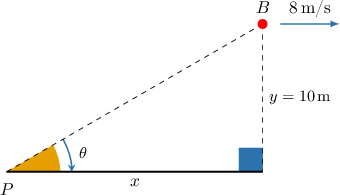

# Calculating Related Rates Using Trigonometry

Source: https://www.mathacademy.com/topics/369?courseId=24
Topic ID: 369

## Prerequisites

- [Modeling With Trigonometry](../../../high-school/traditional/lessons/geometry/641-modeling-with-trigonometry.md)
- [Related Rates With Implicit Functions](./4059-related-rates-with-implicit-functions.md)

## Lesson

### Introduction

Suppose that a jet takes off and climbs with an angle of $\dfrac{\pi}{6}$ radians to the horizontal. The speed of the jet is $462\,\text{km}/\text{h}$ and the angle of elevation does not change. How fast is the altitude of the jet increasing?

Let's begin by drawing a diagram depicting the given information.

In the figure, $y$ is the jet's height from the ground (i.e., its altitude), $z$ is the jet's distance from its take-off point. The quantity that we're required to calculate is

$$

\dfrac{\textrm d y}{\textrm d t}.

$$

To do this, let's start by setting up a relation between $y$ and $z.$ Relative to the angle $\theta = \dfrac{\pi}{6},$ the sides $y$ and $z$ are the opposite and hypotenuse, respectively. So, we have

$$

\begin{aligned}sin⁡(\frac{𝜋}{6}) & =\frac{𝑦}{𝑧} \\ \frac{1}{2} & =\frac{𝑦}{𝑧} \\ 𝑦 & =\frac{1}{2}𝑧.\end{aligned}

$$

Now, we differentiate both sides of the equation with respect to $t$ using the chain rule, and we get

$$

\begin{aligned}\frac{d}{d𝑡}(𝑦) & =\frac{d}{d𝑡}(\frac{1}{2}𝑧) \\ \frac{d𝑦}{d𝑡} & =\frac{1}{2}\frac{d𝑧}{d𝑡}.\end{aligned}

$$

We know that $\dfrac{\textrm d z}{\textrm d t} = 462\,\text{km/h},$ so plugging this into the above gives

$$

\dfrac{\textrm d y}{\textrm d t} = \dfrac{1}{2} \cdot 462 = 231.

$$

Therefore, the altitude is increasing at a rate of $231\,\text{km/h}.$

### Example: Calculating the Rate of Change of a Leg or the Hypotenuse at a Fixed Angle

#### Question

Maria is flying a kite $K$ at an angle of $\dfrac{\pi}{3}$ to the horizontal. The kite's shadow $S$ is projected onto the ground vertically below the kite. If the kite is moving towards Maria with a speed of $5\,\text{ft}/\text{s},$ what is the speed of the kite's shadow?

**: Remember that speed is always positive or zero.

#### Explanation

Let $x$ be the distance between María and the shadow, and let $z$ be the distance between Maria and the kite.

We want to find $\dfrac{\textrm d x}{\textrm dt}.$ To do this, let's start by setting up a relation between $x$ and $z.$ Relative to the angle $\theta = \dfrac{\pi}{3},$ the sides $x$ and $z$ are the adjacent and hypotenuse, respectively. So, we have

$$

\begin{aligned}cos⁡(\frac{𝜋}{3}) & =\frac{𝑥}{𝑧} \\ \frac{1}{2} & =\frac{𝑥}{𝑧} \\ 𝑥 & =\frac{1}{2}𝑧.\end{aligned}

$$

Now, we differentiate both sides of the equation with respect to $t$ using implicit differentiation, and we get

$$

\begin{aligned}\frac{d}{d𝑡}(𝑥) & =\frac{d}{d𝑡}(\frac{1}{2}𝑧) \\ \frac{d𝑥}{d𝑡} & =\frac{1}{2}\frac{d𝑧}{d𝑡}.\end{aligned}

$$

We know that $\dfrac{\textrm d z}{\textrm dt} = -5\,\text{ft/s}$ (negative because the distance between Maria and the kite is decreasing). Substituting this into the above gives

$$

\dfrac{\textrm d x}{\textrm dt} = \dfrac{1}{2} \cdot (-5) = -2.5.

$$

Therefore, the speed of the shadow is $2.5\,\text{ft/s}.$

### Calculating Rates of Varying Angles Using Trigonometry

Consider a $2\,\text{m}$ ladder that leans against a wall, forming an angle $\theta$ with the ground. The bottom of the ladder is pushed toward the wall at a rate of $\dfrac 1 2 \,\text{m}/\text{s},$ as shown below. How fast is the angle $\theta$ increasing?

Let's begin by drawing a figure according to the given information.

In the figure, $z$ is the length of the ladder and $x$ the distance of the bottom of the ladder from the wall. The quantity $z=2$ does not change with time because the length of the ladder is fixed.

Our job is to calculate

$$

\dfrac{\textrm d \theta}{\textrm d t}.

$$

To do this, let's start by setting up a relation between $x$ and $z.$ Relative to the angle $\theta,$ the sides $x$ and $z$ are the adjacent and hypotenuse, respectively. So, we have

$$

\begin{aligned}cos⁡𝜃 & =\frac{𝑥}{𝑧} \\ cos⁡𝜃 & =\frac{𝑥}{2}.\end{aligned}

$$

Now, we differentiate both sides of the equation with respect to $t$ using the chain rule, and we get

$$

\begin{aligned}\frac{d}{d𝑡}(cos⁡𝜃) & =\frac{d}{d𝑡}(\frac{𝑥}{2}) \\ −sin⁡𝜃⋅\frac{d𝜃}{d𝑡} & =\frac{1}{2}\frac{d𝑥}{d𝑡}\end{aligned}

$$

Finally, since the bottom of the ladder is pushed against the wall at a rate of $\dfrac 1 2 \,\text{m}/\text{s},$ we have $\dfrac{\textrm dx}{\textrm d t} = \dfrac{1}{2},$ and therefore

$$

\begin{aligned}−sin⁡𝜃⋅\frac{d𝜃}{d𝑡} & =\frac{1}{2}⋅\frac{1}{2} \\ −sin⁡𝜃⋅\frac{d𝜃}{d𝑡} & =\frac{1}{4} \\ \frac{d𝜃}{d𝑡} & =−\frac{1}{4sin⁡𝜃} \\ \frac{d𝜃}{d𝑡} & =−\frac{1}{4}csc⁡𝜃.\end{aligned}

$$

### Example: Calculating the Rate of Change of a Leg as an Angle Varies

#### Question

Yurii is flying a kite $K$ with a string of length $45\,\text{m}.$ The angle of elevation of the kite $\theta$ decreases at a rate of $\dfrac{\pi}{15}$ radians per second. At what rate is the altitude of the kite is decreasing at the moment when $\theta=\dfrac{\pi}{6}?$

#### Explanation

In the figure, $y$ is the altitude of the kite, and $z$ is the distance between the kite and Yurii. The quantity $z=45$ meters does not change with time because the kite string's length is fixed.

We wish to calculate $\dfrac{\textrm d y}{\textrm d t}.$ To do this, let's start by setting up a relation between $y$ and $z.$ Relative to the angle $\theta,$ the sides $y$ and $z$ are the opposite and hypotenuse, respectively. So, we have

$$

\begin{aligned}sin⁡𝜃 & =\frac{𝑦}{𝑧} \\ sin⁡𝜃 & =\frac{𝑦}{45} \\ 𝑦 & =45sin⁡𝜃.\end{aligned}

$$

Now, we differentiate both sides of the equation with respect to $t$ using implicit differentiation, and we get

$$

\begin{aligned}\frac{d}{d𝑡}(𝑦) & =\frac{d}{d𝑡}(45sin⁡𝜃) \\ \frac{d𝑦}{d𝑡} & =(45cos⁡𝜃)\frac{d𝜃}{d𝑡}.\end{aligned}

$$

From the given information, we have $\dfrac{\textrm d \theta}{\textrm d t} = -\dfrac{\pi}{15}$ (negative because the angle is decreasing) and $\theta=\dfrac{\pi}{6}.$ Substituting these values into the above, we reach

$$

\begin{aligned}\frac{d𝑦}{d𝑡} & =(45cos⁡(\frac{𝜋}{6}))(−\frac{𝜋}{15}) \\ \frac{d𝑦}{d𝑡} & =45(\frac{\sqrt{3}}{2})(−\frac{𝜋}{15}) \\ \frac{d𝑦}{d𝑡} & =−\frac{3𝜋\sqrt{3}}{2}.\end{aligned}

$$

Therefore, the rate that the kite is losing altitude is $\dfrac{3\pi\sqrt3}{2} \,\text{m/s}.$

### Example: Calculating the Rate of Change of an Angle as a Leg Varies

#### Question

Peter is standing on the bank of a river. He observes a speed boat $B$ going downstream at a constant distance of $10\,\text{m}$ from the bank. If the boat moves at a constant speed of $8 \, \text{m/s}$ parallel to the bank, at what rate is the angle $\theta,$ between the observer's line of sight to the boat and the bank, decreasing when $\theta = \dfrac{\pi}6?$ Assume the angle of elevation is decreasing at a **** rate, and do not round the answer.

#### Explanation

In the figure, $y$ is the distance between the boat and the bank and $x$ is the horizontal distance traveled by that boat after passing Peter. The quantity $y=10$ meters does not change with time because the boat is at a constant distance from the bank.

We wish to calculate $\dfrac{\text{d}\theta}{\text{d}t}.$ To do this, let's start by setting up a relation between $x$ and $y.$ Relative to the angle $\theta,$ the sides $x$ and $y$ are the adjacent and opposite, respectively. So, we have

$$

\begin{aligned}tan⁡𝜃 & =\frac{𝑦}{𝑥} \\ tan⁡𝜃 & =\frac{10}{𝑥} \\ 𝑥 & =10cot⁡𝜃.\end{aligned}

$$

Now, we differentiate both sides of the equation with respect to $t$ using implicit differentiation, and we get

$$

\begin{aligned}\frac{d}{d𝑡}(𝑥) & =\frac{d}{d𝑡}(10cot⁡𝜃) \\ \frac{d𝑥}{d𝑡} & =(−10csc^{2}⁡𝜃)\frac{d𝜃}{d𝑡}.\end{aligned}

$$

From the given information, we have $\dfrac{\textrm d x}{\textrm d t}=8$ and $\theta = \dfrac{\pi}6.$ Substituting this into the above, we reach

$$

\begin{aligned}8 & =(−10csc^{2}⁡(\frac{𝜋}{6}))\frac{d𝜃}{d𝑡} \\ −\frac{4}{5} & =csc^{2}⁡(\frac{𝜋}{6})\frac{d𝜃}{d𝑡} \\ −\frac{4}{5} & =(2)^{2}\frac{d𝜃}{d𝑡} \\ −\frac{4}{5} & =4\frac{d𝜃}{d𝑡} \\ \frac{d𝜃}{d𝑡} & =−\frac{1}{5}.\end{aligned}

$$

Therefore, the rate at which the angle $\theta$ is decreasing is $\dfrac{1}{5}$ radians per second.
