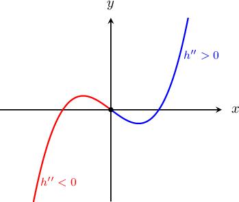
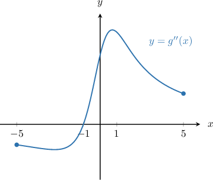
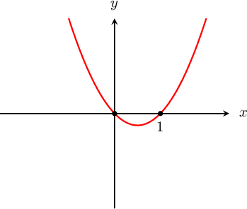

# Relating Concavity to the Second Derivative

Source: https://www.mathacademy.com/topics/3846?courseId=24
Topic ID: 3846

## Prerequisites

- [Second and Higher-Order Derivatives](./281-second-and-higher-order-derivatives.md)
- [Intervals of Concavity](./363-intervals-of-concavity.md)

## Lesson

### Introduction

Let's have a look at a plot of $h(x) = x^3-x.$ The curve is concave down on $x \in (-\infty, 0),$ and concave up on $x \in (0,\infty).$

In general, to determine the **intervals of concavity** of a particular function $f(x)$, we need to solve

- $f''(x) > 0$ to determine when the function is concave up, and

- $f''(x)< 0$ to determine when the function is concave down.

Let's see some examples.

### Example: Determining the Intervals on Which a Function Is Concave Up or Down

#### Question

Determine the intervals on which the function $f(x) = x^3 -3x$ is concave up.

#### Explanation

A function $f(x)$ is concave up on an interval $(a,b)$ if $f''(x)> 0$ for all $x \in (a,b).$

First, we calculate the second derivative of $f(x)= x^3 -3x \mathbin{:}$

$$

\begin{aligned}𝑓^{′}(𝑥) & =3𝑥^{2}−3 \\ 𝑓^{″}(𝑥) & =6𝑥\end{aligned}

$$

Now, to find where the function is concave up, we solve the inequality $f''(x) > 0,$ as follows:

$$

\begin{aligned}6𝑥 & >0 \\ 𝑥 & >0\end{aligned}

$$

Therefore, $f(x)$ is concave up on $(0, \infty).$

### Example: Determining the Intervals of Concavity Given the Graph of the Second Derivative

#### Question

The graph below shows $y=g''(x),$ where the function $g(x)$ is defined on $[-5,5].$ Find the intervals on which the function $g(x)$ is concave up.

#### Explanation

A function $g(x)$ is concave up over an interval $(a,b)$ if $g''(x)> 0$ for all $x \in (a,b).$

On the given graph of $y=g''(x),$ we can see that $g''(x) >0$ on the interval $(-1,5).$ Therefore, the function $g(x)$ is concave up on the interval $(-1,5).$

### Example: Finding the Intervals of Concavity of a Function

#### Question

Find the intervals of concavity for the function $f(x) = 2 x^3 - x^4.$

#### Explanation

First, we calculate the second derivative of $f(x),$ as follows:

$$

\begin{aligned}𝑓(𝑥) & =2𝑥^{3}−𝑥^{4} \\ 𝑓^{′}(𝑥) & =6𝑥^{2}−4𝑥^{3} \\ 𝑓^{″}(𝑥) & =12𝑥−12𝑥^{2}\end{aligned}

$$

To find where the function is concave up, we need to solve $f''(x) > 0\mathbin{:}$

$$

\begin{aligned}12𝑥−12𝑥^{2} & >0 \\ 12𝑥^{2}−12𝑥 & <0 \\ 𝑥(𝑥−1) & <0\end{aligned}

$$

We can solve this inequality by considering the graph of $y=x(x-1).$

From the graph, we see that $x(x-1) < 0$ when $0 < x < 1.$ So the graph is concave up on the interval $(0,1).$

The function $f(x)$ is concave down when $f''(x) < 0.$ By similar reasoning to before, this leads to the inequality $x(x-1) > 0,$ which has the solution $(-\infty,0)$ and $\left(1,\infty\right).$
