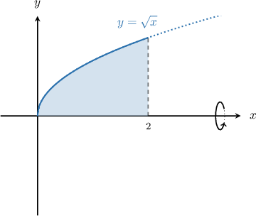
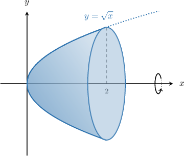
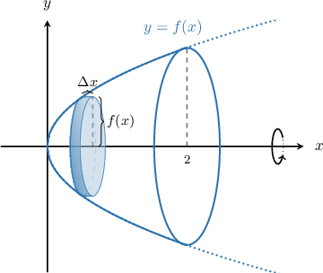
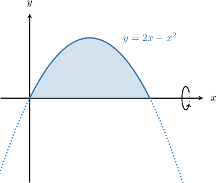
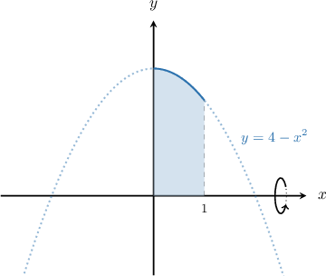
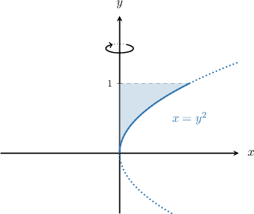
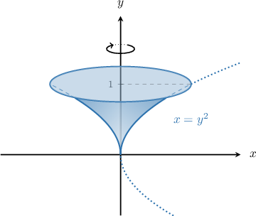
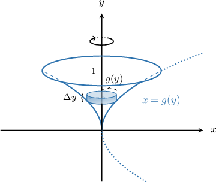
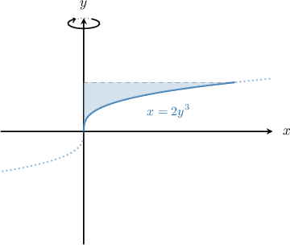
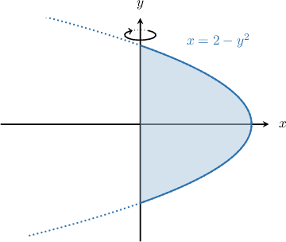

# Volumes of Revolution Using the Disc Method: Rotation About the Coordinate Axes

Source: https://www.mathacademy.com/topics/413?courseId=24
Topic ID: 413

## Prerequisites

- [The Area Bounded by a Curve and the Y-Axis](./1041-the-area-bounded-by-a-curve-and-the-y-axis.md)
- [Volumes of Cylinders](../../../high-school/traditional/lessons/geometry/1144-volumes-of-cylinders.md)

## Lesson

### Introduction

Consider the finite region bounded by the curve $y=\sqrt{x},$ the $x$-axis, and the vertical line $x=2,$ as shown in the picture below.

When we rotate this region $360^\circ$ about the $x$-axis (called the **axis of revolution**), we get a **solid of revolution,** as shown below. How can we find the volume of this solid?

To find the volume of the solid generated when the region bounded by a curve $y=f(x),$ the $x$-axis, and the vertical lines $x=a$ and $x=b$ is rotated $2\pi$ radians about the $x$-axis, we use the following formula:

$$

V = \pi \int_{a}^{b} y^2 \:\text{d}x = \pi \int_{a}^{b} \left[ f(x) \right]^2 \:\text{d}x

$$

The method corresponding to the formula above is called the **disc method** because it involves breaking up the region into many thin discs (or cylinders) of height $\Delta{x},$ as shown below.

When $\Delta{x} \to 0,$ the radius of each disc can be considered equal to $y=f(x).$ So, the volume of the disc (cylinder) is

$$

\pi y^2 \Delta{x} = \pi \left[ f(x) \right]^2 \Delta{x}.

$$

Integrating this expression from $a$ to $b,$ we obtain the formula for the volume of the solid.

In our example above, we have $f(x) = \sqrt{x},$ so the volume is given by

$$

V = \pi\int_0^2 (\sqrt{x})^2\,\textrm d x = \pi\int_0^2 x\,\textrm d x.

$$

Evaluating this integral gives

$$

\begin{aligned}𝑉 & =𝜋⋅\frac{𝑥^{2}}{2}_{20} \\ & =𝜋(\frac{2^{2}}{2}−\frac{0^{2}}{2}) \\ & =2𝜋.\end{aligned}

$$

So the volume of the solid is $2\pi$ cubic units.

### Example: Identifying an Integral Representing the Volume of a Solid Generated by Rotation About the X-Axis

#### Question

Consider the finite region bounded by the curve $y=2x-x^2$ and the $x$-axis, as shown below. What integral gives the volume of the solid generated when that region is rotated $2\pi$ radians about the $x$-axis?

#### Explanation

The volume of the solid generated when the region bounded by a curve $y=f(x),$ the $x$-axis, and the vertical lines $x=a$ and $x=b$ is rotated $2\pi$ radians about the $x$-axis is given by

$$

V = \pi \int_a^b \left[ f(x) \right]^2 \text{d}x.

$$

In our example, $f(x)=2x-x^2.$

To determine the limits of integration, we find the intersections of the curve with the $x$-axis by solving the following equation:

$$

\begin{aligned}2𝑥−𝑥^{2} & =0 \\ 𝑥(2−𝑥) & =0\end{aligned}

$$

The solutions are $x=0$ and $x=2.$ So, we need to integrate from $x=0$ to $x=2.$

Finally, the volume can be found as follows:

$$

\begin{aligned}𝑉 & =𝜋∫_{𝑏𝑎}[𝑓(𝑥)]^{2}d𝑥 \\ & =𝜋∫_{20}(2𝑥−𝑥^{2})^{2}d𝑥 \\ & =𝜋∫_{20}(4𝑥^{2}−4𝑥^{3}+𝑥^{4})\,d𝑥\end{aligned}

$$

### Example: Computing the Volume of a Solid Generated by Rotation About the X-Axis

#### Question

Consider the finite region bounded by the curve $y=4-x^2,$ the $x$-axis, and the vertical lines $x=0$ and $x=1,$ as shown below. Calculate the volume of the solid generated when this region is rotated $2\pi$ radians about the $x$-axis.

#### Explanation

The volume of the solid generated when the region bounded by a curve $y=f(x),$ the $x$-axis, and the vertical lines $x=a$ and $x=b$ is rotated $2\pi$ radians about the $x$-axis is given by

$$

V = \pi \int_a^b \left[ f(x) \right]^2 \text{d}x.

$$

In our example, $f(x)=4-x^2$ and the limits of integration are from $x=0$ to $x=1.$

Therefore, the volume can be found as follows:

$$

\begin{aligned}𝑉 & =𝜋∫_{𝑏𝑎}[𝑓(𝑥)]^{2}d𝑥 \\ & =𝜋∫_{10}(4−𝑥^{2})^{2}d𝑥 \\ & =𝜋∫_{10}(16−8𝑥^{2}+𝑥^{4})\,d𝑥 \\ & =𝜋(16∫_{10}d𝑥−8∫_{10}𝑥^{2}\,d𝑥+∫_{10}𝑥^{4}\,d𝑥) \\ & =𝜋(16𝑥\,_{10}−8⋅\frac{𝑥^{3}}{3}_{10}+\frac{𝑥^{5}}{5}_{10}) \\ & =𝜋(16(1−0)−8(\frac{1}{3}−0)+(\frac{1}{5}−0)) \\ & =𝜋(16−\frac{8}{3}+\frac{1}{5}) \\ & =\frac{203𝜋}{15}\end{aligned}

$$

### Rotation About the Y-Axis

Consider the finite region bounded by the curve $x=y^2,$ the $y$-axis, and the horizontal line $y=1,$ as shown in the picture below.

When we rotate this region $360^\circ$ about the $y$-axis, we again get a solid of revolution, as shown below. How can we find the volume of this solid?

To find the volume of this solid, we can use the same *disc method* approach that we used earlier for the $x$-axis.

The only difference is that we need to swap $x$ and $y.$ The radius of each disc (cylinder) is equal to $x=g(y)$ and its height is $\Delta{y}.$ So, the volume of the disc (cylinder) is

$$

\pi x^2 \Delta{y} = \pi [ g(y) ]^2 \Delta{y}.

$$

Finally, we need to integrate this expression. Therefore, to find the volume of the solid generated when the region bounded by a curve $x=g(y),$ the $y$-axis, and the horizontal lines $y=c$ and $y=d$ is rotated $2\pi$ radians about the $y$-axis, we use the following formula:

$$

V = \pi \int_{c}^{d} \left[ g(y) \right]^2 \:\text{d}y

$$

In our example above, we have $x=y^2,$ so the volume is given by

$$

\begin{aligned}𝑉 & =∫_{10}[𝑦^{2}]^{2}\,d𝑦=𝜋∫_{10}𝑦^{4}\,d𝑦.\end{aligned}

$$

Evaluating this integral gives

$$

\begin{aligned}𝑉 & =𝜋∫_{10}𝑦^{4}\,d𝑦 \\ & =𝜋⋅\frac{𝑦^{5}}{5}_{10} \\ & =𝜋(\frac{1}{5}−0) \\ & =\frac{𝜋}{5}.\end{aligned}

$$

### Example: Identifying an Integral Representing the Volume of a Solid Generated by Rotation About the Y-Axis

#### Question

Consider the finite region bounded by the curve $x=2y^3,$ the $y$-axis, and the line $y=1,$ as shown below. Which integral gives the volume of the solid generated when this region is rotated by $2\pi$ radians about the $y$-axis?

#### Explanation

The volume of the solid generated when the region bounded by a curve $x=g(y),$ the $y$-axis, and the horizontal lines $y=c$ and $y=d$ is rotated $2\pi$ radians about the $y$-axis is given by

$$

V = \pi \int_{c}^{d} [ g(y) ]^2 \text{d}y.

$$

In our example, $g(y)=2y^3.$

To determine the limits of integration, we find the intersections of the curve with the $y$-axis by solving the following equation:

$$

\begin{aligned}2𝑦^{3} & =0 \\ 𝑦^{3} & =0\end{aligned}

$$

Hence, the solution is $y=0.$ Since we consider the region above bounded by the curve $x=2y^3$, the $y$-axis, and the line $y=1$, we need to integrate from $y=0$ to $y=1.$

Finally, the volume can be found as follows:

$$

\begin{aligned}𝑉 & =𝜋∫_{𝑑𝑐}[𝑔(𝑦)]^{2}d𝑦 \\ & =𝜋∫_{10}(2𝑦^{3})^{2}d𝑦 \\ & =4𝜋∫_{10}𝑦^{6}\,d𝑦\end{aligned}

$$

### Example: Computing the Volume of a Solid Generated by Rotation About the Y-Axis

#### Question

Consider the finite region bounded by the curve $x=2-y^2$ and the $y$-axis, as shown below. Calculate the volume of the solid generated when this region is rotated $360^\circ$ about the $y$-axis.

#### Explanation

The volume of the solid generated when the region bounded by a curve $x=g(y),$ the $y$-axis, and the horizontal lines $y=c$ and $y=d$ is rotated $2\pi$ radians about the $y$-axis is given by

$$

V = \pi \int_{c}^{d} [ g(y) ]^2 \text{d}y.

$$

In our example, $g(y)=2-y^2$

To determine the limits of integration, we find the intersections of the curve with the $y$-axis by solving for $y$ the following equation:

$$

\begin{aligned}2−𝑦^{2} & =0 \\ 𝑦^{2} & =2\end{aligned}

$$

Hence, the solutions are $y=\pm \sqrt 2.$ So, we need to integrate from $y=-\sqrt{2}$ to $y=\sqrt 2.$

Finally, the volume can be found as follows:

$$

\begin{aligned}𝑉 & =𝜋∫_{𝑑𝑐}[𝑔(𝑦)]^{2}d𝑦 \\ & =𝜋∫_{\sqrt{2}−\sqrt{2}}^{}(2−𝑦^{2})^{2}d𝑦 \\ & =𝜋∫_{\sqrt{2}−\sqrt{2}}^{}(4−4𝑦^{2}+𝑦^{4})\,d𝑦 \\ & =2𝜋∫_{\sqrt{2}0}^{}(4−4𝑦^{2}+𝑦^{4})\,d𝑦 \\ & =2𝜋[4𝑦−\frac{4}{3}𝑦^{3}+\frac{1}{5}𝑦^{5}]_{\sqrt{2}0}^{} \\ & =2𝜋([4(\sqrt{2})−\frac{4}{3}(\sqrt{2})^{3}+\frac{1}{5}(\sqrt{2})^{5}]−[0]) \\ & =2𝜋(4\sqrt{2}−\frac{8\sqrt{2}}{3}+\frac{4\sqrt{2}}{5}) \\ & =2𝜋(\frac{32\sqrt{2}}{15}) \\ & =\frac{64𝜋\sqrt{2}}{15}\end{aligned}

$$

**** Since the region is symmetrical about the $x$-axis, in step $3$ above we were able to write

$$

\displaystyle \pi\int_{-\sqrt 2}^{\sqrt 2} [g(y)]^2\,\textrm d y = 2\pi\int_{0}^{\sqrt 2} [g(y)]^2\,\textrm d y.

$$

This step saved us a bit of work because the antiderivative evaluated to zero at the lower limit.
