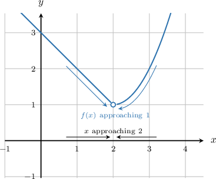
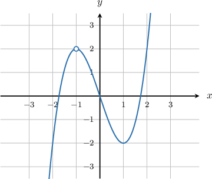
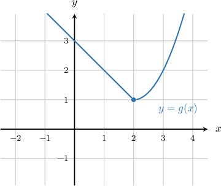
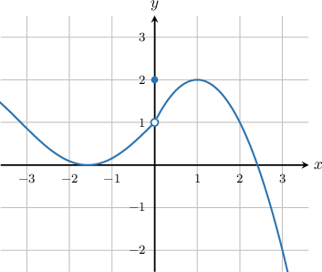
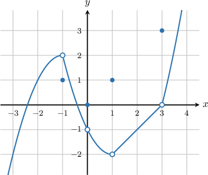

# The Finite Limit of a Function

Source: https://www.mathacademy.com/topics/461?courseId=24
Topic ID: 461

## Prerequisites

- [Piecewise Functions](../../../high-school/traditional/lessons/algebra-i/165-piecewise-functions.md)

## Lesson

### Introduction

The **limit** of a function is the value that the function approaches. For example, the function $y=f(x)$ shown below is not defined at $x=2,$ as represented by the open circle there $-$ but when we *approach* $x=2$, we see that $f(x)$ *approaches* the value $y=1.$

As $x$ approaches $2$, the value of $f(x)$ approaches $1.$ In other words, the limit of $f(x),$ as $x$ approaches $2,$ is $1$. We can express this mathematically as

$$

\lim\limits_{x\rightarrow 2}f(x)=1 \, .

$$

### Example: Finding a Limit When the Function Value is Not Defined

#### Question

Find $\lim\limits_{x\rightarrow \,-1}f(x)$ for the function $f(x)$ whose graph is shown below.

#### Explanation

As $x$ approaches $-1,$ the value of $f(x)$ approaches $2.$ Consequently,

$$

\lim\limits_{x\rightarrow \,-1}f(x)=2\,.

$$

### Limit Has Nothing to Do With the Function Value

The limit of a function at some point has **nothing to do** with the value of the function at that point.

For example, the following functions $g(x)$ and $h(x)$ have *different values* at $x=2,$ but they have the *same limit* at $x=2.$

The actual values of $g(2)$ and $h(2)$ are irrelevant for determining the limit at $x=2$. All that matters is what values the functions *look like* they are approaching as $x$ approaches $2$.

Near $x=2,$ both $g(x)$ and $h(x)$ appear to be approaching $y=1$. Therefore,

$$

\lim\limits_{x\rightarrow 2}g(x)=1

$$

and

$$

\lim\limits_{x\rightarrow 2}h(x)=1 \, .

$$

### Example: Finding a Limit When the Limit is Not Equal to the Function Value

#### Question

Find $\lim\limits_{x\rightarrow \,0} f(x)$ for the function below.

#### Explanation

As $x$ approaches $0,$ the value of $f(x)$ approaches $1.$ Consequently,

$$

\lim\limits_{x\rightarrow \,0}f(x)= 1\,.

$$

Remember, it does not matter that the actual value of $f(0)$ is $2.$ All that matters is that as $x$ approaches $0,$ the function $f(x)$ ** it is getting closer and closer to $1$.

### Example: Identifying True Statements About Limits

#### Question

Which of the following statements are true concerning the function $y=f(x)$ whose graph is shown below?

1. $\lim\limits_{x\rightarrow \,0}f(x)=0$

2. $\lim\limits_{x\rightarrow \,3}f(x)=0$

3. $\lim\limits_{x\rightarrow \,-1}f(x)=\lim\limits_{x\rightarrow \,1}f(x)$

#### Explanation

Let's analyze each statement in turn.

- Statement I is false. As $x$ approaches $0,$ the function $f(x)$ approaches the value $y=-1.$ Consequently,

- Statement II is true. As $x$ approaches $3,$ the function $f(x)$ approaches the value $y=0.$ Consequently,

- Statement III is false. As $x$ approaches $-1$ the function $f(x)$ approaches the value $y=2,$ and consequently Similiarly, as $x$ approaches $1,$ the function $f(x)$ approaches the value $y=-2,$ and consequently As a result,

In conclusion, only statement II is true.
