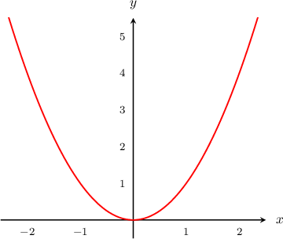
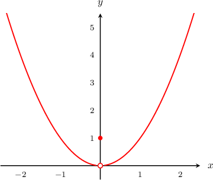
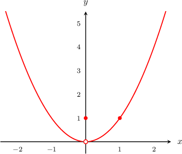
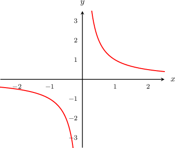
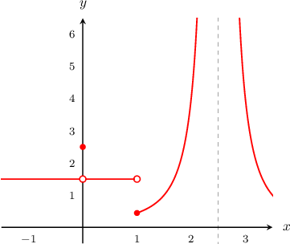
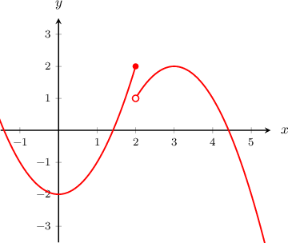

# Determining Continuity from Graphs

Source: https://www.mathacademy.com/topics/462?courseId=24
Topic ID: 462

## Prerequisites

- [Infinite Limits from Graphs](./1814-infinite-limits-from-graphs.md)

## Lesson

### Introduction

A function $f(x)$ is **continuous** over its entire domain if the graph of $y=f(x)$ can be drawn using a pencil and a piece of paper without taking the pencil off of the paper.

To illustrate, let's consider the function $y=x^2$ whose graph is shown below.

We can draw as much of the function $y=x^2$ as we want without taking our pencil off of the paper. Therefore, we say that $y=x^2$ is **continuous** at every point in its domain.

Let's compare this to the function $y=g(x)$ below:

Notice that this function has a jump in its value at $x=0.$

It is *impossible* to draw $y=g(x)$ without taking the pencil off the paper to fill in the jump at $x=0.$ Therefore, we say that $y=g(x)$ has a **discontinuity** at $x=0.$

### Continuity at a Point

Now consider the function $y=h(x)$ below. This function has a discontinuity at $x=0,$ so it is not continuous over its entire domain.

However, the function $h(x)$ may be continuous at other points, such as $x=1.$

To determine whether $h(x)$ is continuous at $x=1,$ we have to consider points in the **neighborhood** of $x=1.$ Roughly speaking, the *neighborhood of $x=1$* means the points on the curve that have an $x$-coordinate that's close to $1.$

Indeed, in the *neighborhood* of $x=1,$ we can draw the function $h(x)$ without taking the pencil off the paper. So, $h(x)$ is indeed continuous at $x=1.$

### Example: Determining Whether a Function Is Continuous at a Given Point

#### Question

Is the function $y=f(x),$ plotted below, continuous at $x=0?$

#### Explanation

Because there is an asymptote at $x=0,$ it is impossible to draw the function in the neighborhood of $x=0$ without taking our pencil off of the paper.

Therefore, the function $y=f(x)$ is not continuous at $x=0.$

### Example: Identifying Points of Discontinuity

#### Question

What are the points of discontinuity of the function $y=g(x),$ plotted below?

#### Explanation

The points of discontinuity are at $x=0,$ $x=1,$ and $x=2.5.$ It is impossible to draw the function in the neighborhood of these three points without taking our pencil off of the page.

### Example: Determining the Behavior of a Function in the Neighborhood of a Point

#### Question

The graph of $y=f(x)$ is shown above. Which of the following statements are true?

1. $f(x)$ is defined at $x=2$

2. $\lim\limits_{x\rightarrow \, 2}f(x)$ exists

3. $f(x)$ is continuous at $x=2$

#### Explanation

By inspecting the graph, we can conclude the following:

- Statement I is true. Indeed, $f(2)=2.$

- Statement II is false. From the graph, we can see that the left and right-sided limits are different: Therefore, $\lim\limits_{x\rightarrow \, 2}f(x)$ does not exist.

- Statement III is false. The graph of the function breaks at $x=2.$ It's impossible to draw the graph of $f(x)$ without taking our pencil off of the paper. Therefore, $f(x)$ is not continuous at $x=2.$

In conclusion, only statement I is true.
