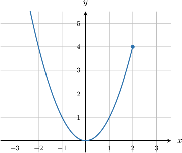
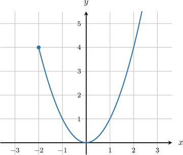
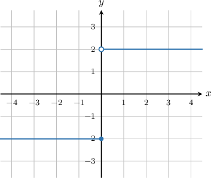
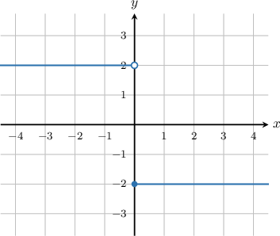

# Left and Right Continuity

Source: https://www.mathacademy.com/topics/474?courseId=24
Topic ID: 474

## Prerequisites

- [Defining Continuity at a Point](./314-defining-continuity-at-a-point.md)

## Lesson

### Introduction

A function $f(x)$ is said to be **left-continuous** at the point $x=c$ if the left-sided limit is equal to the function value:

$$

\lim\limits_{x\to c^-} f(x) = f(c).

$$

To demonstrate, let's consider the function $y=f(x)$ defined on the interval $(-\infty,2]$ as shown below.

Notice that at $x=2,$ the left limit exists, while right limit does not exist because $f(x)$ is not defined for $x>2.$

$$

\lim_{x\to 2^-}f(x) = 4, \qquad \lim_{x\to 2^+}f(x) = \text{DNE}

$$

Because the right-sided limit does not exist, the overall limit does not exist either:

$$

\lim_{x\to 2}f(x) = \text{DNE}

$$

Therefore, $f(x)$ is not continuous at $x=2.$ However, because the left-sided limit exists and is equal to the function value at $x=2,$ i.e.,

$$

\lim_{x\to 2^-}f(x) = 4 = f(2),

$$

we can say that the function is **left-continuous** at $x=2.$

### Right Continuity

A function $f(x)$ is said to be **right-continuous** at the point $x=c$ if the right-sided limit is equal to the function value:

$$

\lim\limits_{x\to c^+} f(x) = f(c).

$$

To demonstrate, let's consider the function $y=f(x)$ defined on the interval $[-2,\infty)$ as shown below.

The function is **right-continuous** at $x=-2$ because

$$

\lim_{x\to -2^+}f(x) = 4 = f(-2).

$$

### Example: Determining Whether a Function is Left- or Right-Continuous From a Graph

#### Question

Is the function $y=g(x)$ below left-continuous at $x=0?$

#### Explanation

To determine whether $g(x),$ is left-continuous at $x=0,$ we need to check whether the left-sided limit is equal to the function value.

Indeed, we see that

$$

\lim_{x\to 0^-} g(x) = -2 = g(0).

$$

Therefore, $g(x)$ is left-continuous at $x=0.$

### Example: Using the Definition of Left- and Right-Continuity to Compute a Limit

#### Question

If $f(x)$ is right-continuous at $x=3$ and $f(3)=1$, then what is $\displaystyle{\lim_{x\to 3^+}} \left(f(x)-x^2\right)?$

#### Explanation

Since $f(x)$ is right-continuous at $x=3,$ we must have

$$

\lim_{x\to 3^+} f(x)=f(3)=1.

$$

Consequently,

$$

\begin{aligned}\underset{𝑥→3^{+}}{lim}(𝑓(𝑥)−𝑥^{2})=1−3^{2}=−8.\end{aligned}

$$

### Defining Continuity in Terms of Left-Continuity and Right-Continuity

Recall that a function $f(x)$ is said to be **continuous** at a point $x=c$ if

$$

\lim\limits_{x \to c} f(x) = f(c) .

$$

In order for the above statement to be true, we require both

$$

\begin{aligned}\underset{𝑥→𝑐^{−}}{lim}𝑓(𝑥)=𝑓(𝑐)\,and\,\underset{𝑥→𝑐^{+}}{lim}𝑓(𝑥)=𝑓(𝑐).\end{aligned}

$$

The above equalities represent left-continuity and right-continuity. So, we have the following fact:

A function is **continuous** at a point if and only if it is *both* **left-continuous** *and* **right-continuous** at that point.

### Example: Identifying True Statements Regarding Left- and Right-Continuity

#### Question

Which of the following statements are true in relation to the function $y=g(x)$ above?

1. The function is left-continuous at $x=0$

2. The function is right-continuous at $x=0$

3. The function is continuous at $x=0$

#### Explanation

Let's look at each statement in turn:

- Statement I is false. The function is not left-continuous at $x=0,$ since the left-sided limit is not equal to the function value:

- Statement II is true. The function is right-continuous at $x=0,$ since the right-sided limit is equal to the function value:

- Statement III is false. In order for the function to be continuous at $x=0,$ it must be both left-continuous and right-continuous. However, we have already determined that the function is not left-continuous at this point.

In conclusion, only statement II is true.
