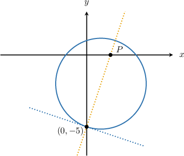

# Implicit Differentiation

Source: https://www.mathacademy.com/topics/57?courseId=24
Topic ID: 57

## Prerequisites

- [Calculating the Equation of a Normal Line Using Differentiation](./987-calculating-the-equation-of-a-normal-line-using-differentiation.md)
- [Selecting Procedures for Calculating Derivatives](./1115-selecting-procedures-for-calculating-derivatives.md)
- [Adding Rational Expressions With No Common Factors in the Denominator](../../../high-school/traditional/lessons/algebra-ii/3739-adding-rational-expressions-with-no-common-factors-in-the-denominator.md)

## Lesson

### Introduction

Functions are usually given in the form where is explicitly written as a function of However, they can also be written in **implicit** form, like

When a function is given in implicit form, we can differentiate it using the method of **implicit differentiation**, which consists of the following two steps:

**Step 1**: Differentiate both sides of the equation with respect to

We need to remember that *is a function of* i.e., So, we apply the chain rule:

**Step 2**: Solve the equation for

So, the derivative of is

### Example: Finding the Derivative of a Function Given in Implicit Form

#### Question

Given find

#### Explanation

First, we differentiate both sides of the equation with respect to assuming that

Now we solve the equation for as follows:

### Example: Finding the Derivative of a Function Given in Implicit Form Using the Product Rule

#### Question

Given $xy+y^2=x^2,$ find $\dfrac{\textrm{d}y}{\textrm{d}x}.$

#### Explanation

First, we differentiate both sides of the equation with respect to $x,$ assuming that $y = y(x).$

Note that to differentiate the $xy$ term, we will need to use the product rule.

$$

\begin{aligned}\frac{d}{d𝑥}(𝑥𝑦+𝑦^{2}) & =\frac{d}{d𝑥}(𝑥^{2}) \\ \frac{d}{d𝑥}(𝑥𝑦)+\frac{d}{d𝑥}(𝑦^{2}) & =\frac{d}{d𝑥}(𝑥^{2}) \\ 𝑥\frac{d𝑦}{d𝑥}+𝑦\frac{d}{d𝑥}(𝑥)+2𝑦\frac{d𝑦}{d𝑥} & =2𝑥 \\ 𝑥\frac{d𝑦}{d𝑥}+𝑦+2𝑦\frac{d𝑦}{d𝑥} & =2𝑥\end{aligned}

$$

Now we solve the equation for $\dfrac{\textrm{d}y}{\textrm{d}x},$ as follows:

$$

\begin{aligned}𝑥\frac{d𝑦}{d𝑥}+𝑦+2𝑦\frac{d𝑦}{d𝑥} & =2𝑥 \\ (𝑥+2𝑦)\frac{d𝑦}{d𝑥} & =2𝑥−𝑦 \\ \frac{d𝑦}{d𝑥} & =\frac{2𝑥−𝑦}{𝑥+2𝑦}\end{aligned}

$$

### Example: Finding the Slope of the Tangent Line to a Curve Given in Implicit Form at a Point

#### Question

Find the slope of the tangent at the point $\left(1,\,2 \right)$ for the curve $xy+y^2=2x^2+4.$

#### Explanation

To find the slope at a point, we use implicit differentiation to calculate the derivative of the curve, assuming that $y = y(x).$

Note that to differentiate the $xy$ term, we will need to use the product rule.

$$

\begin{aligned}\frac{d}{d𝑥}(𝑥𝑦+𝑦^{2}) & =\frac{d}{d𝑥}(2𝑥^{2}+4) \\ \frac{d}{d𝑥}(𝑥𝑦)+\frac{d}{d𝑥}(𝑦^{2}) & =\frac{d}{d𝑥}(2𝑥^{2}+4) \\ 𝑥\frac{d𝑦}{d𝑥}+𝑦\frac{d}{d𝑥}(𝑥)+2𝑦\frac{d𝑦}{d𝑥} & =4𝑥 \\ 𝑥\frac{d𝑦}{d𝑥}+𝑦+2𝑦\frac{d𝑦}{d𝑥} & =4𝑥 \\ (𝑥+2𝑦)\frac{d𝑦}{d𝑥} & =4𝑥−𝑦 \\ \frac{d𝑦}{d𝑥} & =\frac{4𝑥−𝑦}{𝑥+2𝑦}\end{aligned}

$$

Therefore, the slope of the tangent at the point $\left(1,\,2 \right)$ is given by

$$

\begin{aligned} m &=\left(\dfrac{\textrm{d}y}{\textrm{d}x}\right)_{\left(1,\,2 \right)}\\\[5pt] &=\left(\dfrac{4x-y}{x+2y}\right)_{\left(1,\,2 \right)}\\\[5pt] &=\dfrac{4\cdot 1-2}{1+2\cdot 2}\\\[5pt] &=\dfrac{2}{5} \, . \end{aligned}

$$

### Example: Determining an Intercept of a Tangent or Normal Line to a Curve Given in Implicit Form

#### Question

The equation $x^2-2x+y^2+4y=5$ represents a circle. The normal line at the point $\left(0, -5 \right)$ on the circle intersects the $x$-axis at the point $P.$ What are the coordinates of $P?$

#### Explanation

First of all, we need to find the slope of the normal line at the point $(0,-5).$ Remember that the slope of the normal line, $m',$ is the negative reciprocal of the slope of the tangent line:

$$

m' = -\frac{1}{m}

$$

To find the slope of the tangent line, we will calculate the derivative using implicit differentiation, assuming that $y = y(x).$

$$

\begin{aligned} \dfrac{\textrm{d}}{\textrm{d}x} (x^2-2x+ y^2+4y) &=\dfrac{\textrm{d}}{\textrm{d}x} (5)\\\[5pt] \dfrac{\textrm{d}}{\textrm{d}x} (x^2)-\dfrac{\textrm{d}}{\textrm{d}x} (2x)+\dfrac{\textrm{d}}{\textrm{d}x} (y^2)+\dfrac{\textrm{d}}{\textrm{d}x} (4y)&=\dfrac{\textrm{d}}{\textrm{d}x} (5)\\\[5pt] 2x-2+2y\dfrac{\textrm{d}y}{\textrm{d}x}+4\dfrac{\textrm{d}y}{\textrm{d}x}&=0\\\[5pt] (2y+4)\dfrac{\textrm{d}y}{\textrm{d}x}&=2-2x\\\[5pt] \dfrac{\textrm{d}y}{\textrm{d}x} &=\dfrac{2-2x}{2y+4} \end{aligned}

$$

So, the slope of the tangent at the point $\left(0,\,-5 \right)$ is

$$

\begin{aligned} m &=\left(\dfrac{\textrm{d}y}{\textrm{d}x}\right)_{\left(0,\,-5 \right)}\\\[5pt] &=\left(\dfrac{2-2x}{2y+4}\right)_{\left(0,\,-5 \right)}\\\[5pt] &=\dfrac{2-2\cdot 0}{2\cdot (-5)+4}\\\[5pt] &=\dfrac{2}{-6}\\\[5pt] &=-\dfrac{1}{3} \, . \end{aligned}

$$

Therefore, the slope of the normal line is $m'=-\dfrac{1}{m}=3.$ We can write the equation of the normal at the point $\left(0,\,-5 \right)$ as follows:

$$

\begin{aligned} y-y_1 &=m'\left(x-x_1 \right)\\\[5pt] y+5 &=3\left(x-0 \right)\\\[5pt] y&=3x-5 \end{aligned}

$$

Now, we just need to find where this normal line intersects the $x$-axis. At the point $P$ the $y$-coordinate is $0,$ so we set $y=0$ and solve for $x\mathbin{:}$

$$

\begin{aligned} y&=3x-5\\\[5pt] 0&=3x-5\\\[5pt] x&=\dfrac{5}{3} \end{aligned}

$$

Therefore, the coordinates of $P$ are $\left(\dfrac{5}{3},\,0 \right).$

### Deriving the Formula for the Derivative of the Natural Logarithm

We're now able to prove the following result:

First, we set

Our goal is to find

First, note that since we have

Differentiating both sides with respect to we get the following:

Finally, since we conclude

as required.
