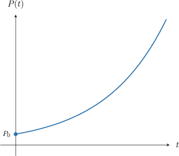
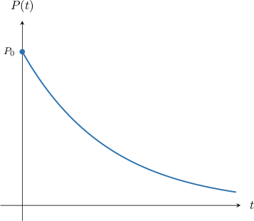

# Exponential Growth and Decay Models With First-Order ODEs

Source: https://www.mathacademy.com/topics/876?courseId=24
Topic ID: 876

## Prerequisites

- [Continuously Compounded Interest](../../../high-school/traditional/lessons/algebra-ii/237-continuously-compounded-interest.md)
- [Solving First-Order IVPs Using Separation of Variables](./1179-solving-first-order-ivps-using-separation-of-variables.md)
- [Modeling With First-Order ODEs](./2023-modeling-with-first-order-odes.md)
- [Solving Exponential Decay Problems](../../../high-school/traditional/lessons/algebra-i/2466-solving-exponential-decay-problems.md)

## Lesson

### Introduction

We often model real-life situations using a differential equation of the form

$$

\dfrac{\mathrm dP}{\mathrm dt} = rP,

$$

where $P = P(t),$ and $r>0$ is a constant of proportionality.

This differential equation is used to model a quantity $P$ *whose value increases at a rate that is proportional to the quantity $P$ itself.*

The general solution of this differential equation is given by

$$

P(t) = P_0 e^{r t},

$$

where $P_0 = P(0).$ We will derive this general solution at the end of this lesson.

A typical solution curve is shown below.

Notice that $P(t)$ is simply an exponential growth curve. For this reason, the original differential equation is sometimes called an **exponential growth differential equation** or **exponential growth model.**

### Example: Solving an Exponential Growth Problem

#### Question

Suppose that the population $P(t)$ of a town after $t$ years can be modeled by the differential equation

$$

\dfrac {\text{d}P} {\text{d}t} = 0.02P.

$$

If there are currently $500$ people in the town, what will be the town's population in $3$ years?

#### Explanation

We note that this is an exponential growth differential equation with $r = 0.02$. Therefore, the solution to this equation is

$$

P(t) = P_0\,e^{0.02t},

$$

where $P_0$ is the initial value.

We're told that the population is currently $500,$ so we have $P_0 = 500.$

Therefore, the population of the town at time $t$ is

$$

P(t) = 500\,e^{0.02t}.

$$

Finally, to find the population after $3$ years, we substitute $t=3$ into the above, as follows:

$$

\begin{aligned}𝑃(3) & =500\,𝑒^{0.02⋅3} \\ & =500\,𝑒^{0.06} \\ & ≈531\end{aligned}

$$

Therefore, we conclude that the population will be approximately $531$ after $3$ years.

### The Exponential Decay Problem

Now let's consider a differential equation of the form

$$

\dfrac{\mathrm dP}{\mathrm dt} = -rP,

$$

where $P = P(t),$ and $r>0$ is a constant of proportionality.

This differential equation is used to model a quantity $P$ whose value *decreases* at a rate that is proportional to the quantity $P$ itself.

The general solution of this differential equation is given by

$$

P(t) = P_0 e^{-r t},

$$

where $P_0 = P(0).$ We will derive this general solution at the end of this lesson.

A typical solution curve is shown below.

Notice that $P(t)$ is simply an exponential decay curve. For this reason, the original differential equation is sometimes called an **exponential decay differential equation** or **exponential decay model.**

### Example: Solving an Exponential Decay Problem

#### Question

Suppose that the value $V(t)$ of a particular car can be modeled by the differential equation

$$

\dfrac{\textrm d V}{\textrm d t} = -0.1V,

$$

where $t$ is the time, in years, since the car was first purchased. If the car was purchased for $10\,000,$ what will it be worth after $3$ years?

#### Explanation

First, notice that the right-hand side of the equation is **, which means that the car's value is **

This is an exponential decay differential equation with $r = 0.1.$ Therefore, the general solution to this equation is

$$

V(t) = V_0 e^{-0.1 t}.

$$

We know that the car was first purchased for $10\,000.$ Therefore, $V_0 = 10\,000,$ and we have the particular solution

$$

V(t) = 10\,000 e^{-0.1 t}.

$$

To find the car's value after $3$ years, we substitute $t=3$ into the particular solution above. This gives

$$

\begin{aligned}𝑉(3) & =10\,000𝑒^{−0.1⋅3} \\ & =10\,000𝑒^{−0.3} \\ & ≈7\,408.\end{aligned}

$$

Therefore, the car will be worth approximately $7\,408$ after three years.

### Example: Computing an Unknown Rate

#### Question

The number of followers of a celebrity's social media account increases at a rate that is directly proportional to the number of followers at that time. Given that there are currently $600\,000$ followers and in $3$ months there will be $780\,000$ followers, what is the growth rate? Round your answer to the nearest percent.

#### Explanation

The rate $N'(t)$ at which the number of followers increases is directly proportional to the number of followers $N.$ Therefore, we can model the number of followers using the differential equation

$$

\frac{\mathrm{d} N}{\mathrm{d} t} = rN,

$$

where $t$ is measured in months, and $r > 0$ is the growth rate.

The solution to this equation is

$$

N(t) = N_0\,e^{rt},

$$

where $N_0$ is the initial number of followers.

We're told that there are currently $600\,000$ followers, so we have $N_0 = 600\,000.$

Therefore, the number of followers $N$ after $t$ months is

$$

N(t) = 600\,000 \, e^{rt} .

$$

Finally, to find the growth rate, we substitute $N(3)=780\,000$ into the equation above and solve for $r,$ as follows:

$$

\begin{aligned}𝑁(3) & =600\,000\,𝑒^{𝑟⋅3} \\ 780\,000 & =600\,000\,𝑒^{3𝑟} \\ 𝑒^{3𝑟} & =\frac{780\,000}{600\,000} \\ 𝑒^{3𝑟} & =1.3 \\ ln⁡(𝑒^{3𝑟}) & =ln⁡(1.3) \\ 3𝑟 & =ln⁡(1.3) \\ 𝑟 & =\frac{1}{3}ln⁡(1.3) \\ 𝑟 & ≈0.087\,54\end{aligned}

$$

Therefore, $r\approx 9\%,$ rounded to the nearest percent.

### Deriving the General Solution

We have been using the fact that the general solution to the differential equation

$$

\dfrac{\mathrm d P}{\mathrm d t} = \pm rP

$$

is given by the formula

$$

P(t) = P_0 e^{\pm r t},

$$

where $P_0 = P(0)$ is the value of $P$ when $t=0.$ Let's now derive this general solution.

Our differential equation is separable, so we can solve it by separating variables and then integrating both sides with respect to $t,$ as follows:

$$

\begin{aligned}\frac{d𝑃}{d𝑡} & =±𝑟𝑃 \\ \frac{1}{𝑃}\frac{d𝑃}{d𝑡} & =±𝑟 \\ ∫\frac{1}{𝑃}\frac{d𝑃}{d𝑡}\,d𝑡 & =∫±𝑟\,d𝑡 \\ ∫\frac{1}{𝑃}\,d𝑃 & =∫±𝑟\,d𝑡 \\ ln⁡|𝑃| & =±𝑟𝑡+𝐶 \\ |𝑃| & =𝑒^{±𝑟𝑡+𝐶} \\ |𝑃| & =𝑒^{𝐶}𝑒^{±𝑟𝑡} \\ 𝑃(𝑡) & =±𝑒^{𝐶}𝑒^{±𝑟𝑡} \\ 𝑃(𝑡) & =𝐾𝑒^{±𝑟𝑡},\end{aligned}

$$

where $K=\pm e^C$ is a constant. Substituting $t=0,$ we get

$$

\begin{aligned}𝑃(0) & =𝐾𝑒^{0}=𝐾,\end{aligned}

$$

and our model becomes

$$

P(t) = P(0) e^{\pm rt}.

$$

Lastly, it is common to denote $P(0)$ by $P_0.$ Doing this, we have

$$

P(t) = P_0 e^{\pm rt}.

$$
