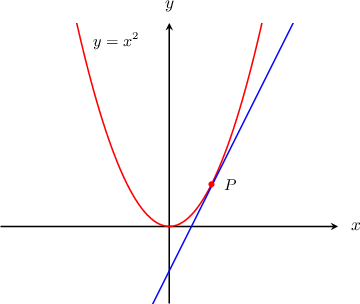

# Calculating the Equation of a Tangent Line Using Differentiation

Source: https://www.mathacademy.com/topics/986?courseId=24
Topic ID: 986

## Prerequisites

- [Calculating the Slope of a Tangent Line Using Differentiation](./332-calculating-the-slope-of-a-tangent-line-using-differentiation.md)

## Lesson

### Introduction

The equation of the tangent line to the curve $y = f(x)$ at the point $P(x_1,y_1),$ in point-slope form, is given by

$$

y - y_1 = m (x - x_1), \hspace{.75cm} m=f'(x_1).

$$

Here, $m = f'(x_1)$ because $f'(x_1)$ represents the slope of the tangent line to $y=f(x)$ at the point $(x_1,y_1).$

For example, suppose we want to compute the equation of the tangent line to the curve $y=x^2$ at the point $P(1,1).$

Since $y=x^2,$ we have $f(x)=x^2.$ We begin by calculating the derivative of $f(x)\mathbin{:}$

$$

f'(x) = \dfrac {\text{d}}{\text{d}x}(x^2)= 2x

$$

Then, we determine the slope of the tangent at $P(1,1)\mathbin{:}$

$$

m = f'(1) = 2(1) = 2

$$

Finally, we substitute the slope $m=2$ and the coordinates of $P(1,1)$ into the point-slope form, and get

$$

\begin{aligned}𝑦−1 & =2(𝑥−1) \\ 𝑦 & =2𝑥−2+1 \\ 𝑦 & =2𝑥−1.\end{aligned}

$$

Therefore, the equation of the tangent is $y=2x-1.$

### Example: Calculating the Equation of a Tangent Line to a Curve at a Point

#### Question

Find the equation of the tangent to the curve $y = 2x^3 - 2x$ at the point $(1,0).$

#### Explanation

Let $f(x) = 2x^3 - 2x.$ Computing the derivative $f'(x)$ gives

$$

f'(x) = 6x^2-2.

$$

We then compute $f'(1)$, which gives

$$

f'(1) = 6(1)^2-2 = 4.

$$

Finally, we use the point-slope form with $m=4$ and the coordinates of our point $(1,0),$ and get

$$

\begin{aligned}𝑦−𝑦_{1} & =𝑚(𝑥−𝑥_{1}) \\ 𝑦−0 & =4(𝑥−1) \\ 𝑦 & =4𝑥−4.\end{aligned}

$$

### Example: Determining where a Tangent Line Intersects an Axis

#### Question

Find where the tangent to the curve $y=4\sqrt{x}+4x$ at the point $(1,8)$ intersects the $x$-axis.

#### Explanation

Let $f(x)=4\sqrt{x}+4x.$ Let's first calculate the derivative:

$$

\begin{aligned}𝑓^{′}(𝑥) & =\frac{d}{d𝑥}(4\sqrt{𝑥}+4𝑥) \\ & =\frac{d}{d𝑥}(4𝑥^{1/2}+4𝑥) \\ & =2𝑥^{−1/2}+4\end{aligned}

$$

So, the slope of the tangent at our point is

$$

m=f'(1) = 2(1)^{-1/2}+4 = 6.

$$

Therefore, the equation of the tangent is

$$

\begin{aligned}𝑦−𝑦_{1} & =𝑚(𝑥−𝑥_{1}) \\ 𝑦−8 & =6(𝑥−1) \\ 𝑦 & =6𝑥−6+8 \\ 𝑦 & =6𝑥+2.\end{aligned}

$$

To find where the tangent line intercepts the $x$-axis, we set $y=0$ and solve:

$$

\begin{aligned}0 & =6𝑥+2 \\ 𝑥 & =−\frac{1}{3}\end{aligned}

$$

Therefore, the point of intersection is $\left(-\dfrac 1 3, 0\right).$
