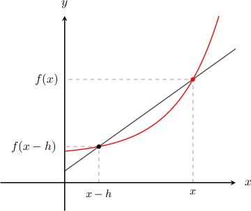
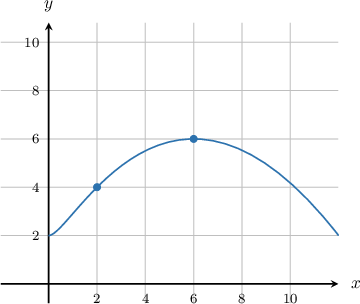
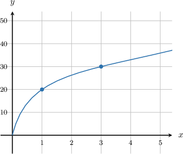

# Estimating Derivatives Using a Backward Difference Quotient

Source: https://www.mathacademy.com/topics/993?courseId=24
Topic ID: 993

## Prerequisites

- [Interpreting the Meaning of the Derivative in Context](./296-interpreting-the-meaning-of-the-derivative-in-context.md)

## Lesson

### Introduction

To approximate the derivative of a function, we can use the finite difference formula

$$

f'(x)\approx \frac{f(x) - f(x-h) }{h}

$$

for small values of the step size $h,$ with $h>0.$

This expression is known as the **backward difference approximation** because if $h>0$ then $x-h$ is a step behind $x$ (i.e., to the left).

As usual, the smaller the step size $h$ is, the better the approximation to $f'(x)$ we obtain.

### Example: Estimating a Derivative Given a Table Using a Backward Difference Approximation

#### Question

A function $f(x)$ has values according to the table below:

#### Explanation

We use the backward difference approximation formula

$$

f'(x) \approx \frac{f(x) - f(x-h)}{h}

$$

at the point $x=16.$ We choose the step size $h$ to be as small as possible, in this case $h=3.$ This gives

$$

\begin{aligned}𝑓^{′}(16) & ≈\frac{𝑓(16)−𝑓(16−3)}{3} \\ & =\frac{𝑓(16)−𝑓(13)}{3} \\ & =\frac{21−15}{3} \\ & =\frac{6}{3} \\ & =2.\end{aligned}

$$

### Example: Estimating a Derivative Given a Graph Using a Backward Difference Approximation

#### Question

The graph of the function $g(x)$ is shown above. Approximate $g'(x)$ at the point $x=6$ using a backward difference approximation with step size $h=4.$

#### Explanation

We use the backward difference approximation formula

$$

g'(x) \approx \frac{g(x) - g(x-h)}{h},

$$

at the point $x=6.$ Applying the above formula with $x=6$ and $h=4$ gives

$$

\begin{aligned}𝑔^{′}(6) & ≈\frac{𝑔(6)−𝑔(6−4)}{4} \\ & =\frac{𝑔(6)−𝑔(2)}{4} \\ & =\frac{6−4}{4} \\ & =\frac{2}{4} \\ & =\frac{1}{2}.\end{aligned}

$$

### Example: Estimating a Derivative Given a Table Using a Backward Difference Approximation: Word Problem

#### Question

A race car's position along a straight track, measured in meters from the starting line, is given by the function $s(t),$ where $t$ is the time in seconds. The values of $s(t)$ for different values of $t$ are given in the table below.

Approximate the velocity $s'(t)$ when $t=1.6$ using a backward difference approximation.

#### Explanation

We use the backward difference approximation formula

$$

s'(t) \approx \frac{s(t) - s(t-h)}{h}

$$

at the time $t=1.6.$ We choose the step size $h$ to be as small as possible, in this case $h=0.2.$ This gives

$$

\begin{aligned}𝑠^{′}(1.6) & ≈\frac{𝑠(1.6)−𝑠(1.6−0.2)}{0.2} \\ & =\frac{𝑠(1.6)−𝑠(1.4)}{0.2} \\ & =\frac{2.9−2.7}{0.2} \\ & =\frac{0.2}{0.2} \\ & =1.\end{aligned}

$$

So at the time $t=1.6,$ the velocity is approximately $1\, \textrm{m}/\textrm{s}.$

### Example: Estimating a Derivative Given a Graph Using a Backward Difference Approximation: Word Problem

#### Question

A factory produces fans. The total cost of producing $x$ fans, in dollars, is given by the function $C(x).$ The graph of $C(x)$ is shown below.

Approximate the marginal cost $C'(x)$ at the point $x=3$ using a backward difference approximation with step size $h=2.$

#### Explanation

We use the backward difference approximation formula

$$

C'(x) \approx \dfrac{C(x) - C(x-h)}{h},

$$

at the point $x=3.$ Applying the above formula with $x=3$ and $h=2$ gives

$$

\begin{aligned}𝐶^{′}(3) & ≈\frac{𝐶(3)−𝐶(3−2)}{2} \\ & =\frac{𝐶(3)−𝐶(1)}{2} \\ & =\frac{30−20}{2} \\ & =\frac{10}{2} \\ & =5.\end{aligned}

$$

So the marginal cost is $5$ per fan.

### Derivation of the Formula

Where does the formula for the backward difference come from? Remember that from the definition of derivative, we have the forward difference formula

$$

f'(x)\approx \frac{f(x+h) - f(x) }{h}

$$

for small values of $h.$

Now, replacing $h$ with $-h$ in the formula above gives

$$

\begin{aligned}𝑓^{′}(𝑥) & ≈\frac{𝑓(𝑥−ℎ)−𝑓(𝑥)}{−ℎ} \\ & =\frac{𝑓(𝑥)−𝑓(𝑥−ℎ)}{ℎ}.\end{aligned}

$$

The step of replacing $h$ with $-h$ is equivalent to stepping a distance of $h$ to the left rather than to the right.
