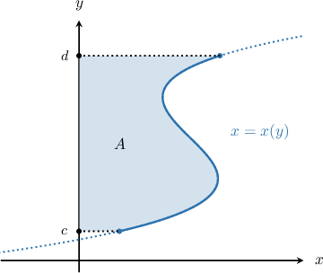
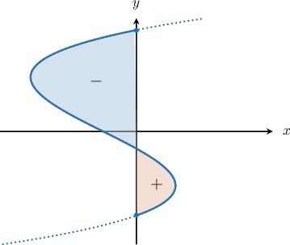
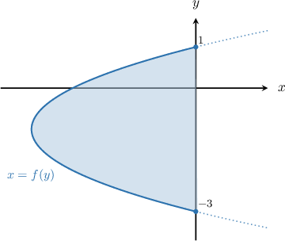
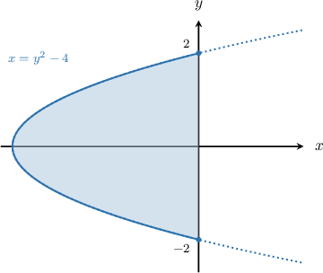
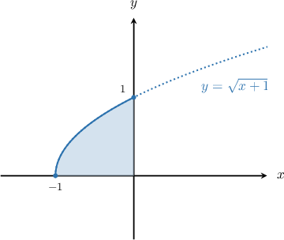

# The Area Bounded by a Curve and the Y-Axis

Source: https://www.mathacademy.com/topics/1041?courseId=21
Topic ID: 1041

## Prerequisites

- [Finding the Area Between a Curve and the X-Axis When They Intersect](../ap-calculus-ab/1432-finding-the-area-between-a-curve-and-the-x-axis-when-they-intersect.md)

## Lesson

### Introduction

The area $A$ bounded by a curve $x=x(y),$ the $y$-axis, and the horizontal lines $y=c$ and $y=d$ (see the picture below) can be computed as follows:

$$

A = \int_{c}^{d} x(y) \:\text{d}y

$$

When using integration to find areas, we must note the following:

- definite integrals that correspond to areas to the right of the $y$-axis are positive, while

- definite integrals that correspond to areas to the left of the $y$-axis are negative.

### Example: Finding the Area Bounded by a Curve, the y-Axis, and Two Horizontal Lines

#### Question

Find the area bounded between the curve the -axis, and the lines and as shown above.

#### Explanation

To find the area, we compute the corresponding definite integral, as follows:

Since the region lies to the left of the -axis, we obtained a negative number. So the area that we want is

### Example: Finding the Finite Area Bounded Between a Curve and the Y-Axis

#### Question

Find the area of the closed region between the curve $x=y^2-4$ and the $y$-axis.

#### Explanation

First, we find the $y$-intercepts of the curve:

$$

\begin{aligned}𝑦^{2}−4 & =0 \\ 𝑦^{2} & =4 \\ 𝑦 & =±2\end{aligned}

$$

Next, we draw a sketch of the region:

We want the area between the curve $x=y^2-4$ and the $y$-axis from $y=-2$ to $y=2.$ To find the area, we compute the corresponding definite integral, as follows:

$$

\begin{aligned}𝐴 & =∫_{𝑑𝑐}𝑥(𝑦)\,d𝑦 \\ & =∫_{2−2}(𝑦^{2}−4)\,d𝑦 \\ & =2∫_{20}(𝑦^{2}−4)\,d𝑦 \\ & =2∫_{20}𝑦^{2}\,d𝑦−8∫_{20}\,d𝑦 \\ & =2⋅\frac{𝑦^{3}}{3}_{20}−8𝑦_{20} \\ & =2(\frac{8}{3}−0)−8(2−0) \\ & =\frac{16}{3}−16 \\ & =−\frac{32}{3}\end{aligned}

$$

We obtained a negative number because the region lies to the left of the $y$-axis. So the area that we want is $\left|-\dfrac{32}{3}\right| = \dfrac{32}{3}.$

### Example: Finding the Area Bounded Between a Curve and the Y-Axis by First Rewriting the Function

#### Question

Find the area between the curve $y=\sqrt{x+1},$ the $y$-axis, and the lines $y=0$ and $y=1,$ as shown above.

#### Explanation

First, we make $x$ the subject:

$$

\begin{aligned}𝑦 & =\sqrt{𝑥+1} \\ 𝑦^{2} & =𝑥+1 \\ 𝑥 & =𝑦^{2}−1\end{aligned}

$$

Now, to find the area, we compute the corresponding definite integral, as follows:

$$

\begin{aligned}𝐴 & =∫_{10}(𝑦^{2}−1)\,d𝑦 \\ & =∫_{10}𝑦^{2}\,d𝑦−∫_{10}\,d𝑦 \\ & =\frac{𝑦^{3}}{3}_{10}−𝑦_{10} \\ & =(\frac{1}{3}−0)−(1−0) \\ & =\frac{1}{3}−1 \\ & =−\frac{2}{3}\end{aligned}

$$

We obtained a negative number because the region lies to the left of the $y$-axis. So the area that we want is $\left|-\dfrac{2}{3}\right| = \dfrac{2}{3}.$
