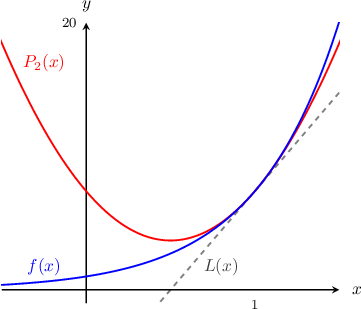

# Second-Degree Taylor Polynomials

Source: https://www.mathacademy.com/topics/1177?courseId=21
Topic ID: 1177

## Prerequisites

- [Second and Higher-Order Derivatives](../ap-calculus-ab/281-second-and-higher-order-derivatives.md)
- [Approximating Functions Using Local Linearity and Linearization](../ap-calculus-ab/621-approximating-functions-using-local-linearity-and-linearization.md)

## Lesson

### Introduction

Recall that we can approximate a function $f(x)$ around the point $x=a$ using a linear approximation $L(x)\mathbin{:}$

$$

f(x)\approx L(x) = f(a) + f'(a)(x-a).

$$

This approximates the function $f(x)$ using a straight line. But we can do even better! We can approximate $f(x)$ using a quadratic curve instead.

The quadratic approximation is called the **second-degree Taylor polynomial** $P_2(x),$ and is given by

$$

P_2(x) = \underbrace{f(a) + f'(a)(x-a)}_{\text{linear approximation}} + \underbrace{\dfrac{1}{2}f''(a)(x-a)^2}_{\text{new quadratic term}}.

$$

Notice that we added another term to the linear approximation to get the second-degree Taylor polynomial. This new term is called the **second-degree term** of the Taylor polynomial.

The *coefficient* of the second-degree term is $\dfrac 1 2 f''(a).$ We'll discuss why the second-degree term is of this form at the end of the lesson.

In general, $P_2(x)$ is a more accurate estimate of the function $f(x)$ compared with $L(x),$ provided that $x$ is close to the value of $a.$

**Note:** The phrase "Taylor polynomial" refers to a polynomial that's used to approximate a function. The first degree Taylor polynomial is just the linear approximation, meaning $L(x) = P_1(x),$ and the second degree Taylor polynomial is the quadratic approximation. In the future, we will encounter higher-degree approximations as well.

### Example: Finding the Second-Degree Taylor Polynomial of a Given Function About a Point

#### Question

Find the second degree Taylor polynomial of the function $f(x) = e^{2x}$ about $x=1.$

#### Explanation

To find the second-degree Taylor polynomial about $x=1,$ we plug $a=1$ into the general formula to give

$$

P_2(x) = f(1) + f'(1)(x-1) +\dfrac{1}{2}f''(1)(x-1)^2.

$$

So we need to work out $f(1),$ $f'(1),$ and $f''(1)\mathbin{;}$

$$

\begin{aligned}𝑓(𝑥) & =𝑒^{2𝑥} & ⟹ & & 𝑓(1) & =𝑒^{2} \\ 𝑓^{′}(𝑥) & =2𝑒^{2𝑥} & ⟹ & & 𝑓^{′}(1) & =2𝑒^{2} \\ 𝑓^{″}(𝑥) & =4𝑒^{2𝑥} & ⟹ & & 𝑓^{″}(1) & =4𝑒^{2}.\end{aligned}

$$

We now plug the results for $f(1),$ $f'(1),$ and $f''(1)$ into our second-degree Taylor polynomial. This gives

$$

\begin{aligned}𝑃_{2}(𝑥) & =𝑒^{2}+2𝑒^{2}(𝑥−1)+\frac{1}{2}⋅4𝑒^{2}(𝑥−1)^{2} \\ & =𝑒^{2}+2𝑒^{2}(𝑥−1)+2𝑒^{2}(𝑥−1)^{2}.\end{aligned}

$$

The plot below shows $f(x),$ $P_2(x),$ and $L(x).$ We can see that $P_2(x)$ is a better approximation to $f(x)$ around $x=1$ compared with $L(x).$

### Example: Finding a Coefficient in a Second-Degree Taylor Polynomial

#### Question

What is the coefficient of $(x+2)^2$ in the second-degree Taylor polynomial of $f(x)=\dfrac{1}{x}$ at $x = -2?$

#### Explanation

The second-degree Taylor polynomial of $f(x)$ about $x=-2$ is given by

$$

\begin{aligned}𝑃_{2}(𝑥)=𝑓(−2)+𝑓^{′}(−2)(𝑥+2)+\frac{𝑓^{″}(−2)}{2}(𝑥+2)^{2}.\end{aligned}

$$

The coefficient of $(x+2)^2$ in the above Taylor polynomial is

$$

\dfrac{f''(-2)}{2}.

$$

To find this coefficient, we start by computing the second derivative $f''(x)\mathbin{:}$

$$

\begin{aligned} f(x)&=\dfrac{1}{x}\\f'(x)&=-\dfrac{1}{x^2}\\f''(x)&=\dfrac{2}{x^3} \end{aligned}

$$

Then, we evaluate $f''(x)$ at $x=-2.$ This gives

$$

f''(-2)=\dfrac{2}{(-2)^3}=-\dfrac{1}{4}.

$$

Finally, we determine the coefficient of $(x+2)^2,$ as follows:

$$

\begin{aligned} \dfrac{f''(-2)}{2}&=\dfrac{\left(-\dfrac{1}{4}\right)}{2}=-\dfrac{1}{8}. \end{aligned}

$$

### Justification for the Second Term

We'll now give some intuition regarding why the second-degree coefficient in the second-order Taylor polynomial of $f(x)$ is $\dfrac12f''(a).$

First, recall that the first-degree Taylor polynomial (linear approximation) about $x=a$ is given by

$$

P_1(x) = f(a) + f'(a)(x-a).

$$

This approximates the function $f(x)$ using a straight line. So, if we want to approximate $f(x)$ using a quadratic curve, we need an additional quadratic term:

$$

P_2(x) = f(a) + f'(a)(x-a) + k(x-a)^2

$$

where $k$ is to be determined. Note:

- We've chosen $(x-a)^2$ as the variable part of our quadratic term (not just $x^2$).

- By doing this, the approximation $P_2(x)$ is *exact* at the point $x=a,$ because

Our task now is to find the coefficient $k.$

Let's assume $x$ is sufficiently close to $a.$ Then, $P_2(x)$ gives a good approximation of $f(x){:}$

$$

f(x) \approx P_2(x) = f(a) + f'(a)(x-a) + k(x-a)^2

$$

Differentiating once, we get

$$

f'(x) \approx f'(a) + 2k(x-a).

$$

Differentiating again, we get

$$

f''(x) \approx 2k.

$$

Thus, we have that

$$

k\approx \dfrac12 f''(x).

$$

We're approximating $f(x)$ in the vicinity of $x=a$ using a quadratic curve. For any quadratic curve, the second derivative is constant. Thus, we can approximate $f''(x)$ by its value at $x=a.$ Thus:

$$

k\approx \dfrac12 f''(a).

$$

Finally, we have

$$

f(x) \approx P_2(x) = f(a) + f'(a)(x-a) + \dfrac12 f''(a)(x-a)^2

$$

as required.
