# Sketching a Function From the Graph of its Derivative

Source: https://www.mathacademy.com/topics/1206?courseId=21
Topic ID: 1206

## Prerequisites

- [Interpreting the Graph of a Function's Derivative: Concavity and Points of Inflection](../ap-calculus-ab/3548-interpreting-the-graph-of-a-function-s-derivative-concavity-and-points-of-inflection.md)

## Lesson

### Introduction

The graph of $y=f'(x),$ the derivative of $y=f(x)$ is shown below. Let's use this to sketch a possible graph of the original function, $y=f(x).$

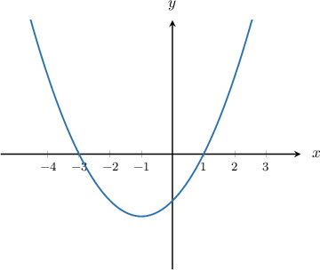

Recall that the critical points of $y=f(x)$ occur when $f'(x)=0$ or $f'(x)$ does not exist. In our case, there are two critical points:

$$

x=-3\quad \text{and} \quad x=1

$$

Also, we have the following:

- If $f'(x) > 0$ then $f(x)$ is increasing.

- If $f'(x) < 0$ then $f(x)$ is decreasing.

We can now summarize the information from the graph in the table below.

Let's now sketch the graph of $y=f(x)\mathbin{:}$

- First, we draw the critical points. We choose an arbitrary point on the vertical lines $x=-3$ and $x=1.$ Since $f(x)$ is decreasing $\searrow$ on $(-3,1),$ the point at $x=1$ must be lower than the point at $x=-3,$ as shown below.

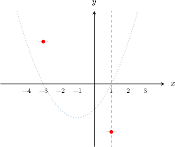

- Next, we consider the behavior of $y=f(x)$ in the neighborhood of the critical points: Since $f(x)$ is increasing $\nearrow$ on $(-\infty,-3)$ and decreasing $\searrow$ on $(-3,1)$, the graph of $f(x)$ goes down to the left and to the right of $x=-3.$ Since $f(x)$ is decreasing $\searrow$ on $(-3,1)$ and increasing $\nearrow$ on $(1,\infty)$, the graph of $f(x)$ goes up to the left and to the right of $x=1.$

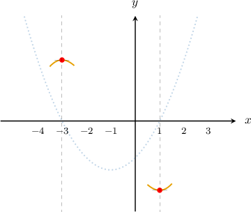

- Finally, by connecting and extending the existing parts with a smooth curve, we obtain a possible graph of $y=f(x)\mathbin{:}$

### Non-Uniqueness in Sketching a Function Given the Graph of Its Derivative

Let's draw our possible function $y=f(x)$ once more. The graph of its derivative $y=f'(x)$ is also shown.

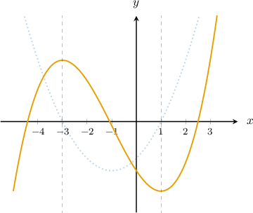

In reality, there are infinitely many possible graphs of $f(x)$ that can be drawn if we are given only the graph of $f'(x).$ We can always shift the graph up and down as we please, because the slopes of the tangent lines do not change. For the problem above, any of the following graphs would be valid:

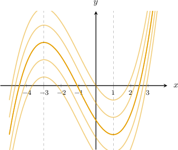

In this topic, we will focus on sketching a *possible* graph of $y=f(x)$ given the graph of $y=f'(x).$ But bear in mind that whatever $y=f(x)$ we sketch, we can get an equally valid answer by shifting or $y=f(x)$ curve up or down by an arbitrary amount.

The only exception is if we're given a point on the curve $y=f(x).$ If we're given a point, this has the effect of *fixing* our answer to a particular curve. We'll see an example of this next.

### Example: Sketching a Function Given the Graph of its Derivative and a Point on the Graph

#### Question

The graph of $y=f'(x),$ the derivative of $f(x),$ is shown below. Given that $f(0)=0,$ sketch a possible graph of $y=f(x).$

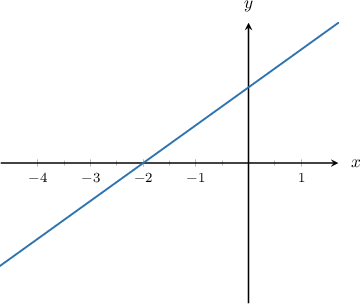

#### Explanation

Recall that critical points of $y=f(x)$ occur when $f'(x)=0$ or $f'(x)$ does not exist. In our case, there is one critical point:

$$

x=-2

$$

Also, we have the following:

- If $f'(x) > 0$ then $f(x)$ is increasing.

- If $f'(x) < 0$ then $f(x)$ is decreasing.

We can now summarize the information from the graph in the table below.

Let's now sketch the graph of $y=f(x)\mathbin{:}$

- First, we draw the critical point. Consider the vertical line $x=-2.$ Since we are told that $f(0)=0,$ we can draw that point on the graph. Since $f(x)$ is increasing $\nearrow$ on $(-2,\infty),$ the point at $x=-2$ must be lower than the point at $x=0.$

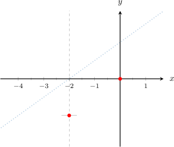

- Next, we consider the behavior of $y=f(x)$ in the neighborhood of the critical point: Since $f(x)$ is decreasing $\searrow$ on $(-\infty,-2)$ and increasing $\nearrow$ on $(-2,\infty)$, the graph of $y=f(x)$ goes up to the left and to the right of $x=-2.$

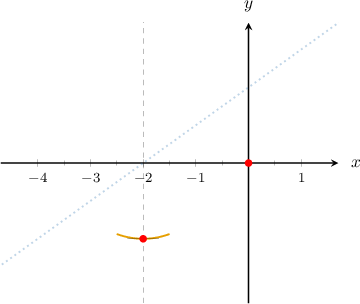

- Finally, by connecting and extending the existing parts with a smooth curve, we obtain a possible graph of $y=f(x)\mathbin{:}$

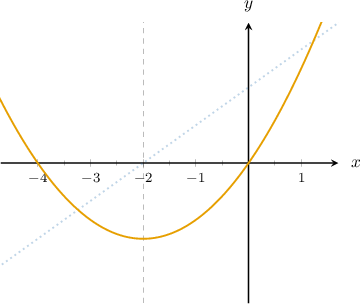

### Example: Sketching a Function Given the Graph of its Derivative

#### Question

The graph of $y=f'(x),$ the derivative of $f(x),$ is shown below. Sketch a possible graph of $y=f(x).$

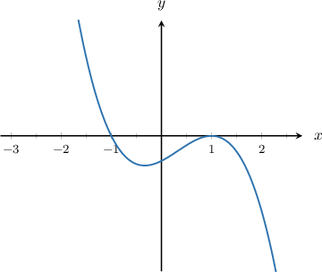

#### Explanation

Recall that critical points of $y=f(x)$ occur when $f'(x)=0$ or $f'(x)$ does not exist. In our case, there are two critical points:

$$

x=-1\quad \text{and} \quad x=1

$$

Also, we have the following:

- If $f'(x) > 0$ then $f(x)$ is increasing.

- If $f'(x) < 0$ then $f(x)$ is decreasing.

We can now summarize the information from the graph in the table below.

Let's now sketch the graph of $y=f(x)\mathbin{:}$

- First, we draw the critical points. We choose an arbitrary point on the vertical lines $x=-1$ and $x=1.$ Since $f(x)$ is decreasing $\searrow$ on $(-1,1),$ the point at $x=1$ must be lower than the point at $x=-1,$ as shown below.

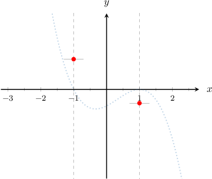

- Next, we consider the behavior of $y=f(x)$ in the neighborhood of the critical points: Since $f(x)$ is increasing $\nearrow$ on $(-\infty,-1)$ and decreasing $\searrow$ on $(-1,1)$, the graph of $y=f(x)$ goes down to the left and the right of $x=-1.$ Since $f(x)$ is decreasing $\searrow$ on $(-1,1)$ and decreasing $\searrow$ on $(1,\infty)$, the graph of $y=f(x)$ goes up to the left and goes down to the right of $x=1.$ Furthermore, since $f'(x)$ is increasing to the left of $x = 1$, we must have $f''(x) > 0$, and, since it is decreasing to the right of $x = 1$, we must have $f''(x) < 0.$ So, $x =1$ is an inflection point at which the curve $y=f(x)$ changes from concave up to concave down.

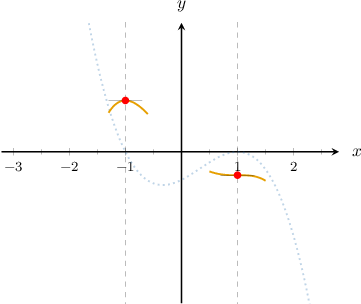

- Finally, by connecting and extending the existing parts with a smooth curve, we obtain a possible graph of $y=f(x)\mathbin{:}$

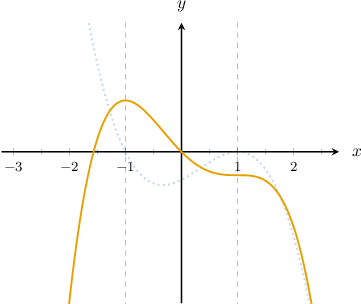

### Example: Sketching a Continuous Function Given the Graph of its Non-Smooth Derivative

#### Question

The graph of $y=f'(x)$, the derivative of a continuous function $y=f(x)$, is given below. Sketch a possible graph of $y=f(x).$

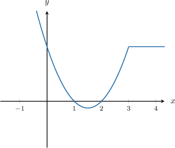

#### Explanation

Recall that critical points of $y=f(x)$ occur when $f'(x)=0$ or $f'(x)$ does not exist. In our case, there are two critical points:

$$

x=1\quad \text{and} \quad x=2

$$

Also, we have the following:

- If $f'(x) > 0$ then $f(x)$ is increasing.

- If $f'(x) < 0$ then $f(x)$ is decreasing.

We can now summarize the information from the graph in the table below.

Let's now sketch the graph of $y=f(x)\mathbin{:}$

- First, we draw the critical points. Consider the vertical lines $x=1$ and $x=2.$ We choose an arbitrary point on the vertical line $x=1.$ Since $f(x)$ is decreasing $\searrow$ on $(1,2),$ the point at $x=2$ must be lower than the point at $x=1.$

So, we draw it as follows:

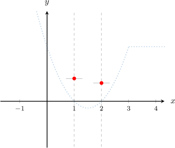

- Next, we consider the behavior of $y=f(x)$ in the neighborhood of the critical points: Since $f(x)$ is increasing $\nearrow$ on $(-\infty,1)$ and decreasing $\searrow$ on $(1,2)$, the graph of $f(x)$ goes down to the left and to the right of $x=1.$ Since $f(x)$ is decreasing $\searrow$ on $(1,2)$ and increasing $\nearrow$ on $(2,\infty)$, the graph of $f(x)$ goes up to the left and to the right of $x=2.$ Furthermore, since $f'(x)$ is increasing to the left of $x = 3$, we must have $f''(x) > 0.$ So, the curve $y=f(x)$ is concave up on $(2,3).$ Also, since $f'(x)$ is constant and positive to the right of $x = 3$, the graph of $y=f(x)$ represents a section of an increasing straight line on $(3,\infty).$

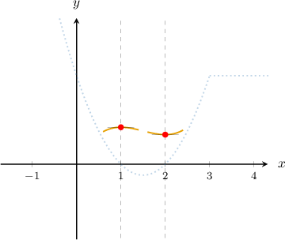

- Finally, since we are told that our graph must be continuous, by connecting and extending the existing parts with a smooth curve, we obtain a possible graph of $y=f(x)\mathbin{:}$

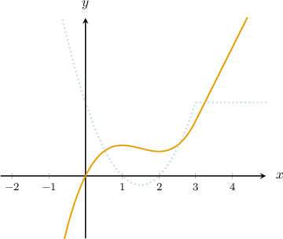

**** The graph we obtained is not the only possible one. Any similar graph that's shifted vertically up or down could also be considered a possible $y=f(x).$

### Example: Sketching a Continuous Function Given its Derivative in Algebraic Form

#### Question

If $f'(x)=|x+1|,$ sketch a possible graph of a continuous function $y=f(x).$

#### Explanation

The graph of $y=f'(x)$ is the following:

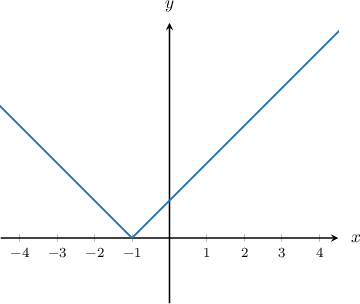

Recall that critical points of $y=f(x)$ occur when $f'(x)=0$ or $f'(x)$ does not exist. In our case, there is one critical point:

$\qquad$ $x=-1$

Also, we have the following:

- If $f'(x) > 0$ then $f(x)$ is increasing.

- If $f'(x) < 0$ then $f(x)$ is decreasing.

We can now summarize the information from the graph in the table below.

Let's now sketch the graph of $y=f(x)\mathbin{:}$

- First, we draw the critical point. We choose an arbitrary point on the vertical line $x=-1,$ as shown below.

- Next, we consider the behavior of $y=f(x)$ in the neighborhood of the critical points: Since $f(x)$ is increasing $\nearrow$ on $(-\infty,-1)$ and on $(-1,\infty)$, the graph of $y=f(x)$ goes down the left of $x=-1$ and goes up to the right of $x=-1.$ Furthermore, since $f'(x)$ is decreasing to the left of $x = -1$, we must have $f''(x) < 0$, and, since it is increasing to the right of $x = -1$, we must have $f''(x) > 0.$ So, $x =-1$ is an inflection point at which the curve $y=f(x)$ changes from concave down to concave up. So, we can draw as follows:

- Finally, since we are told that our graph must be continuous, by connecting and extending the existing parts with a smooth curve, we obtain a possible graph of $y=f(x)\mathbin{:}$
