# Volumes of Solids with Rectangular Cross Sections

Source: https://www.mathacademy.com/topics/1248?courseId=21
Topic ID: 1248

## Prerequisites

- [Volumes of Solids with Square Cross Sections](../ap-calculus-ab/1083-volumes-of-solids-with-square-cross-sections.md)

## Lesson

### Introduction

Suppose that the base of a solid is the semicircle enclosed by the curve $y=-\sqrt{4-x^2}$ and the $x$-axis, as shown in the picture below. Cross-sections perpendicular to the $x$-axis are rectangles. If the height of each rectangle is half of the length of its base, then what is the volume of the solid?

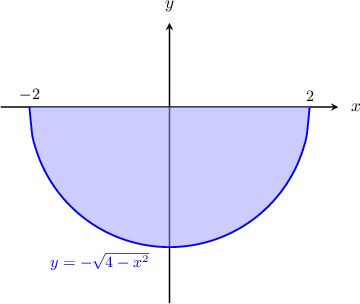

A sketch with a few cross-sections is shown in the picture below.

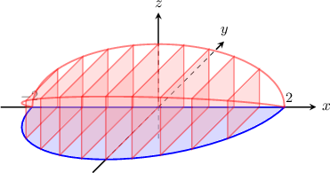

If we are given the expression $A(x)$ for the area of each cross-section, then we find the volume as follows:

$$

V = \int_{c}^{d} A(x)\:\textrm{d}x.

$$

Consider now a cross-section at some point $x$, where $x \in (-2,2)\mathbin{:}$

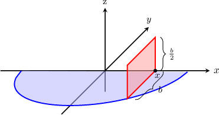

If we project the rectangular cross-section onto the $xy$-plane, we get the following picture:

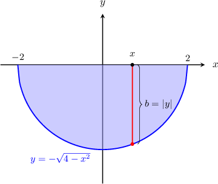

Then the base of the cross-section is

$$

\begin{aligned}𝑏 & =|𝑦| \\ & =−\sqrt{√4−𝑥^{2}} \\ & =\sqrt{√4−𝑥^{2}}.\end{aligned}

$$

Since the height ($h$) of each rectangle is $\dfrac{1}{2}$ times the base ($b$), the area of the rectangle is

$$

A = bh = b \cdot \left( \dfrac{1}{2} b \right) = \dfrac{1}{2}b^2.

$$

So, the expression for the area of the cross-section is

$$

\begin{aligned}𝐴(𝑥) & =\frac{1}{2}𝑏^{2} \\ & =\frac{1}{2}(\sqrt{√4−𝑥^{2}})^{2} \\ & =\frac{1}{2}(4−𝑥^{2}).\end{aligned}

$$

We can now calculate the volume of the solid using the following integral:

$$

\begin{aligned}𝑉 & =∫_{𝑑𝑐}^{}𝐴(𝑥)\,d𝑥 \\ & =\frac{1}{2}∫_{2−2}^{}(4−𝑥^{2})\,d𝑥\end{aligned}

$$

### Example: Computing the Volume When the Base Is Bounded by a Curve

#### Question

The base of a solid is the triangular region enclosed by the line $y=x-1$ and the $x$-axis from $x=0$ to $x=1.$ Cross-sections perpendicular to the $x$-axis are rectangles. Given that the height of each rectangle is $2$ times the length of its base, calculate the volume of the solid.

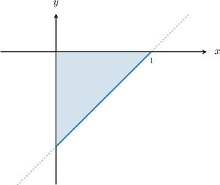

#### Explanation

Consider a cross-section at some point $x$, where $x \in (0,1)$, and its projection on the $xy$-plane:

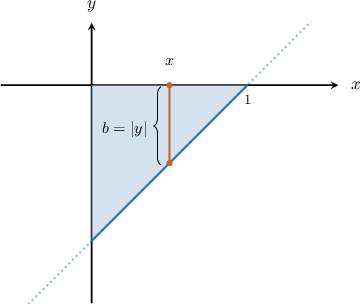

The base of the rectangle (cross-section) is

$$

\begin{aligned}𝑏 & =|𝑦|=|𝑥−1|.\end{aligned}

$$

The area of a rectangle is $A = bh.$ So, since we have $h=2b,$ the expression for the area of the cross-section is

$$

\begin{aligned}𝐴(𝑥) & =𝑏ℎ \\ & =2𝑏^{2} \\ & =2|𝑥−1|^{2} \\ & =2(𝑥−1)^{2}.\end{aligned}

$$

We can now calculate the volume of the solid, as follows:

$$

\begin{aligned}𝑉 & =∫_{𝑑𝑐}^{}𝐴(𝑥)\,d𝑥 \\ & =∫_{10}^{}2(𝑥−1)^{2}\,d𝑥 \\ & =2∫_{10}^{}(𝑥−1)^{2}\,d𝑥 \\ & =2∫_{10}^{}𝑥^{2}−2𝑥+1\,d𝑥 \\ & =2[\frac{𝑥^{3}}{3}−𝑥^{2}+𝑥]_{10}^{} \\ & =2([\frac{(1)^{3}}{3}−(1)^{2}+(1)]−[\frac{(0)^{3}}{3}−(0)^{2}+(0)]) \\ & =2(\frac{1}{3}−0) \\ & =\frac{2}{3}.\end{aligned}

$$

### Example: Computing the Volume When the Base Is Bounded by Two Curves

#### Question

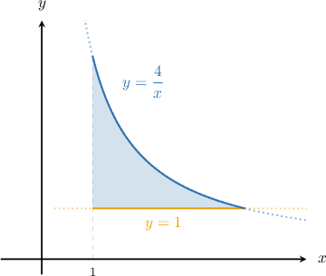

The base of a solid is the region enclosed by the curves $y=\dfrac{4}{x}$ and the lines $x=1,$ $y=1,$ as shown in the picture. Cross-sections perpendicular to the $x$-axis are rectangles. If the height of each rectangle is $3$ times the length of its base, which integral gives the volume of the solid?

#### Explanation

First, we let $f(x)=\dfrac4x$ and $g(x)=1.$

We need to determine the limits of integration. To do that, we find the intersections of the two curves by setting the functions equal to each other and solving for $x\mathbin{:}$

$$

\begin{aligned}𝑓(𝑥) & =𝑔(𝑥) \\ \frac{4}{𝑥} & =1 \\ 𝑥 & =4\end{aligned}

$$

Hence, the limits of integration are $x=1$ and $x=4.$

Now, consider a cross-section at some point $x$, where $x \in (1,4)$, and its projection on the $xy$-plane:

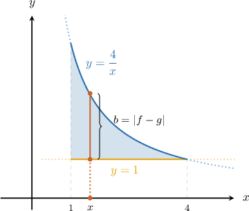

The base of the cross-section is

$$

\begin{aligned}𝑏 & =|𝑓(𝑥)−𝑔(𝑥)| \\ & =\frac{4}{𝑥}−1.\end{aligned}

$$

The area of a rectangle is $A = bh.$ So, since we have $h=3b,$ the expression for the area of the cross-section is

$$

\begin{aligned}𝐴(𝑥) & =𝑏ℎ \\ & =3𝑏^{2} \\ & =3(\frac{4}{𝑥}−1)^{2} \\ & =3(\frac{16}{𝑥^{2}}−\frac{8}{𝑥}+1).\end{aligned}

$$

We can now calculate the volume of the solid using the following integral.

$$

\begin{aligned}𝑉 & =∫_{𝑑𝑐}^{}𝐴(𝑥)\,d𝑥 \\ & =3∫_{41}^{}(\frac{16}{𝑥^{2}}−\frac{8}{𝑥}+1)d𝑥\end{aligned}

$$

### Cross-Sections Perpendicular to the y-Axis

Let's now suppose that the base of a solid is the right triangle enclosed by the line $x=2y+2$ and the $y$-axis between $y=-1$ and $y=0$, as shown in the picture below.

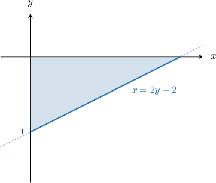

Suppose further that cross-sections perpendicular to the $\mathbf y$**-axis** are rectangles and that the height of each rectangle is $\dfrac{3}{4}$ times the length of its base. How do we find the volume of that solid?

A sketch with a few cross-sections is shown in the picture below.

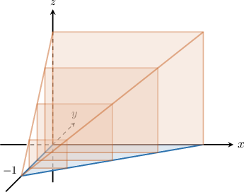

If we are given the expression $A(y)$ for the area of each cross-section, then we find the volume as follows:

$$

V = \int_{c}^{d} A(y)\:\textrm{d}y.

$$

Consider now a cross-section at some point $y,$ where $y \in (-1,0)\mathbin{:}$

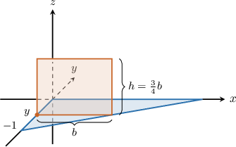

By projecting the rectangular cross-section onto the $xy$-plane, we get the following picture:

Then, the base of the cross-section is

$$

\begin{aligned}𝑏 & =|𝑥|=|2𝑦+2|.\end{aligned}

$$

Since the height $h$ is $\dfrac{3}{4}$ times the base $b$, the area of the rectangle is

$$

\begin{aligned}𝐴(𝑥) & =𝑏ℎ \\ & =𝑏⋅(\frac{3}{4}𝑏) \\ & =\frac{3}{4}𝑏^{2} \\ & =\frac{3}{4}(2𝑦+2)^{2} \\ & =3(𝑦+1)^{2}.\end{aligned}

$$

We can now calculate the volume of the solid using the following integral:

$$

\begin{aligned}𝑉 & =∫_{𝑑𝑐}^{}𝐴(𝑦)\,d𝑦 \\ & =3∫_{0−1}^{}(𝑦+1)^{2}d𝑦\end{aligned}

$$

### Example: Computing the Volume When the Cross Sections Are Perpendicular to the y-Axis

#### Question

The base of a solid is the region enclosed by the curve $x=\sqrt{3+y}$ and the $y$-axis from $y=-2$ to $y=0,$ as shown in the picture. Cross-sections perpendicular to the $y$-axis are rectangles. Given that the height of each rectangle is $2$ times the length of its base, calculate the volume of the solid.

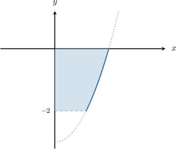

#### Explanation

Let's consider a cross-section at some point $y$, where $y \in (-2,0)$, and its projection on the $xy$-plane:

Then, the base of the rectangle (cross-section) is

$$

\begin{aligned}𝑏 & =|𝑥|=\sqrt{√3+𝑦}.\end{aligned}

$$

The area of the rectangle is $A = bh.$ So, since we have $h=2b,$ the expression for the area of the cross-section is

$$

\begin{aligned}𝐴(𝑦) & =𝑏ℎ \\ & =2𝑏^{2} \\ & =2(\sqrt{√3+𝑦})^{2} \\ & =2(3+𝑦).\end{aligned}

$$

We can now calculate the volume of the solid, as follows:

$$

\begin{aligned}𝑉 & =∫_{𝑑𝑐}^{}𝐴(𝑦)\,d𝑦 \\ & =∫_{0−2}^{}2(3+𝑦)\,d𝑦 \\ & =∫_{0−2}^{}(6+2𝑦)\,d𝑦 \\ & =∫_{0−2}^{}6\,d𝑦+∫_{0−2}^{}2𝑦\,d𝑦 \\ & =6𝑦\,_{0−2}^{}+𝑦^{2}\,_{0−2}^{} \\ & =6(0−(−2))+(0−4) \\ & =12−4 \\ & =8\end{aligned}

$$

### Example: Computing the Volume When the Base Is Bounded by Two Curves

#### Question

The base of a solid is the region enclosed by the curves $x=-y^4$ and the line $x=-1,$ as shown in the picture. Cross-sections perpendicular to the $y$-axis are rectangles. If the height of each rectangle is $\dfrac{1}{2}$ times the length of its base, which integral gives the volume of the solid?

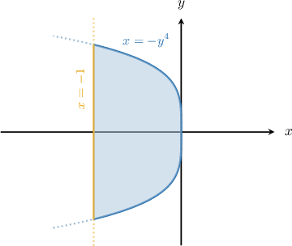

#### Explanation

First, we let $f(y)=-y^4$ and $g(y)=-1.$

We need to determine the limits of integration. To do that, we find the intersections of the two curves by setting the functions equal to each other and solving for $y\mathbin{:}$

$$

\begin{aligned}𝑓(𝑦) & =𝑔(𝑦) \\ −𝑦^{4} & =−1 \\ 𝑦^{4}−1 & =0 \\ (𝑦^{2}+1)(𝑦^{2}−1) & =0 \\ (𝑦^{2}−1) & =0 \\ 𝑦 & =±1\end{aligned}

$$

Hence, the limits of integration are $y=-1$ and $y=1.$

Now, consider a cross-section at some point $y$, where $y \in (-1,1)$, and its projection on the $xy$-plane:

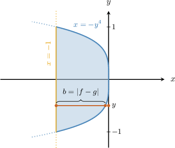

Then, the base of the cross-section is

$$

\begin{aligned}𝑏 & =|𝑓(𝑦)−𝑔(𝑦)| \\ & =−𝑦^{4}−(−1) \\ & =1−𝑦^{4}.\end{aligned}

$$

The area of a rectangle is $A =bh.$ So, since we have $h=\dfrac12b,$ the expression for the area of the cross-section is

$$

\begin{aligned}𝐴(𝑦) & =𝑏ℎ \\ & =\frac{1}{2}𝑏^{2} \\ & =\frac{1}{2}(1−𝑦^{4})^{2}.\end{aligned}

$$

We can now calculate the volume of the solid using the following integral:

$$

\begin{aligned}𝑉 & =∫_{𝑑𝑐}^{}𝐴(𝑦)\,d𝑦 \\ & =\frac{1}{2}∫_{1−1}^{}(1−𝑦^{4})^{2}d𝑦.\end{aligned}

$$
