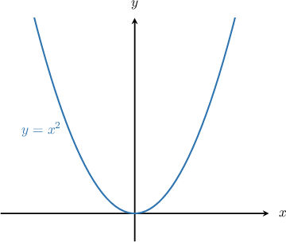
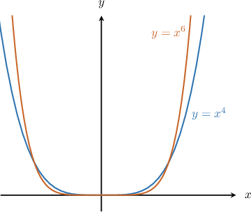
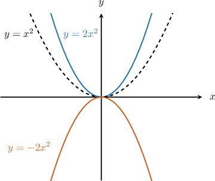
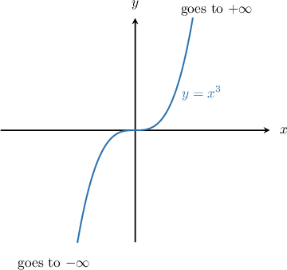

# Limits at Infinity of Polynomials

Source: https://www.mathacademy.com/topics/1263?courseId=21
Topic ID: 1263

## Prerequisites

- [The Power and Root Rules for Limits](../ap-calculus-ab/37-the-power-and-root-rules-for-limits.md)
- [Limits at Infinity from Graphs](../ap-calculus-ab/1873-limits-at-infinity-from-graphs.md)
- [End Behavior of Polynomials](../../../high-school/traditional/lessons/algebra-ii/2050-end-behavior-of-polynomials.md)

## Lesson

### Introduction

Suppose we want to calculate $\lim\limits_{x \to \infty} x^2$ and $\lim\limits_{x \to -\infty} x^2.$ To do this, we can use the graph of $y=x^2,$ which takes the familiar shape of a parabola.

On the right side of the graph, we see that $y$ increases without bound as $x \to \infty.$ On the left side of the graph, we have a similar situation: $y$ again increases without bound as $x \to -\infty.$ Consequently, we have

$$

\lim\limits_{x \to \infty} x^2=\infty\qquad \text{and}\qquad \lim\limits_{x \to -\infty} x^2=\infty.

$$

Notice that the functions $y=x^4$ and $y=x^6$ have a similar shape, and as such their limiting behavior is the same.

In general, whenever $n$ is an *even natural number*, we have

$$

\lim\limits_{x \to \infty} x^n=\infty\qquad \text{and}\qquad \lim\limits_{x \to -\infty} x^n=\infty, \qquad \text{for}\qquad n=2,4,6,\ldots.

$$

### The Effect of Coefficients

Multiplication of a power function by any *positive* real constant does not influence its limit at infinity. For example,

$$

\begin{aligned}\underset{𝑥→∞}{lim}2𝑥^{2} & =\underset{𝑥→∞}{lim}𝑥^{2}=∞\end{aligned}

$$

because $y=2x^2$ is an upward parabola, just like $y=x^2.$

On the other hand, multiplication of a power function by a *negative* real constant changes the *sign* of the limit. For example,

$$

\begin{aligned}\underset{𝑥→∞}{lim}−2𝑥^{2}=−\underset{𝑥→∞}{lim}𝑥^{2}=−∞\end{aligned}

$$

because $y=-2x^2$ is a downwards parabola that points in the opposite direction as $y=x^2.$

### Example: Computing the Limit at Infinity of a Power Function With an Even Power

#### Question

Find $\lim\limits_{x \to \infty} \left(-12x^{12}\right).$

#### Explanation

The graph $y=x^{12}$ looks similar to an upward parabola, so

$$

\lim\limits_{x \to \infty} x^{12} = \infty .

$$

However, multiplying by the negative coefficient $-12$ causes $y=-12x^{12}$ to look more like a downward parabola. This changes the sign of the limit. Therefore,

$$

\begin{aligned}\underset{𝑥→∞}{lim}(−12𝑥^{12})=−\underset{𝑥→∞}{lim}(𝑥^{12})=−∞.\end{aligned}

$$

### Computing the Limit at Infinity of a Power Function With an Odd Power

Now let's look at the graph of $y=x^3.$

We notice that the situation here is different:

$$

\lim_{x \to \infty} x^3=\infty \qquad\text{and}\qquad \lim_{x \to -\infty} x^3=-\infty.

$$

These limits are valid for any power function of the form $x^n,$ where $n$ is an *odd natural number*.

$$

\lim\limits_{x \to \infty} x^n=\infty\qquad \text{and}\qquad \lim\limits_{x \to -\infty} x^n=-\infty, \qquad n=1,3,5,\ldots.

$$

Again, multiplication of $x^n$ by a positive constant does not affect the limit at infinity. However, multiplication by a negative constant changes the sign of the limit.

### Example: Computing the Limit at Infinity of a Power Function With an Odd Power

#### Question

Evaluate $\lim\limits_{x \rightarrow -\infty} \dfrac{x^3}{2}.$

#### Explanation

First, we note that

$$

\begin{aligned}\underset{𝑥→−∞}{lim}\frac{𝑥^{3}}{2} & =\underset{𝑥→−∞}{lim}(\frac{1}{2}⋅𝑥^{3}) \\ & =\frac{1}{2}⋅\underset{𝑥→−∞}{lim}𝑥^{3}.\end{aligned}

$$

The graph $y=x^3$ is power function with an odd positive power and therefore has the property that

$$

\lim_{x\to-\infty } x^3 = -\infty.

$$

Multiplication by the positive constant $\dfrac{1}{2}$ does not affect the limit at infinity. So, we have

$$

\begin{aligned}\frac{1}{2}⋅\underset{𝑥→−∞}{lim}𝑥^{3} & =\underset{𝑥→−∞}{lim}𝑥^{3} \\ & =−∞.\end{aligned}

$$

### Infinite Limits of Constant Functions

Constants do not vary with $x.$ So, any limit of a constant evaluates to just the constant itself.

For example, we have

$$

\lim\limits_{x \to \infty} 3=3.

$$

Likewise,

$$

\lim\limits_{x \to -\infty} \sqrt{ \pi}= \sqrt{\pi} .

$$

In general, for any constant $C,$ we have

$$

\lim\limits_{x \to \pm\infty} C=C.

$$

### Example: Computing the Limit at Infinity of a Constant Function

#### Question

Given that $p(x)=9x^4$ and $q(x)=3x^4$, what is $\lim\limits_{x \to -\infty} \dfrac{p(x)}{q(x)}?$

#### Explanation

When we divide the two functions, we get a constant, and the limit of a constant is just the constant itself:

$$

\begin{aligned}\underset{𝑥→−∞}{lim}\frac{𝑝(𝑥)}{𝑞(𝑥)} & =\underset{𝑥→−∞}{lim}\frac{9𝑥^{4}}{3𝑥^{4}} \\ & =\underset{𝑥→−∞}{lim}3 \\ & =3\end{aligned}

$$

### Limits at Infinity of General Polynomials

To compute the limit at infinity of a general polynomial, we *only* need to consider the term with the largest exponent, called the **leading term**. All of the other terms can be disregarded!

For example, to compute

$$

\lim\limits_{x\to \infty} \left( 6x + 2x^3-7x^2+12\right) \, ,

$$

we identify the leading term and compute its limit. Here, the leading term is ${\color{blue}{2x^3}},$ so we have

$$

\begin{aligned}\underset{𝑥→∞}{lim}(6𝑥+2𝑥^{3}−7𝑥^{2}+12) & =\underset{𝑥→∞}{lim}(2𝑥^{3}) \\ & =\underset{𝑥→∞}{lim}(𝑥^{3}) \\ & =∞\,.\end{aligned}

$$

The reason this works is that when $x$ becomes very large, the behavior of the polynomial is dominated by the term with the largest exponent.

**Watch out!** The leading term is *not* always the first term that appears in the expression. Rather, it is the term *with the largest exponent*. This term may appear anywhere in the expression.

The reason why we call the term with the largest exponent the "leading" term is that when the polynomial is arranged in standard form (with exponents ordered from greatest to least), the term with the largest exponent appears first:

$$

6x+ {\color{blue}{2x^3}}-7x^2+12 \quad \to \quad {\color{blue}{2x^3}}-7x^2+6x+12

$$

### Example: Computing the Limit at Infinity of a General Polynomial

#### Question

Calculate $\lim\limits_{y\rightarrow -\infty} (44-3y^4-9y^{12}) \,.$

#### Explanation

We identify the leading term and compute its limit:

$$

\begin{aligned}\underset{𝑦→−∞}{lim}(44−3𝑦^{4}−9𝑦^{12}) & =\underset{𝑦→−∞}{lim}(−9𝑦^{12}) \\ & =−\underset{𝑦→−∞}{lim}(𝑦^{12}) \\ & =−∞\end{aligned}

$$
