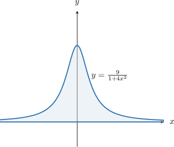

# Improper Integrals Over the Real Line

Source: https://www.mathacademy.com/topics/1382?courseId=21
Topic ID: 1382

## Prerequisites

- [The Area Bounded by a Curve and the X-Axis](../ap-calculus-ab/1040-the-area-bounded-by-a-curve-and-the-x-axis.md)
- [Improper Integrals Involving Exponential Functions](./4004-improper-integrals-involving-exponential-functions.md)
- [Improper Integrals Involving Arctangent](./4005-improper-integrals-involving-arctangent.md)

## Lesson

### Introduction

Consider an improper integral in which both the left and right endpoints are unbounded:

$$

\int_{-\infty}^{\infty} f(x) \, \text{d}x

$$

If the integrand $f(x)$ is continuous on $(-\infty, \infty),$ then we can break the integral up into two improper integrals, each with a single unbounded endpoint:

$$

\int_{-\infty}^{\infty} f(x) \, \text{d}x = \int_{-\infty}^{0} f(x) \, \text{d}x + \int_{0}^{\infty} f(x) \, \text{d}x

$$

Then, we can compute each of the two integrals separately and combine their results.

**Watch out!** If either of the two integrals on the right-hand side is divergent, then the integral on the left-hand side is also divergent.

### Example: Identifying Convergent or Divergent Integrals With Unbounded Limits

#### Question

Consider the function $f(x) = e^{-x}.$ Which of the following statements are true?

1. $\displaystyle \int_0^\infty f(x) \, \textrm dx$ is convergent

2. $\displaystyle \int_{-\infty}^0 f(x) \, \textrm dx$ is divergent

3. $\displaystyle \int_{-\infty}^\infty f(x) \, \textrm dx$ is divergent

#### Explanation

Suppose we have an improper integral in which both the left and right endpoints are unbounded:

$$

\int_{-\infty}^{\infty} f(x) \, \text{d}x

$$

If the integrand $f(x)$ is continuous on $(-\infty, \infty),$ then we can break the integral up into two improper integrals, each with a single unbounded endpoint:

$$

\int_{-\infty}^{\infty} f(x) \, \text{d}x = \int_{-\infty}^{0} f(x) \, \text{d}x + \int_{0}^{\infty} f(x) \, \text{d}x

$$

Then, we can compute each of the two integrals separately and combine their results.

**** If either of the two integrals on the right-hand side is divergent, then the integral on the left-hand side is also divergent.

With that in mind, let's examine our integrals.

- Computing the integral in statement I, we get So the integral converges, and statement I is true.

- Computing the integral in statement II, we get So the integral diverges, and statement II is true.

- The integral in statement III can be expressed as However, the first integral on the right-hand side is divergent. Therefore, the integral on the left-hand side is also divergent, and statement III is true.

In conclusion, statements I, II, and III are all true.

### Improper Integrals of Even and Odd Functions

Computing the definite integral of a function over the entire real line requires us to break the integral into two parts and separately evaluate each one.

$$

\int_{-\infty}^{\infty} f(x) \, \text{d}x = \int_{-\infty}^{0} f(x) \, \text{d}x + \int_{0}^{\infty} f(x) \, \text{d}x

$$

Evaluating two improper integrals can be quite time-consuming. However, we can shorten the process if we see that $f(x)$ is an even or odd function.

- Recall that $f(x)$ is an even function if $f(-x) = f(x).$ Even functions are symmetrical about the $y$-axis. Therefore, if $f(x)$ is even, we have provided that the integrals are convergent. Moreover, if $f(x)$ is even and the above integrals are convergent, then

- Recall that $f(x)$ is an odd function if $f(-x) = -f(x).$ Therefore, if $f(x)$ is odd, we have provided that the integrals are convergent. Moreover, if $f(x)$ is odd and the above integrals are convergent, then

### Example: Calculating an Improper Integral With Unbounded Limits

#### Question

Evaluate $\displaystyle \int_{-\infty}^{\infty} \dfrac{1}{x^2+1} \, \text{d}x.$

#### Explanation

We break up the integral as follows:

$$

\int_{-\infty}^{\infty} \dfrac{1}{x^2+1} \, \text{d}x = \int_{-\infty}^{0} \dfrac{1}{x^2+1} \, \text{d}x + \int_{0}^{\infty} \dfrac{1}{x^2+1} \, \text{d}x.

$$

Evaluating the first of these integrals, we get

$$

\begin{aligned} \int_{-\infty}^0 \dfrac {1}{x^2+1} \,\text{d}x &= \lim_{a \to -\infty} \int_{a}^0 \dfrac {1}{x^2+1} \,\text{d}x\\[5pt] & = \lim_{a \to -\infty}\left( \arctan (x) \Big|_a^0 \right) \\[5pt] & = \lim_{a \to -\infty} \left[\arctan \left( 0 \right) - \arctan \left( a \right) \right] \\[5pt] & = 0 - \lim_{a \to -\infty} \arctan \left( a \right) \\[5pt] &= - \left(-\dfrac \pi 2 \right)\\[5pt] & = \dfrac{\pi}{2}. \end{aligned}

$$

Now, notice that the integrand is an **** function (i.e., it is symmetrical about the $y$-axis). This means that we can immediately deduce that

$$

\int_{0}^\infty \dfrac {1}{x^2+1} \,\text{d}x =\dfrac{\pi}{2}.

$$

Therefore, since both improper integrals exist, we conclude that

$$

\begin{aligned} \int_{-\infty}^{\infty} \dfrac{1}{x^2+1} \, \text{d}x &= \int_{-\infty}^{0} \dfrac{1}{x^2+1} \, \text{d}x + \int_{0}^{\infty} \dfrac{1}{x^2+1} \, \text{d}x\\[5pt] &=\dfrac{\pi}{2}+ \dfrac{\pi}{2}\\[5pt] &= \pi.\end{aligned}

$$

### Example: Finding the Area of an Unbounded Region

#### Question

Find the area of the region bounded by the graph of the curve $y = \dfrac{9}{1+4x^2}$ and the $x$-axis.

#### Explanation

Let's sketch a graph of the region.

In this case, we must calculate the improper integral

$$

\displaystyle \int_{-\infty}^{\infty} \dfrac{9}{4x^2+1}\,\text{d}x.

$$

As usual, we break up the integral as follows:

$$

\displaystyle \int_{-\infty}^{\infty} \dfrac{9}{4x^2+1}\,\text{d}x = \displaystyle \int_{-\infty}^{0} \dfrac{9}{4x^2+1}\,\text{d}x + \displaystyle \int_{0}^{\infty} \dfrac{9}{4x^2+1}\,\text{d}x

$$

Evaluating the first of these integrals, we get

$$

\begin{aligned} \int_{-\infty}^0 \dfrac {9}{4x^2+1} \,\text{d}x & = 9\lim_{a \to -\infty}\left( \left[\dfrac{1}{2}\arctan \left(2x \right) \right]_a^0 \right) \\[5pt] & = \dfrac{9}{2} \lim_{a \to -\infty} \left[\arctan \left( 0 \right) - \arctan \left( 2a \right) \right] \\[5pt] & = 0 - \dfrac{9}{2}\lim_{a \to -\infty} \arctan \left( 2a \right) \\[5pt] & = -\dfrac{9}{2} \left(-\dfrac \pi 2 \right)\\[5pt] & = \dfrac{9\pi}{4}. \end{aligned}

$$

Now, notice that the integrand is an **** function. Therefore, we can immediately deduce that

$$

\displaystyle \int_{0}^\infty\dfrac {9}{4x^2+1} \,\text{d}x = \dfrac{9\pi}{4}.

$$

Therefore, since both improper integrals exist, we conclude that

$$

\int_{-\infty}^{\infty} \dfrac{9}{4x^2+1}\,\text{d}x = \dfrac{9\pi}{4}+ \dfrac{9\pi}{4}= \dfrac{9\pi}{2} .

$$

So, the required area is equal to $\dfrac{9\pi}{2}$ square units.
