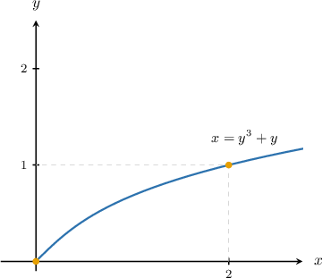
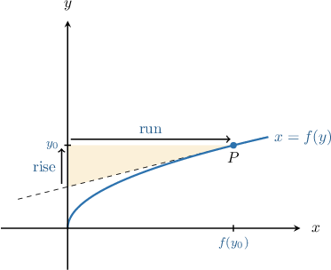

# Calculating dy/dx Using dx/dy

Source: https://www.mathacademy.com/topics/1784?courseId=21
Topic ID: 1784

## Prerequisites

- [Calculating the Equation of a Tangent Line Using Differentiation](../ap-calculus-ab/986-calculating-the-equation-of-a-tangent-line-using-differentiation.md)
- [Plotting X as a Function of Y](../../../high-school/traditional/lessons/algebra-ii/2978-plotting-x-as-a-function-of-y.md)
- [Adding Rational Expressions With No Common Factors in the Denominator](../../../high-school/traditional/lessons/algebra-ii/3739-adding-rational-expressions-with-no-common-factors-in-the-denominator.md)

## Lesson

### Introduction

Suppose that a curve is defined by the following equation:

$$

x= y^3+y

$$

Plotting this curve in the $xy$-plane, we get the following:

To find the slope of the tangent to this curve at a point, we need to follow two steps.

- First, we calculate $\dfrac{\textrm dx}{\textrm dy}$ by differentiating the equation of the curve with respect to $y.$

- Then, we find $\dfrac{\textrm dy}{\textrm dx}$ by taking the reciprocal of $\dfrac{\textrm dx}{\textrm dy}{:}$

We'll explore some intuition behind this result at the end of the lesson, but for now, let's focus on carrying out the computation.

We start by differentiating $x=y^3+y$ with respect to $y\mathbin{:}$

$$

\begin{aligned}\frac{d𝑥}{d𝑦} & =\frac{d}{d𝑦}(𝑦^{3}+𝑦) \\ & =\frac{d}{d𝑦}(𝑦^{3})+\frac{d}{d𝑦}(𝑦) \\ & =3𝑦^{2}+1\end{aligned}

$$

Then, we take its reciprocal:

$$

\begin{aligned}\frac{d𝑦}{d𝑥} & =(\frac{d𝑥}{d𝑦})^{−1} \\ & =\frac{1}{(\frac{d𝑥}{d𝑦})} \\ & =\frac{1}{3𝑦^{2}+1}\end{aligned}

$$

Notice that the derivative is also defined implicitly. In other words, $\dfrac{\textrm dy}{\textrm dx}$ is a function of $y,$ not $x.$

To calculate the slope of the tangent to this curve at a point, say $(2,{\color{blue}{1}}),$ we substitute ${\color{blue}{y}} = {\color{blue}{1}}$ into our expression for $\dfrac{\textrm dy}{\textrm dx}{:}$

$$

\begin{aligned}(\frac{d𝑦}{d𝑥})_{(2,1)} & =\frac{1}{3(1)^{2}+1} \\ & =\frac{1}{3+1} \\ & =\frac{1}{4}\end{aligned}

$$

Therefore, the slope of the tangent to the curve at the point $(2,1)$ equals $\dfrac14.$

### Example: Calculating dy/dx Using dx/dy

#### Question

If $x=2y^2 + \dfrac1{y^2}$, then find $\dfrac{\textrm dy}{\textrm dx}.$

#### Explanation

First, we differentiate $x(y)$ with respect to $y\mathbin{:}$

$$

\begin{aligned}\frac{d𝑥}{d𝑦} & =\frac{d}{d𝑦}(2𝑦^{2}+\frac{1}{𝑦^{2}}) \\ & =\frac{d}{d𝑦}(2𝑦^{2}+𝑦^{−2}) \\ & =2\frac{d}{d𝑦}(𝑦^{2})+\frac{d}{d𝑦}(𝑦^{−2}) \\ & =4𝑦−2𝑦^{−3} \\ & =4𝑦−\frac{2}{𝑦^{3}} \\ & =\frac{4𝑦^{4}−2}{𝑦^{3}}\end{aligned}

$$

Now, taking the reciprocal of $\dfrac{\textrm dx}{\textrm dy},$ we get

$$

\dfrac{\textrm dy}{\textrm dx} = \left( \dfrac{\textrm dx}{\textrm dy} \right)^{-1} = \dfrac{y^3}{4y^4 -2}.

$$

### Example: Calculating dy/dx at a Point Using dx/dy

#### Question

If $x = y + 2y\sqrt y$, find $\dfrac{\textrm dy}{\textrm dx}$ at the point $\left(3, 1\right).$

#### Explanation

First, we differentiate $x(y)$ with respect to $y{:}$

$$

\begin{aligned}\frac{d𝑥}{d𝑦} & =\frac{d}{d𝑦}(𝑦+2𝑦\sqrt{𝑦}) \\ & =\frac{d}{d𝑦}(𝑦+2𝑦^{3/2}) \\ & =\frac{d}{d𝑦}(𝑦)+2\frac{d}{d𝑦}(𝑦^{3/2}) \\ & =1+2⋅(\frac{3}{2}𝑦^{1/2}) \\ & =1+3𝑦^{1/2} \\ & =1+3\sqrt{𝑦}\end{aligned}

$$

Now, taking the reciprocal of $\dfrac{\textrm dx}{\textrm dy},$ we get

$$

\dfrac{\textrm dy}{\textrm dx} = \left( \dfrac{\textrm dx}{\textrm dy} \right)^{-1} = \dfrac{1}{1 + 3\sqrt y}.

$$

Finally, substituting the point $(3,1),$ we find

$$

\begin{aligned}\frac{d𝑦}{d𝑥}_{(𝑥,𝑦)=(3,1)} & =\frac{1}{1+3\sqrt{1}}=\frac{1}{4}.\end{aligned}

$$

### Example: Finding the Equation of a Tangent Line Using dx/dy

#### Question

What is the equation of the tangent to the curve $x = 2y^2 -y + 1$ at the point $(2,1)?$

#### Explanation

First, we differentiate $x(y)$ with respect to $y{:}$

$$

\begin{aligned}\frac{d𝑥}{d𝑦} & =\frac{d}{d𝑦}(2𝑦^{2}−𝑦+1) \\ & =2\frac{d}{d𝑦}(𝑦^{2})−\frac{d}{d𝑦}(𝑦)+\frac{d}{d𝑦}(1) \\ & =2⋅(2𝑦)−1+0 \\ & =4𝑦−1\end{aligned}

$$

Now, taking the reciprocal of $\dfrac{\textrm dx}{\textrm dy},$ we get

$$

\dfrac{\textrm dy}{\textrm dx} = \left( \dfrac{\textrm dx}{\textrm dy} \right)^{-1} = \dfrac1{4y - 1}.

$$

The slope of the tangent to the curve at the point $(2,1)$ is

$$

\begin{aligned}𝑚 & =\frac{d𝑦}{d𝑥}_{(𝑥,𝑦)=(2,1)} \\ & =\frac{1}{4(1)−1} \\ & =\frac{1}{3}.\end{aligned}

$$

Using the point-slope formula for a tangent line, we get

$$

\begin{aligned}𝑦−𝑦_{1} & =𝑚(𝑥−𝑥_{1}) \\ 𝑦−1 & =\frac{1}{3}(𝑥−2) \\ 𝑦 & =\frac{𝑥}{3}−\frac{2}{3}+1 \\ 𝑦 & =\frac{𝑥}{3}+\frac{1}{3}.\end{aligned}

$$

### Justification of the Formula

Throughout this lesson, we've made use of the following result:

$$

\dfrac{\textrm dy}{\textrm dx} = \left( \dfrac{\textrm dx}{\textrm dy} \right)^{-1}

$$

Let's now build some more intuition behind this result.

Consider the graph of $x=f(y),$ shown below.

The slope of the tangent to $x=f(y)$ at $P$ is given by

$$

\begin{aligned}\frac{d𝑦}{d𝑥} & =\frac{rise}{run}.\end{aligned}

$$

Now, the quantity

$$

\dfrac{\textrm d x}{\textrm d y}

$$

represents the change in $x$ *per unit change* in $y$ at $P.$ According to our diagram, this is given by

$$

\begin{aligned}\frac{d𝑥}{d𝑦} & =\frac{run}{rise}.\end{aligned}

$$

Therefore, we can write the slope of the tangent to the curve at $P$ as

$$

\begin{aligned}\frac{d𝑦}{d𝑥} & =\frac{rise}{run} \\ & =(\frac{run}{rise})^{−1} \\ & =\frac{1}{(\frac{d𝑥}{d𝑦})}.\end{aligned}

$$

This result can also be proved formally using the so-called **chain rule**.
