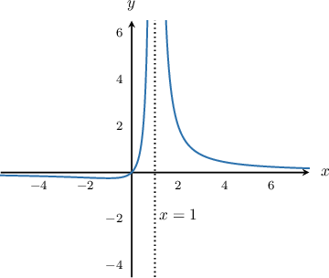
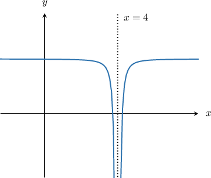
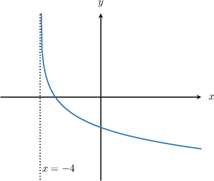

# Infinite Limits from Graphs

Source: https://www.mathacademy.com/topics/1814?courseId=21
Topic ID: 1814

## Prerequisites

- [Finding the Existence of a Limit Using One-Sided Limits](../ap-calculus-ab/625-finding-the-existence-of-a-limit-using-one-sided-limits.md)
- [Unbounded Behavior of Functions Near a Point](../../../high-school/traditional/lessons/algebra-ii/2046-unbounded-behavior-of-functions-near-a-point.md)

## Lesson

### Introduction

Until now, all limits of the form $\lim\limits_{x \to a} f(x)$ that we have encountered have evaluated to either a finite number or $\text{DNE}.$ However, there is another possibility: the limit could be *infinite*!

For example, consider the function $f(x)$ whose graph is shown below. This function has a vertical asymptote at $x=1,$ and the function value $f(x)$ grows without bound as $x$ approaches the asymptote $x=1.$ What is the limit $\lim\limits_{x\to 1} f(x)$?

Remember that in order for computing any limit, in this case, $\lim\limits_{x\to 1} f(x),$ we have to compute the left and right-sided limits separately and ensure that they match up.

- **Left-sided limit:** As we approach $x=1$ (the vertical asymptote) from the left side of the graph, the function $f(x)$ increases without bound, approaching $\infty.$ We conclude that

- **Right-sided limit:** Likewise, as we approach the vertical asymptote $x=1$ from the right side of the graph, $f(x)$ still approaches $\infty.$ Consequently,

We see that both the left and right limits exist and are equal to $\infty\mathbin{:}$

$$

\lim\limits_{x\to 1^-} f(x) = \lim\limits_{x\to 1^+} f(x) = \infty

$$

As a result, the overall limit is also equal to $\infty\mathbin{:}$

$$

\lim\limits_{x\to 1} f(x) = \infty

$$

### Example: Identifying Infinite Limits when the Left and Right Limits are the Same

#### Question

The figure below shows the graph of $f(x).$ Evaluate $\lim\limits_{x \to \,4} f(x).$

#### Explanation

We see from the graph that as $x$ approaches $4$ from the left, the function $f(x)$ approaches $-\infty.$ So, the left-hand limit is

$$

\lim\limits_{x\rightarrow 4^-} f(x) = -\infty \, .

$$

Likewise, as $x$ approaches $4$ from the right, the function $f(x)$ again approaches $-\infty.$ So, the right-hand limit is

$$

\lim\limits_{x\rightarrow 4^+} f(x) = -\infty \, .

$$

Consequently,

$$

\lim\limits_{x\rightarrow 4} f(x)=-\infty \, .

$$

### Example: Identifying Infinite Limits when the Left and Right Limits are Different

#### Question

The figure below shows the graph of $f(x).$ What is $\lim\limits_{x \to \,-\,4} f(x)?$

#### Explanation

As $x$ approaches $-4$ from the right, the function value $f(x)$ grows to infinity, and therefore

$$

\lim\limits_{x\to -4^+} f(x)=\infty.

$$

However, the function $f(x)$ is not defined for $x<-4,$ and consequently we cannot approach $x=-4$ from the left. So we have

$$

\lim\limits_{x\to -4^-} f(x)=\text{DNE},

$$

and therefore

$$

\lim\limits_{x\to -4} f(x)=\text{DNE}.

$$
