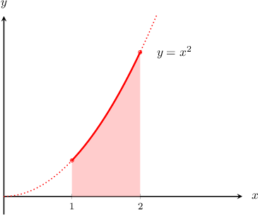

# The Fundamental Theorem of Calculus

Source: https://www.mathacademy.com/topics/283?courseId=21
Topic ID: 283

## Prerequisites

- [The Antiderivative](../ap-calculus-ab/308-the-antiderivative.md)
- [Continuity of Functions](../ap-calculus-ab/2006-continuity-of-functions.md)

## Lesson

### Introduction

Consider the function $f(x) = x^2.$ The **definite integral** **of** $\mathbf f(x)$ **between** $\mathbf{x=1}$ and $\mathbf{x=2}$ is denoted

$$

\int_1^2 x^2 \, \textrm d x.

$$

Geometrically, this definite integral can be interpreted as the **signed area** bounded between the curve $y=f(x),$ the lines $x=1$ and $x=2,$ and the $x$-axis, as shown below.

The area is taken as positive (with a plus sign) if the corresponding region lies above the $x$-axis and as negative (with a minus sign) if the region lies below the $x$-axis.

To calculate this area, we use a theorem known as the **fundamental theorem of calculus**, which states the following:

*If $f(x)$ is a function that's continuous on an interval $[a,b]$, and there exists a function $F(x)$ such that $F'(x) = f(x)$ on $[a,b]$, then*

$$

\int_a^b f(x)\,\text{d}x = F(b) - F(a).

$$

So how do we use this to calculate our definite integral $\displaystyle \int_1^2 x^2\,\text{d}x?$ We just need to follow a few steps:

**Step 1**: Find the *indefinite* integral (also known as the antiderivative) of the function using the power rule. We can ignore the constant of integration.

$$

\int x^2 \, \textrm d x = \dfrac{x^3}{3}

$$

**Step 2**: Write the lower and upper limit next to the result.

$$

\int_1^2 x^2 \, \textrm d x = \dfrac{x^3}{3}\Bigg|_{\color{red}1}^{\color{blue}2}

$$

**Step 3**: Evaluate the antiderivative between the upper and lower limit, and subtract them.

$$

\begin{aligned}∫_{21}𝑥^{2}\,d𝑥 & =\frac{(2)^{3}}{3}−\frac{(1)^{3}}{3} \\ & =\frac{8}{3}−\frac{1}{3} \\ & =\frac{7}{3}.\end{aligned}

$$

Therefore, we conclude that

$$

\int_1^2 f(x)\,\text{d}x = \dfrac73.

$$

### Example: Evaluating the Definite Integral of a Polynomial Function

#### Question

Evaluate $\displaystyle\int_0^4 x \, \textrm d x.$

#### Explanation

Taking the antiderivative and evaluating the difference at the bounds, we get

$$

\begin{aligned}∫_{40}𝑥\,d𝑥 & =\frac{𝑥^{1+1}}{1+1}_{40} \\ & =\frac{𝑥^{2}}{2}_{40} \\ & =\frac{4^{2}}{2}−\frac{0^{2}}{2} \\ & =\frac{16}{2} \\ & =8.\end{aligned}

$$

### Example: Evaluating the Definite Integral of a Rational Function

#### Question

Evaluate $\displaystyle \int _{1}^2\dfrac 1 {x^3}\, \textrm d x.$

#### Explanation

Taking the antiderivative and evaluating the difference at the bounds, we get

$$

\begin{aligned}∫_{21}\frac{1}{𝑥^{3}}\,d𝑥 & =∫_{21}𝑥^{−3}\,d𝑥 \\ & =\frac{𝑥^{−3+1}}{−3+1}_{21} \\ & =−\frac{𝑥^{−2}}{2}_{21} \\ & =−\frac{1}{2}(2^{−2}−1^{−2}) \\ & =−\frac{1}{2}(\frac{1}{4}−1) \\ & =−\frac{1}{2}(−\frac{3}{4}) \\ & =\frac{3}{8}.\end{aligned}

$$

### Example: Evaluating the Definite Integral of a Radical Function

#### Question

Calculate $\displaystyle\int_1^4\sqrt x\, \textrm d x.$

#### Explanation

Taking the antiderivative and evaluating the difference at the bounds, we get

$$

\begin{aligned}∫_{41}\sqrt{𝑥}\,d𝑥 & =∫_{41}𝑥^{1/2}\,d𝑥 \\ & =\frac{2}{3}𝑥^{3/2}_{41} \\ & =\frac{2}{3}(4^{3/2}−1^{3/2}) \\ & =\frac{2}{3}(\sqrt{64}−1) \\ & =\frac{2}{3}(8−1) \\ & =\frac{14}{3}.\end{aligned}

$$
