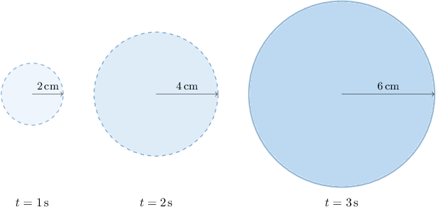
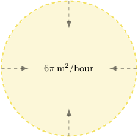
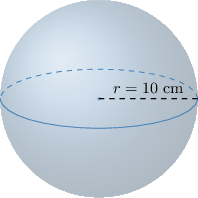

# Calculating Related Rates With Circles and Spheres

Source: https://www.mathacademy.com/topics/287?courseId=21
Topic ID: 287

## Prerequisites

- [Related Rates With Implicit Functions](../ap-calculus-ab/4059-related-rates-with-implicit-functions.md)

## Lesson

### Introduction

Suppose we're told that the radius of a circle is **growing at a rate of $2\,\text{cm}$ every second**, as shown below.

If the radius of the circle is growing, then its area is also increasing. How do we calculate the **rate at which the area is increasing**?

The rate at which the area is changing can be expressed using a derivative:

$$

\dfrac{\textrm d A}{\textrm d t}

$$

Here, $A$ is the area of the circle, measured in $\text{cm}^2,$ and $t$ is the time in seconds.

We know that the area is related to the radius $r$ as

$$

A = \pi r^2.

$$

Differentiating the above using implicit differentiation, we get

$$

\begin{aligned}\frac{d}{d𝑡}(𝐴) & =\frac{d}{d𝑡}(𝜋𝑟^{2}) \\ \frac{d𝐴}{d𝑡} & =\frac{d𝑟}{d𝑡}⋅\frac{d}{d𝑟}(𝜋𝑟^{2}) \\ \frac{d𝐴}{d𝑡} & =\frac{d𝑟}{d𝑡}⋅2𝜋𝑟\end{aligned}

$$

Since the radius of a circle is growing at a rate of $2\,\text{cm}$ every second, we have $\dfrac{\textrm dr}{\textrm dt} = 2 \, \text{cm}.$ Substituting this information, we have

$$

\begin{aligned}\frac{d𝐴}{d𝑡} & =2⋅2𝜋𝑟=4𝜋𝑟\,cm^{2}/s.\end{aligned}

$$

And, that's it, we're done!

If we want to calculate $\dfrac{\textrm d A}{\textrm d t}$ at a particular moment, we substitute the value of $r$ at that moment into the above. So, for example, if we want to compute $\dfrac{\textrm d A}{\textrm d t}$ at the moment when $r=6\,\text{cm},$ we plug this into the above and get

$$

\dfrac{\textrm d A}{\textrm d t} = 4\pi \cdot 6 = 24\pi\,\text{cm}^2/\text{s}.

$$

### Example: Calculating a Related Rate With a Circle

#### Question

The radius of a circle is increasing. At a particular moment, the rate of increase of the area of the circle is numerically equal to half the rate of increase of the circumference. What is the radius of the circle at that moment?

#### Explanation

Let $r$ be the radius, $A$ the area, and $C$ the circumference of the circle. We wish to find $r$ at the moment when $\dfrac{\textrm d A}{\textrm d t} = \dfrac{1}{2}\dfrac{\textrm d C}{\textrm d t}.$

To start, let's set up an equation relating the area $A$ and the circumference $C$ of the circle. Since $C=2\pi r$ and $A = \pi r^2,$ the relationship between $A$ and $C$ is

$$

A = \pi r^2 = \pi \left(\dfrac{C}{2\pi} \right)^2 = \dfrac{C^2}{4\pi}.

$$

Differentiating this relationship with respect to $t$ using implicit differentiation, we get

$$

\begin{aligned}\frac{d}{d𝑡}(𝐴) & =\frac{d}{d𝑡}(\frac{𝐶^{2}}{4𝜋}) \\ \frac{d𝐴}{d𝑡} & =\frac{d𝐶}{d𝑡}⋅\frac{d}{d𝐶}(\frac{𝐶^{2}}{4𝜋}) \\ \frac{d𝐴}{d𝑡} & =\frac{d𝐶}{d𝑡}⋅\frac{𝐶}{2𝜋}.\end{aligned}

$$

Now, since $\dfrac{\textrm d A}{\textrm d t} = \dfrac{1}{2}\dfrac{\textrm d C}{\textrm d t},$ we have

$$

\begin{aligned}\frac{1}{2}\frac{d𝐶}{d𝑡} & =\frac{d𝐶}{d𝑡}⋅\frac{𝐶}{2𝜋} \\ \frac{1}{2} & =\frac{𝐶}{2𝜋} \\ 𝐶 & =𝜋.\end{aligned}

$$

Lastly, since $C = 2\pi r,$ we have

$$

\begin{aligned}2𝜋𝑟 & =𝜋 \\ 𝑟 & =\frac{1}{2}.\end{aligned}

$$

### Example: Calculating a Related Rate With a Circle: Word Problem

#### Question

A circular oil spillage is being cleaned up by a team using specialized cleaning equipment. If the area of the circle is ** at a rate of $6\pi\,\text{m}^2/\text{h}$, what is the rate at which the radius is decreasing at the instant when the radius is $2\,\text{m}?$

#### Explanation

In this situation, we want to find $\dfrac{\textrm d r}{\textrm d t}$ at the moment when $r=2,$ and we are also told that $\dfrac{\textrm d A}{\textrm d t} = -6\pi.$

To start, let's write down the area formula for the circle and then differentiate it using implicit differentiation. We get

$$

\begin{aligned}𝐴 & =𝜋𝑟^{2} \\ \frac{d}{d𝑡}(𝐴) & =\frac{d}{d𝑡}(𝜋𝑟^{2}) \\ \frac{d𝐴}{d𝑡} & =\frac{d𝑟}{d𝑡}⋅\frac{d}{d𝑟}(𝜋𝑟^{2}) \\ \frac{d𝐴}{d𝑡} & =\frac{d𝑟}{d𝑡}⋅2𝜋𝑟.\end{aligned}

$$

Now we can substitute the given information $\dfrac{\textrm dA}{\textrm dt} = -6\pi$ and $r=2,$ and solve for $\dfrac{\textrm d r}{\textrm d t}.$ We get

$$

\begin{aligned}−6𝜋 & =\frac{d𝑟}{d𝑡}⋅2𝜋(2) \\ −6𝜋 & =\frac{d𝑟}{d𝑡}⋅4𝜋 \\ \frac{d𝑟}{d𝑡} & =−\frac{3}{2}.\end{aligned}

$$

We conclude that the radius is decreasing at a rate of $\dfrac{3}{2}$ meter per hour.

### Example: Calculating a Related Rate With a Sphere: Word Problem

#### Question

Air is leaking from a spherical balloon at the rate of $500\pi\,\text{cm}^3/\text{s}.$ How fast is the radius of the balloon decreasing when the radius is $10\,\text{cm}?$

#### Explanation

Let $r$ be the radius of the balloon and $V$ its volume. Both $r$ and $V$ change with time. In particular, we are given

$$

\dfrac{\textrm dV}{\textrm dt} = -500\pi\,\text{cm}^3/\text{s},

$$

and we want to find $\dfrac{\textrm dr}{\textrm dt}$ when $r=10\,\text{cm}.$

To start, let's write down the volume formula for the sphere and then differentiate it using implicit differentiation. We get

$$

\begin{aligned}𝑉 & =\frac{4}{3}𝜋𝑟^{3} \\ \frac{d}{d𝑡}(𝑉) & =\frac{d}{d𝑡}(\frac{4}{3}𝜋𝑟^{3}) \\ \frac{d𝑉}{d𝑡} & =\frac{d𝑟}{d𝑡}⋅\frac{d}{d𝑟}(\frac{4}{3}𝜋𝑟^{3}) \\ \frac{d𝑉}{d𝑡} & =\frac{d𝑟}{d𝑡}⋅4𝜋𝑟^{2}.\end{aligned}

$$

Now we can substitute the given information $\dfrac{\textrm dV}{\textrm dt} = -500\pi$ and $r=10,$ and solve for $\dfrac{\textrm dr}{\textrm dt}.$ We get

$$

\begin{aligned}−500𝜋 & =\frac{d𝑟}{d𝑡}⋅4𝜋(10)^{2} \\ −500𝜋 & =\frac{d𝑟}{d𝑡}⋅400𝜋 \\ \frac{d𝑟}{d𝑡} & =−\frac{5}{4} \\ \frac{d𝑟}{d𝑡} & =−1.25.\end{aligned}

$$

Therefore, the radius of the balloon is decreasing at a rate of $1.25\,\text{cm}/\text{s}$ when the radius is $10\,\text{cm}.$
