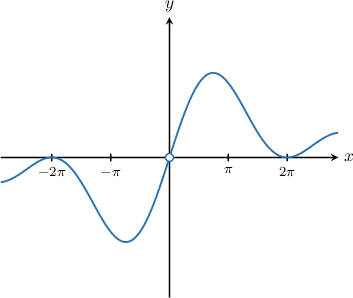

# Special Limits Involving Cosine

Source: https://www.mathacademy.com/topics/292?courseId=21
Topic ID: 292

## Prerequisites

- [Simplifying Expressions Using the Pythagorean Identity](../../../high-school/traditional/lessons/precalculus/207-simplifying-expressions-using-the-pythagorean-identity.md)
- [Calculating Limits of Rational Functions by Factoring](../ap-calculus-ab/1813-calculating-limits-of-rational-functions-by-factoring.md)
- [Evaluating Special Limits Involving Sine Using a Substitution](../ap-calculus-ab/3678-evaluating-special-limits-involving-sine-using-a-substitution.md)

## Lesson

### Introduction

Consider the following limit:

$$

\lim\limits_{x \to 0} \dfrac{1- \cos x}{x}

$$

Notice that direct substitution of $x=0$ leads to the indeterminate form

$$

\begin{aligned}\underset{𝑥→0}{lim}\frac{1−cos⁡𝑥}{𝑥} & =\frac{1−cos⁡0}{0} \\ & =\frac{1−1}{0} \\ & =\frac{0}{0}.\end{aligned}

$$

However, if we plot the graph of $y=\dfrac{1-\cos x}{x},$ we get the following picture.

While $y = \dfrac{1 - \cos{x}}{x}$ is undefined at $x=0,$ it does appear from the graph that

$$

\lim\limits_{x \to 0} \dfrac{1-\cos x}{x}=0.

$$

This is indeed the case. Moreover, it's possible to prove this result rigorously. However, we will assume that it is true and use it to calculate other limits.

### Example: Evaluating a Limit of a Function Involving the Special Limit With Cosine

#### Question

Evaluate $\lim\limits_{y \to 0} \dfrac{\cos^2 y-1}{y}.$

#### Explanation

Notice that as $y \to 0,$ both numerator and denominator approach $0.$

So, if we attempt to evaluate the limit directly, we get

$$

\begin{aligned}\underset{𝑦→0}{lim}\frac{cos^{2}⁡𝑦−1}{𝑦}=\frac{cos^{2}⁡(0)−1}{0}=\frac{0}{0},\end{aligned}

$$

which is an indeterminate form.

Instead, let's recall the following special limit:

$$

\lim\limits_{y \to 0} \dfrac{1-\cos y}{y} = 0

$$

Rewriting the given limit using the algebra of limits and applying our special limit, we obtain the following:

$$

\begin{aligned}\underset{𝑦→0}{lim}\frac{cos^{2}⁡𝑦−1}{𝑦} & =\underset{𝑦→0}{lim}\frac{(cos⁡𝑦−1)(cos⁡𝑦+1)}{𝑦} \\ & =\underset{𝑦→0}{lim}\frac{cos⁡𝑦−1}{𝑦}⋅\underset{𝑦→0}{lim}(cos⁡𝑦+1) \\ & =−\underset{𝑦→0}{lim}\frac{1−cos⁡𝑦}{𝑦}⋅\underset{𝑦→0}{lim}(cos⁡𝑦+1) \\ & =−0⋅(cos⁡0+1) \\ & =0⋅2 \\ & =0\end{aligned}

$$

### Example: Evaluating a Limit of a Function Involving the Special Limit With Cosine: Advanced Cases

#### Question

Calculate $\lim\limits_{x \to 0} \dfrac{\sec x -1}{x}.$

#### Explanation

Notice that as $x \to 0,$ both numerator and denominator approach $0.$

So, if we attempt to evaluate the limit directly, we get

$$

\lim\limits_{x \to 0}\dfrac{\sec x -1}{x} = \dfrac{\sec 0-1}{0} = \dfrac 00,

$$

which is an indeterminate form.

Instead, let's recall the following special limit:

$$

\lim\limits_{x \to 0} \dfrac{1-\cos x}{x} = 0

$$

Now, multiplying both the numerator and denominator by $\cos x,$ we can rewrite the expression and evaluate the limit:

$$

\begin{aligned}\underset{𝑥→0}{lim}\frac{sec⁡𝑥−1}{𝑥} & =\underset{𝑥→0}{lim}\frac{(sec⁡𝑥−1)cos⁡𝑥}{𝑥cos⁡𝑥} \\ & =\underset{𝑥→0}{lim}\frac{(\frac{1}{cos⁡𝑥}−1)cos⁡𝑥}{cos⁡𝑥} \\ & =\underset{𝑥→0}{lim}\frac{1−cos⁡𝑥}{𝑥cos⁡𝑥} \\ & =\underset{𝑥→0}{lim}\frac{1−cos⁡𝑥}{𝑥}⋅\underset{𝑥→0}{lim}\frac{1}{cos⁡𝑥} \\ & =0⋅\frac{1}{cos⁡(0)} \\ & =0⋅1 \\ & =0.\end{aligned}

$$

### Special Limits Involving Cosine Using a Substitution

We can use our special limit with cosine to evaluate other limits, such as

$$

\lim\limits_{x \to 3} \dfrac{1-\cos(x-3)}{2x-6}.

$$

For this limit, notice that as $x\to3,$ both the numerator and denominator approach $0.$ So, if we attempt to evaluate the limit directly, we get $\%\lim\limits_{x \to 0} \: \dfrac{\sin 2x}{x} = \dfrac00,$ which is an indeterminate form.

Instead, we rewrite the limit using the algebra of limits, as follows:

$$

\begin{aligned}\underset{𝑥→3}{lim}\frac{1−cos⁡(𝑥−3)}{2𝑥−6} & =\underset{𝑥→3}{lim}\frac{1−cos⁡(𝑥−3)}{2(𝑥−3)} \\ & =\underset{𝑥→3}{lim}(\frac{1}{2}⋅\frac{1−cos⁡(𝑥−3)}{𝑥−3}) \\ & =\frac{1}{2}⋅\underset{𝑥→3}{lim}\frac{1−cos⁡(𝑥−3)}{(𝑥−3)}\end{aligned}

$$

Now, this limit looks very similar to our special limit for cosine. So, if we make the substitution $\theta = x-3,$ then, since $\theta \to 0$ as $x \to 3,$ we have

$$

\lim\limits_{x \to 3} \dfrac{1-\cos{\color{blue}(x-3)}}{\color{blue}(x-3)} = \lim\limits_{\theta \to 0} \: \dfrac{1-\cos {\color{blue}\theta}}{\color{blue}\theta} = 0.

$$

Therefore,

$$

\begin{aligned}\underset{𝑥→3}{lim}\frac{1−cos⁡(𝑥−3)}{2𝑥−6} & =\frac{1}{2}⋅\underset{𝑥→3}{lim}\frac{1−cos⁡(𝑥−3)}{(𝑥−3)} \\ & =\frac{1}{2}⋅0 \\ & =0.\end{aligned}

$$

### Example: Using the Special Limit With Cosine and Substitution to Evaluate a Limit

#### Question

Evaluate $\lim\limits_{x \to 0} \dfrac{1-\cos{3x}}{x}.$

#### Explanation

Notice that as $x \to 0,$ both numerator and denominator approach $0.$

So, if we attempt to evaluate the limit directly, we get

$$

\lim\limits_{x \to 0}\dfrac{1-\cos{3x}}{x} = \dfrac{1-\cos(3\cdot 0)}{ 0} = \dfrac 00,

$$

which is an indeterminate form.

Instead, let's recall the following special limit:

$$

\lim\limits_{\theta \to 0} \dfrac{1-\cos \theta}{\theta} = 0

$$

Rewriting the given limit using the algebra of limits and applying our special limit, we get the following:

$$

\begin{aligned}\underset{𝑥→0}{lim}\frac{1−cos⁡3𝑥}{𝑥} & =\underset{𝑥→0}{lim}(3⋅\frac{1−cos⁡3𝑥}{3⋅𝑥}) \\ & =3⋅\underset{𝑥→0}{lim}\frac{1−cos⁡3𝑥}{3𝑥}\end{aligned}

$$

Let $\theta=3x.$ Then, since $\theta \to 0$ as $x \to 0,$ we have

$$

\lim\limits_{x \to 0} \dfrac{1-\cos {\color{blue}3x}}{\color{blue}3x} = \lim\limits_{\theta \to 0} \dfrac{1-\cos {\color{blue}\theta}}{\color{blue}\theta} = 0.

$$

Therefore,

$$

3\cdot\lim\limits_{x \to 0} \dfrac{1-\cos{\color{black}3x}}{\color{black}3x}= 3\cdot 0 = 0.

$$

### Proof of the Limit

We can prove the result

$$

\displaystyle \lim\limits_{x \to 0} \dfrac{1-\cos x}{x}=0,

$$

using the limit

$$

\lim\limits_{x \to 0} \dfrac{\sin x}{x}=1.

$$

First, we multiply the numerator and the denominator of $\dfrac{1-\cos x}{x}$ by $1+\cos x,$ and get

$$

\begin{aligned}\frac{1−cos⁡𝑥}{𝑥} & =\frac{(1−cos⁡𝑥)(1+cos⁡𝑥)}{𝑥(1+cos⁡𝑥)} \\ & =\frac{1−cos^{2}⁡𝑥}{𝑥(1+cos⁡𝑥)} \\ & =\frac{sin^{2}⁡𝑥}{𝑥(1+cos⁡𝑥)}.\end{aligned}

$$

We now take the limit as $x\to 0,$ and obtain

$$

\begin{aligned}\underset{𝑥→0}{lim}\frac{1−cos⁡𝑥}{𝑥} & =\underset{𝑥→0}{lim}\frac{sin^{2}⁡𝑥}{𝑥(1+cos⁡𝑥)} \\ & =\underset{𝑥→0}{lim}(\frac{sin⁡𝑥}{𝑥}⋅\frac{sin⁡𝑥}{1+cos⁡𝑥}) \\ & =(\underset{𝑥→0}{lim}\frac{sin⁡𝑥}{𝑥})⋅(\underset{𝑥→0}{lim}\frac{sin⁡𝑥}{1+cos⁡𝑥}) \\ & =1⋅\frac{sin⁡0}{1+cos⁡0} \\ & =\frac{0}{1+1} \\ & =0.\end{aligned}

$$
