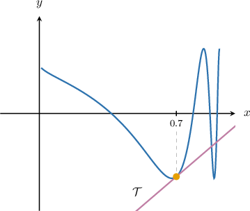

# Finding Derivatives Using a Graphing Calculator

Source: https://www.mathacademy.com/topics/3172?courseId=21
Topic ID: 3172

## Prerequisites

- [Calculating the Equation of a Normal Line Using Differentiation](../ap-calculus-ab/987-calculating-the-equation-of-a-normal-line-using-differentiation.md)
- [Evaluating Expressions Using a Graphing Calculator](../ap-calculus-ab/1832-evaluating-expressions-using-a-graphing-calculator.md)

## Lesson

### Introduction

In this lesson, we'll learn how to use a scientific or graphing calculator to find approximations for derivatives of functions at specific points.

This lesson is designed to help prepare you for the parts of the AP Calculus exam where graphing calculators are needed.

**If you want to succeed on the AP Calculus exam, then you must acquire a physical graphing calculator and use it when completing this lesson.**

Do *not* use any other type of online tool, as you will not be allowed to use it during the exam. You need to practice with the specific calculator that you will use on the AP exam so that you can solve problems quickly without wasting any time troubleshooting your calculator.

A comprehensive list of calculators that are permitted in the AP Calculus exams can be found [here.](https://apcentral.collegeboard.org/exam-administration-ordering-scores/administering-exams/on-exam-day/calculator-policy#list)

Throughout this lesson, we will list buttons that feature on a TI-84 Plus CE-T graphing calculator. We'll also mention some common alternative buttons on other calculator models.

Similar models will have the same or similar buttons, and even dissimilar models may have similar buttons.

If you have a different calculator model and cannot find the right buttons to press, the best way to resolve this is to either to

$\qquad$ (a) consult your calculator's manual, or

$\qquad$ (b) search online for a video that explains how to operate your calculator.

The best way to get familiar with your calculator is to consult its manual. Manuals can usually be found online. For example, a link to the manual for a TI-84 Plus CE-T can be found by entering the following query into a search engine.

$\qquad$ online manual TI-84 Plus CE-T

If you have a different model calculator, replace "TI-84 Plus CE-T" in the query above with your calculator's model.

Answers to common questions can be found by searching for online videos explaining how the calculator works. For example, to find a video that shows how to calculate a derivative on a TI-84, you might type the following query into a search engine.

$\qquad$ video compute derivative on a TI-84 calculator

Again, replace "TI-84" in the query above with your calculator's model. Also, bear in mind that videos for similar models might also help.

**Watch Out!** Some scientific calculators are *not* capable of finding derivatives! Check your calculator's manual to be sure.

### Approximating a Derivative

Let's use our calculator to approximate the following derivative at $x=1{:}$

$$

\dfrac{\textrm{d}}{\textrm{d}x}\left( \dfrac{\sin x}{x^2 + 1} \right)

$$

Since the function we want to differentiate contains trigonometric functions, your calculator *must* be in radians mode!

We bring up the derivative option on most calculators in one of the following ways:

1. Using the $\boxed{\color{gray}\,\dfrac{\textrm{d}}{\textrm{d}x}\boxed{\phantom{00}}\,}$ button. You may need to press the $\boxed{\color{gray}\,2\text{nd}\,}$ (or $\boxed{\color{gray}\,\text{shift}\,}$) button first.

2. Using the $\boxed{\color{gray}\,\text{math}\,}$ (or $\boxed{\color{gray}\,\text{calc}\,}$) button and selecting the "derivative" option. Note that this might be called $\boxed{\color{gray}\,\text{nDeriv}\,}$ or similar.

The next steps depend on whether your calculator uses derivative or function notation. We'll discuss both. You're encouraged to read both instructions as there are several parallels.

#### Derivative Notation

If your calculator uses derivative notation, you should see a prompt that looks similar to the following:

$$

\dfrac{\textrm{d}}{\textrm{d}\boxed{\phantom{\,0\,}}}\Big(\boxed{\phantom{00\big|}}\Big)\Bigg|_{\boxed{\phantom{\,0\,}}=\boxed{\phantom{\,0\,}}}

$$

In this case, we fill in the empty boxes as follows:

- Press the $\boxed{\color{gray}X,T,\theta,n}$ button to enter the variable $x$ into the first and third empty boxes. The prompt should now look as follows:

- Enter the function definition in the second empty box by pressing the following sequence of buttons: The prompt should now look as follows:

- Navigate the cursor to the last empty box by pressing $\boxed{\color{gray}\,\blacktriangleright\,}$ and then press $\boxed{\color{gray}\,1\,}$ to enter the value $x=1.$ The prompt should now look as follows:

- Finally, press $\boxed{\color{gray}\,\textrm{enter}\,},$ and the calculator will return the numerical value of the derivative.

Following the above steps, we obtain

$$

\dfrac{\textrm{d}}{\textrm{d}x}\left.\left( \dfrac{\sin x}{x^2 + 1} \right) \right|_{x=1} = -0.150\,584

$$

rounded to six decimal places.

#### Function Notation

If your calculator uses function notation, then instead of being presented with

$$

\dfrac{\textrm{d}}{\textrm{d}\boxed{\phantom{\,0\,}}}\Big(\boxed{\phantom{00\big|}}\Big)\Bigg|_{\boxed{\phantom{\,0\,}}=\boxed{\phantom{\,0\,}}}

$$

you'll instead see a prompt that looks similar to the following:

$$

\text{derivative}\Big( \boxed{\color{white}\phantom{\Big|}\text{expression}\phantom{\Big|}}, \boxed{\color{white}\phantom{\Big|}\text{variable}\phantom{\Big|}}, \boxed{\color{white}\phantom{\Big|}\text{value}\phantom{\Big|}}\Big)

$$

In this case, we place the function definition in the first box, the variable in the second box, and the $x$-value in the third box.

By entering this information, the prompt will look as follows:

$$

\text{derivative}\left(\,\sin (x) \div (x^2 + 1)\,, \,x\,, \,1\,\right)

$$

Finally, press $\boxed{\color{gray}\,\textrm{enter}\,}$ or $\boxed{\color{gray}\,=\,}$ to return the numerical value of the derivative.

Following the above steps, we obtain

$$

\dfrac{\textrm{d}}{\textrm{d}x}\left.\left( \dfrac{\sin x}{x^2 + 1} \right) \right|_{x=1} = -0.150\,584

$$

rounded to six decimal places.

**Watch Out!**

- It's important to remember that the graphing calculator finds a numerical *approximation* of the derivative.

- Moreover, different calculators use different algorithms to arrive at their approximations.

- For that reason, different calculators may give slightly different answers when approximating the derivative at a point.

- Despite this, the answers returned by different calculators will agree when the answer is rounded to two or three decimal places in most cases.

### Example: Approximating the Derivative of a Function at a Point

#### Question

Evaluate $\dfrac{\textrm{d}}{\textrm{d}x}\left(x^3 \sqrt{\sin x + 1} \right)$ at $x=1.6.$

#### Explanation

First, we need to make sure that the calculator is in $\boxed{\color{gray}\,\text{RAD}\,}$ (radians) mode.

We bring up the derivative option on most calculators in one of the following ways:

- Using the $\boxed{\color{gray}\,\dfrac{\textrm{d}}{\textrm{d}x}\boxed{\phantom{00}}\,}$ button. You may need to press the $\boxed{\color{gray}\,2\text{nd}\,}$ (or $\boxed{\color{gray}\,\text{shift}\,}$) button first.

- Press the $\boxed{\color{gray}\,\text{math}\,}$ (or $\boxed{\color{gray}\,\text{calc}\,}$) button and choose the derivative option. Note that this might be called $\boxed{\color{gray}\,\text{nDeriv}\,}$ or similar.

Evaluating this using a calculator, we obtain

$$

\dfrac{\textrm{d}}{\textrm{d}x}\left.\left( x^3 \sqrt{\sin x + 1} \right) \right|_{x=1.6} \approx 10.818

$$

rounded to $3$ decimal places.

### Calculating Tangents and Normals

We can use the numerical approximation of the derivative of a function at a point to calculate *approximate* tangent and normal lines to the function at that point.

Before we look at an example of how this is done, note the following:

- The numerical value of the derivative gives an *approximate* tangent slope.

- In the following questions, we're typically required to give the coefficients of the tangent and normal lines to one decimal place. Therefore, we will use four decimal places for the intermediate work to avoid rounding errors.

With that in mind, let's take a look at an example.

### Example: Finding an Approximate Tangent Line

#### Question

The function $f(x)$ (shown above) is defined as

$$

f(x) = \sin\left(1 + \dfrac{1}{\ln x} \right).

$$

Find an approximation for the tangent line $\mathcal T$ to $y=f(x)$ at the point where $x=0.7.$

#### Explanation

Evaluating our function at the point $x=0.7$ using a calculator, we get

$$

y=f\left(0.7\right)=\sin\left( 1 + \dfrac{1}{\ln(0.7)} \right) \approx -0.973\,0

$$

rounded to $4$ decimal places.

The slope of the tangent line is the derivative of $f(x)$ at $x=0.7.$

We bring up the derivative option on most calculators in one of the following ways:

- Using the $\boxed{\color{gray}\,\dfrac{\textrm{d}}{\textrm{d}x}\boxed{\phantom{00}}\,}$ button. You may need to press the $\boxed{\color{gray}\,2\text{nd}\,}$ (or $\boxed{\color{gray}\,\text{shift}\,}$) button first.

- Press the $\boxed{\color{gray}\,\text{math}\,}$ (or $\boxed{\color{gray}\,\text{calc}\,}$) button and choose the derivative option. Note that this might be called $\boxed{\color{gray}\,\text{nDeriv}\,}$ or similar.

Evaluating the derivative using a calculator, we obtain

$$

f'\left(0.7\right) = \left. \dfrac{\textrm{d}}{\textrm{d}x} \left( \sin\left( 1 + \dfrac{1}{\ln x} \right) \right) \right|_{x=0.7} \approx 2.591\,5

$$

rounded to $4$ decimal places.

Finally, we use the point-slope form with $m=2.591\,5$ and the coordinates of our point $\left(0.7, -0.973\,0\right),$ and get

$$

\begin{aligned}𝑦−𝑦_{1} & =𝑚(𝑥−𝑥_{1}) \\ 𝑦−(−0.973\,0) & =2.591\,5(𝑥−0.7) \\ 𝑦+0.973\,0 & =2.591\,5𝑥−1.814\,1 \\ 𝑦 & =2.591\,5𝑥−2.787\,1.\end{aligned}

$$

Therefore, rounding the coefficients to one decimal place, we find that the approximate tangent line is given by

$$

y = 2.6x - 2.8.

$$

### Example: Finding an Approximate Normal Line

#### Question

The function $y=f(x)$ is defined as

$$

f(x) =\dfrac{\ln(x^2+8)}{x^2+1}.

$$

Find an approximation for the normal line to $y=f(x)$ at the point where $x=2.$

#### Explanation

Evaluating $f(x)$ at the point $x=2$ using a calculator, we get

$$

y = f(2) = \dfrac{\ln((2)^2+8)}{(2)^2+1} \approx 0.497\, 0

$$

rounded to $4$ decimal places.

The slope of the normal line is the negative reciprocal of the derivative of $f(x)$ at $x=2.$

We bring up the derivative option on most calculators in one of the following ways:

- Using the $\boxed{\color{gray}\,\dfrac{\textrm{d}}{\textrm{d}x}\boxed{\phantom{00}}\,}$ button. You may need to press the $\boxed{\color{gray}\,2\text{nd}\,}$ (or $\boxed{\color{gray}\,\text{shift}\,}$) button first.

- Press the $\boxed{\color{gray}\,\text{math}\,}$ (or $\boxed{\color{gray}\,\text{calc}\,}$) button and choose the derivative option. Note that this might be called $\boxed{\color{gray}\,\text{nDeriv}\,}$ or similar.

Evaluating the derivative using a calculator, we obtain

$$

f'(2) = \left. \dfrac{\textrm{d}}{\textrm{d}x} \left(\dfrac{\ln(x^2+8)}{x^2+1} \right) \right|_{x=2} \approx -0.330\, 9

$$

rounded to $4$ decimal places.

Therefore, the slope $m$ of the normal is

$$

m = -\dfrac{1}{f'(2)} = -\dfrac{1}{-0.330\, 9} = 3.022\, 1.

$$

Finally, we use the point-slope form with $m=3.022\, 1$ and the coordinates of our point $(2, 0.497\, 0),$ and get

$$

\begin{aligned}𝑦−𝑦_{1} & =𝑚(𝑥−𝑥_{1}) \\ 𝑦−0.497\,0 & =3.022\,1(𝑥−2) \\ 𝑦−0.497\,0 & =3.022\,1𝑥−6.044\,2 \\ 𝑦 & =3.022\,1𝑥−5.547\,2.\end{aligned}

$$

Therefore, rounding the coefficients to one decimal place, we find that the approximate normal line is given by

$$

y = 3.0x - 5.5.

$$
