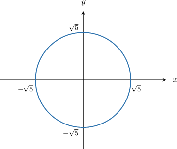
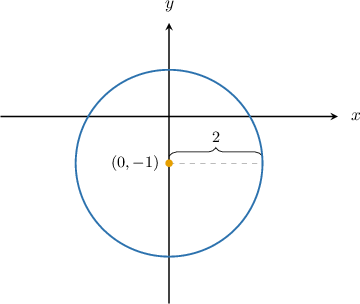
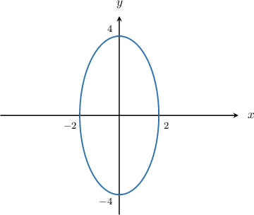
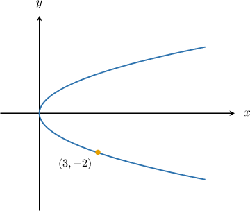

# Calculating Slopes of Circles, Ellipses, and Parabolas

Source: https://www.mathacademy.com/topics/3216?courseId=21
Topic ID: 3216

## Prerequisites

- [Implicit Differentiation](../ap-calculus-ab/57-implicit-differentiation.md)
- [Equations of Ellipses Centered at a General Point](../../../high-school/traditional/lessons/precalculus/849-equations-of-ellipses-centered-at-a-general-point.md)
- [Left and Right Opening Parabolas](../../../high-school/traditional/lessons/algebra-ii/1124-left-and-right-opening-parabolas.md)

## Lesson

### Introduction

Consider the circle below. How do we calculate $\dfrac{\textrm{d}y}{\textrm{d}x},$ the slope of the tangent to this circle at any point on the circle?

To calculate $\dfrac{\textrm d y}{\textrm d x}$, we start by writing down the equation of the circle. Then, we differentiate the equation of the circle with respect to $x.$

Since our circle is centered at the origin and has a radius of $\sqrt{5},$ its equation is given by

$$

x^2 + y^2 = (\sqrt{5})^2 \qquad\Longrightarrow\qquad x^2 + y^2 = 5.

$$

Now, to calculate $\dfrac{\textrm d y}{\textrm d x},$ we differentiate the equation of the circle using implicit differentiation:

$$

\begin{aligned}\frac{d}{d𝑥}(𝑥^{2}+𝑦^{2}) & =\frac{d}{d𝑥}(5) \\ \frac{d}{d𝑥}(𝑥^{2})+\frac{d}{d𝑥}(𝑦^{2}) & =0 \\ 2𝑥+2𝑦\frac{d𝑦}{d𝑥} & =0 \\ 2𝑦\frac{d𝑦}{d𝑥} & =−2𝑥 \\ \frac{d𝑦}{d𝑥} & =−\frac{𝑥}{𝑦}\end{aligned}

$$

We can now find the slope at any point on the circle using our expression for the derivative.

For example, since the point $P\big(\sqrt{2}, \sqrt{3} \big)$ satisfies the equation $x^2 + y^2 = 5,$ it must lie on the circle. Therefore, the slope of the tangent at this point is given by

$$

\dfrac{\textrm{d}y}{\textrm{d}x} \Bigg|_{( \sqrt{2}, \sqrt{3})} = -\dfrac{\sqrt{2}}{\sqrt{3}} = -\dfrac{\sqrt{6}}{3}.

$$

### Example: Calculating the Slope of the Tangent to a Circle

#### Question

Find $\dfrac{\textrm{d}y}{\textrm{d}x}$ for the circle shown above.

#### Explanation

Since our circle is centered at $(0,-1)$ and has a radius of $2,$ its equation is given by

$$

(x-0)^2 + (y - (-1))^2 = 2^2 \qquad\Longrightarrow\qquad x^2 + (y+1)^2 = 4.

$$

Now, to calculate $\dfrac{\textrm d y}{\textrm d x},$ we use implicit differentiation:

$$

\begin{aligned}\frac{d}{d𝑥}(𝑥^{2}+(𝑦+1)^{2}) & =\frac{d}{d𝑥}(4) \\ \frac{d}{d𝑥}(𝑥^{2})+\frac{d}{d𝑥}((𝑦+1)^{2}) & =0 \\ 2𝑥+2(𝑦+1)\frac{d𝑦}{d𝑥} & =0 \\ 2(𝑦+1)\frac{d𝑦}{d𝑥} & =−2𝑥 \\ \frac{d𝑦}{d𝑥} & =−\frac{𝑥}{𝑦+1}\end{aligned}

$$

### Example: Calculating the Slope of the Tangent to an Ellipse

#### Question

Find $\dfrac{\textrm{d}y}{\textrm{d}x}$ for the ellipse shown above.

#### Explanation

Since our ellipse is centered at the origin and has semiaxes $2$ and $4,$ its equation is given by

$$

\dfrac{x^2}{2^2} + \dfrac{y^2}{4^2} = 1 \qquad \Longrightarrow \qquad \dfrac{x^2}{4} + \dfrac{y^2}{16} = 1.

$$

Now, to calculate $\dfrac{\textrm d y}{\textrm d x},$ we use implicit differentiation:

$$

\begin{aligned}\frac{d}{d𝑥}(\frac{𝑥^{2}}{4}+\frac{𝑦^{2}}{16}) & =\frac{d}{d𝑥}(1) \\ \frac{d}{d𝑥}(\frac{𝑥^{2}}{4})+\frac{d}{d𝑥}(\frac{𝑦^{2}}{16}) & =0 \\ \frac{2𝑥}{4}+\frac{2𝑦}{16}⋅\frac{d𝑦}{d𝑥} & =0 \\ \frac{𝑥}{2}+\frac{𝑦}{8}⋅\frac{d𝑦}{d𝑥} & =0 \\ \frac{𝑦}{8}⋅\frac{d𝑦}{d𝑥} & =−\frac{𝑥}{2} \\ \frac{d𝑦}{d𝑥} & =−\frac{4𝑥}{𝑦}\end{aligned}

$$

### Example: Calculating the Slope of the Tangent to a Parabola

#### Question

Find $\dfrac{\textrm{d}y}{\textrm{d}x}$ for the right-opening parabola shown above.

#### Explanation

The diagram shows that the parabola has its vertex at $O,$ and passes through the point $(3,-2).$

The standard equation of a left- or right-opening parabola whose vertex is at $(0,0)$ is given by

$$

y^2 = 4px.

$$

Substituting $x = 3$ and $y = -2$ into the equation above, we get

$$

\begin{aligned}(−2)^{2} & =4𝑝(3) \\ 4 & =12𝑝 \\ 𝑝 & =\frac{1}{3}.\end{aligned}

$$

Therefore, the equation of our parabola is

$$

y^2 = \dfrac{4}{3}x.

$$

Finally, to calculate $\dfrac{\textrm d y}{\textrm d x},$ we use implicit differentiation:

$$

\begin{aligned}\frac{d}{d𝑥}(𝑦^{2}) & =\frac{d}{d𝑥}(\frac{4}{3}𝑥) \\ 2𝑦\frac{d𝑦}{d𝑥} & =\frac{4}{3} \\ \frac{d𝑦}{d𝑥} & =\frac{2}{3𝑦}\end{aligned}

$$
