# Analyzing Slope Fields for Directly Integrable Differential Equations

Source: https://www.mathacademy.com/topics/3219?courseId=21
Topic ID: 3219

## Prerequisites

- [Limits at Infinity and Horizontal Asymptotes of Rational Functions](../ap-calculus-ab/1903-limits-at-infinity-and-horizontal-asymptotes-of-rational-functions.md)
- [Slope Fields for Directly Integrable Differential Equations](../ap-calculus-ab/3276-slope-fields-for-directly-integrable-differential-equations.md)
- [Solving Rational Inequalities](../../../high-school/traditional/lessons/precalculus/3355-solving-rational-inequalities.md)

## Lesson

### Introduction

We may be given a slope field without knowing the differential equation that produced it. So, what properties of a differential equation can we deduce from its slope field?

As an example, consider the slope field of the differential equation $y' = x(3-x),$ shown below.

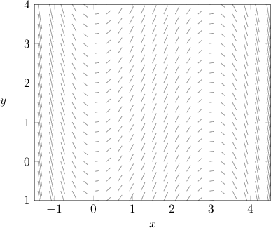

Now, imagine that we don't know which differential equation produced this slope field. Our goal, then, is to gather as much information as possible about the equation by referring *only* to its slope field.

When analyzing slope fields, it's often helpful to visualize a few of the solution curves, so let's sketch a few.

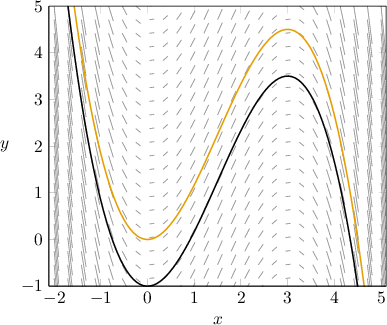

We can now make the following observations:

- First, the solution curves have vertical symmetry. Therefore, the equation must be of the form $y' = f(x).$ Indeed, the equation $y' = x(3-x)$ is of this form.

- Second, notice that the solution curves have stationary points along the lines $x=0$ and $x=3.$ This means that the right-hand side of our differential equation *must evaluate to zero* on these lines. Indeed, this is true of our equation.

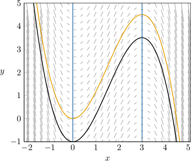

- Third, notice that the lines $x=0$ and $x=3$ split the plane into three regions. The slopes of the solution curves in each of these regions are summarized in the table below. Region $x < 0$ $0 < x < 3$ $x > 3$ Slope $\searrow$ $\nearrow$ $\searrow$ Sign $\color{red}-$ $\color{blue}+$ $\color{red}-$ The equation $y' = x(3-x)$ indeed exhibits this behavior. To see this a little more clearly, let $f(x) = x(3-x).$ A sketch of this function is shown below. The sign of $f(x)$ in the three regions agrees with the above table: $f(x)$ is positive for $0 < x < 3,$ and $f(x)$ is negative for $x<0$ and $x >3.$

### Example: Identifying an Equation That Generates a Slope Field Using Stationary Points

#### Question

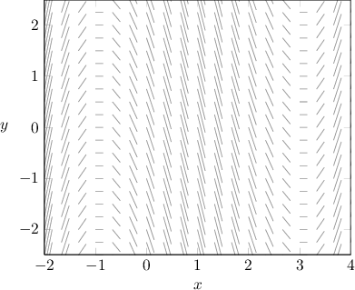

Which of the following equations could have generated the slope field shown above?

1. $y' = (x+1)(x-3)$

2. $y'= (x+1)(x-2)(x-3)$

3. $y' = x+1$

#### Explanation

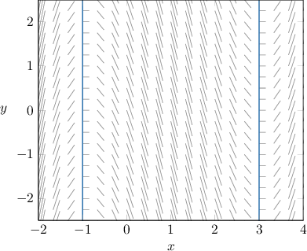

Notice that the slopes of the slope field are horizontal along the lines $x = -1$ and $x = 3,$ as shown above. Therefore, the right-hand side of the differential equation should evaluate to zero on both of these lines.

With that in mind, let's check each equation:

- The equation $y'= (x+1)(x-3)$ gives the required behavior. The right-hand side evaluates to zero at $x=-1$ and $x=3.$

- The equation $y'=(x+1)(x-2)(x-3)$ does ** give the required behavior. The right-hand side evaluates to zero at $x=-1$ and $x=3,$ but it also evaluates to zero when $x=2,$ which is not a behavior exhibited by our slope field.

- The equation $y' = x+1$ does ** give the required behavior. The right-hand side does not evaluate to zero at both $x=-1$ and $x=3.$

Therefore, the correct answer is "I only."

### Example: Identifying an Equation That Generates a Slope Field Using the Sign of the Slopes

#### Question

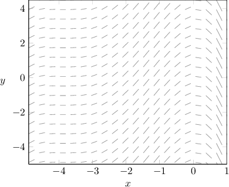

The diagram shown above is the slope field for which of the following differential equations?

1. $y' = -x(x+4)^2$

2. $y' = -x^2(x+2)$

3. $y' = x^2(x+4)$

#### Explanation

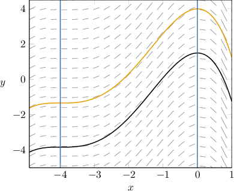

Notice the following properties of the given slope field:

- First, the slopes of the slope field are horizontal along the lines $x = -4$ and $x = 0.$ Therefore, the right-hand side of the differential equation should equal zero on both of these lines. Of the given equations, the only equations that satisfy this condition are the following:

- Second, the lines $x=-4$ and $x=0$ divide the plane into $3$ regions. The sign of the slopes in each of the $3$ regions is easily deduced by considering the behavior of the solution curves in these regions. This information is summarized in the following table: Region $x < -4$ $-4 < x < 0$ $x > 0$ Slope $\nearrow$ $\nearrow$ $\searrow$ Sign $\color{blue}+$ $\color{blue}+$ $\color{red}-$ Of the two remaining options, the only one that gives this behavior is

Therefore, the correct answer is $y'= -x(x+4)^2.$

### Example: Identifying an Equation That Generates a Slope Field Using the Sign of the Slopes and Factoring

#### Question

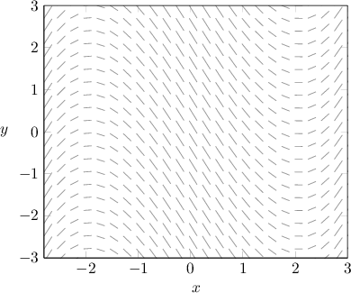

Which of the following equations could have generated the slope field shown above?

1. $y' =x^2 - 4$

2. $y' = x^2 - 4x + 4$

3. $y' = 4 - x^2$

#### Explanation

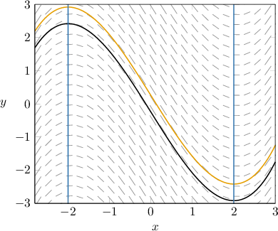

Notice the following properties of the given slope field:

- First, the slope field is zero along the lines $x = -2$ and $x = 2.$ Therefore, the right-hand side of the differential equation should evaluate to zero on both of these lines.

- Second, the lines $x=-2$ and $x=2$ divide the plane into $3$ regions. The sign of the slopes in each of the $3$ regions is easily deduced by considering the behavior of the solution curves in these regions. This information is summarized in the following table: Region $x < -2$ $-2 < x < 2$ $x > 2$ Slope $\nearrow$ $\searrow$ $\nearrow$ Slope $\color{blue}+$ $\color{red}-$ $\color{blue}+$

With that in mind, let's consider each equation.

- The equation gives the required behavior.

- The equation does ** give the required behavior. The right-hand side evaluates to zero at $x=2,$ but not at $x=-2.$

- The equation does ** give the required behavior. The right-hand side evaluates to zero at $x=-2$ and $x=2,$ but the sign of the slopes in the required regions (summarized below) does not correspond to the given slope field. Region $x < -2$ $-2 < x < 2$ $x > 2$ Slope $\searrow$ $\nearrow$ $\searrow$ Sign $\color{red}-$ $\color{blue}+$ $\color{red}-$

Therefore, the correct answer is "I only."

### Example: Identifying an Equation That Generates a Slope Field Using Asymptotes

#### Question

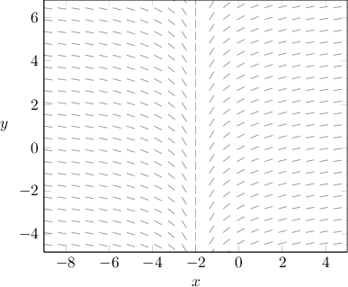

Which of the following equations could have generated the slope field shown above?

1. $y' = \dfrac{2}{(x+2)^2}$

2. $y' = \dfrac{1}{x+2}$

3. $y' = \dfrac{2x}{x+2}$

#### Explanation

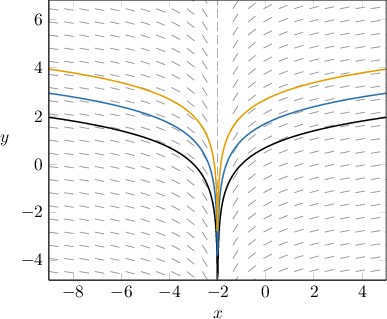

Notice the following properties of the given slope field:

- The solution curves have the vertical asymptote $x=-2.$

- The slopes of the slope field become horizontal as $x\to\pm\infty.$

- The slopes of the slope field are positive for $x>-2$ and negative for $x< -2.$

With that in mind, let's consider each equation.

- The equation $y' = \dfrac{2}{(x+2)^2}$ does ** give the required behavior. The slopes of the slope field for this differential equation are positive for all $x \neq -2.$

- The equation $y' = \dfrac{1}{x+2}$ gives the required behavior. Notice that the right-hand side of this equation is positive for $x>-2$ and negative for $x< -2,$ and $y'\to 0$ as $x\to\pm\infty.$

- The equation $y' = \dfrac{2x}{x+2}$ does ** give the required behavior. Notice that Therefore, the slopes of the slope field for this differential equation do not become horizontal as $x\to\pm\infty.$

Therefore, the correct answer is "II only."
