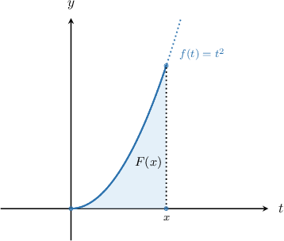
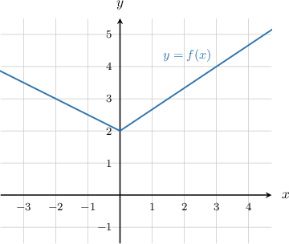
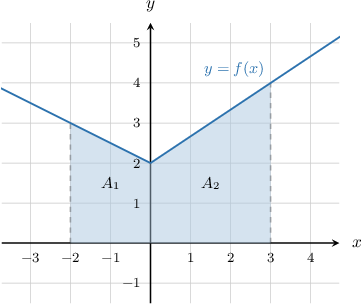

# The Integral as an Accumulation Function

Source: https://www.mathacademy.com/topics/333?courseId=21
Topic ID: 333

## Prerequisites

- [Calculating the Definite Integral of a Function Given Its Graph](../ap-calculus-ab/1200-calculating-the-definite-integral-of-a-function-given-its-graph.md)

## Lesson

### Introduction

We're used to seeing definite integrals where the limits of integration are constants. For example,

$$

\displaystyle \int_{\color{red}0}^{\color{blue}{2}} t^2\,\textrm d t.

$$

Here, the lower limit is $t={\color{red}{0}}$ and the upper limit is $t={\color{blue}{2}}.$

What do we get if we allow one of the integration limits to vary? Let's explore this idea by changing the upper integration limit to $t={\color{blue}{x}}.$

$$

\displaystyle \int_{\color{red}{0}}^{\color{blue}{x}} t^2\,\textrm d t

$$

We can evaluate this integral in the usual way:

$$

\begin{aligned}∫_{𝑥0}𝑡^{2}\,d𝑡 & =\frac{1}{3}𝑡^{3}_{𝑥0} \\ & =\frac{1}{3}𝑥^{3}−0 \\ & =\frac{1}{3}𝑥^{3}\end{aligned}

$$

So, evaluating the integral now gives a function of $x$ instead of a number. This means we can define a new function $F(x)$ as

$$

F(x) = \int_0^x t^2\,\textrm d t.

$$

The function $F(x)$ represents the area *accumulated* by the function $f(t)=t^2$ between $t=0$ and $t=x.$ Different values of $x$ will give different values for the area.

Any function $F(x)$ defined as

$$

F(x) = \int_a^x f(t)\,\textrm d t

$$

is called an **accumulation function**.

### Example: Evaluating an Accumulation Function

#### Question

Calculate $F(\pi)$ where $\displaystyle F(x) = \int_1^x \dfrac 1 t\,\textrm d t.$

#### Explanation

Evaluating $F(x)$ at $x=\pi,$ we get the following definite integral:

$$

F\!\left(\pi\right) = \int_{1}^{\pi} \dfrac{1}{t} \, \text{d}t

$$

Then, computing the definite integral, we get

$$

\begin{aligned}𝐹(𝜋) & =∫_{𝜋1}\frac{1}{𝑡}\,d𝑡 \\ & =ln⁡|𝑡|\,_{𝜋1} \\ & =ln⁡𝜋−ln⁡1 \\ & =ln⁡𝜋.\end{aligned}

$$

### Example: Evaluating an Accumulation Function Given a Graph

#### Question

The graph of a function $y = f(x)$ is shown below. Given $\displaystyle g(t)= \int_{-2}^{t} f(x)\, \text{d}x,$ determine the value of $g(3).$

#### Explanation

Evaluating $g(t)$ at $t=3,$ we get the following definite integral:

$$

g(3) = \int_{-2}^{3} f(x)\, \text{d}x

$$

This integral gives the signed area between the curve and the $x$-axis shown below.

Note that the graph above consists of $2$ parts:

- $x \in [-2,0],$ for which the region between the curve and the $x$-axis is a trapezoid. This corresponds to the area $A_1.$

- $x \in [0,3],$ for which the region between the curve and the $x$-axis is another trapezoid. This corresponds to the area $A_2.$

Therefore, we can write the integral as follows:

$$

g(3) = \int_{-2}^{3} f(x) \, \text{d}x = \underbrace{\int_{-2}^{0} f(x) \, \text{d}x}_{A_1} + \underbrace{\int_{0}^{3} f(x) \, \text{d}x}_{A_2}

$$

Now, let's compute these integrals:

- To find the first integral where $x \in [-2,0],$ we compute the area $A_1$ of the trapezoid as follows:

- To find the second integral where $x \in [0,3],$ we compute the area $A_2$ of the trapezoid as follows:

Therefore, we obtain

$$

\begin{aligned}𝑔(3) & =∫_{3−2}𝑓(𝑥)\,d𝑥=𝐴_{1}+𝐴_{2}=5+9=14.\end{aligned}

$$

### The Accumulation Function of a Rate of Change

When we create an accumulation function by integrating a "rate of change" function, the accumulation function describes the "net change" of the system.

To describe this in more detail, suppose that $f(t)$ is continuous and $F'(t) = f(t)$ for $t\in [a,b].$ From the fundamental theorem of calculus, we know that

$$

F(b) - F(a) = \int_a^b f(t)\,\textrm d t.

$$

The equation above can be rewritten as

$$

F(b) = F(a) + \int_a^b f(t)\,\textrm d t.

$$

If we let the upper limit vary, so setting $b=x,$ we have

$$

F(x) = F(a) + \int_a^x f(t)\,\textrm d t.

$$

This formula tells us that the value of $F$ at an arbitrary point $x$ equals the value of $F$ at some starting point $a$ *plus* the accumulation of the rate of change of $F$ over the interval $[a,x].$

Let's see how to apply this formula to real-world problems.

### Example: Applications of Accumulation Functions

#### Question

Suppose that a pool has a small hole and that water is leaking out at a rate of $t^{1/3}$ gallons per minute, where $t$ is the time in minutes. If at time $t = 0$ the pool contains $100$ gallons of water, how many gallons of water will remain in the pool after $t$ minutes?

#### Explanation

Let $f(t) = -t^{1/3}$ be the rate at which the volume of water in the pool is changing, and let $F(T)$ be the amount of water in the pool after $T$ minutes. Note that $f(t)$ is negative to indicate that the volume is decreasing.

Using our formula for the accumulation of change, we have

$$

F(T) = F(0) + \int_0^T f(t)\,\textrm d t.

$$

Substituting the known information and carrying out the necessary integration gives

$$

\begin{aligned}𝐹(𝑇) & =𝐹(0)+∫_{𝑇0}𝑓(𝑡)\,d𝑡 \\ & =100−∫_{𝑇0}𝑡^{1/3}\,d𝑡 \\ & =100−\frac{3𝑡^{4/3}}{4}_{𝑇0} \\ & =100−\frac{3(𝑇)^{4/3}}{4}+\frac{3(0)^{4/3}}{4} \\ & =100−\frac{3}{4}𝑇^{4/3}.\end{aligned}

$$

Finally, let's rewrite our final answer in terms of the original variable $t.$ We have

$$

F(t) = 100 - \dfrac {3}{4}t^{4/3}.

$$
