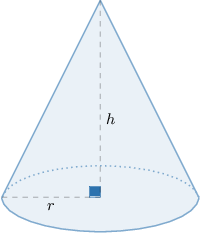
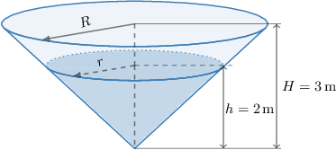
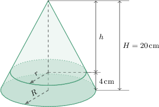

# Calculating Related Rates With Cones

Source: https://www.mathacademy.com/topics/346?courseId=21
Topic ID: 346

## Prerequisites

- [Calculating Related Rates With Rectangular Solids](../ap-calculus-ab/365-calculating-related-rates-with-rectangular-solids.md)
- [Volumes of Right Cones](../../../high-school/traditional/lessons/geometry/1145-volumes-of-right-cones.md)
- [The AA Similarity Criterion](../../../high-school/traditional/lessons/geometry/1365-the-aa-similarity-criterion.md)

## Lesson

### Introduction

We can use differentiation to solve related rates problems in the context of cones. In general, we follow the usual three steps:

**Step 1:** Draw a diagram and identify the variables that change with time.

**Step 2:** Write down a relation between the time-dependent variables.

**Step 3:** Differentiate the relation with respect to time and plug in the known values.

Before we start, recall that the volume $v$ of a right cone of radius $r$ and height $h$ (shown below) is given by the formula

$$

v = \dfrac13 \pi r^2 h.

$$

### Example: Calculating a Rate of Change of Volume Given a Rate of Change of Radius or Height

#### Question

The height of a cone is increasing at a rate of $4 \,\text{m}/\text{s}.$ The radius of the cone is always one-third of its height. At what rate is the cone's volume increasing when its height is $3 \,\text{m}?$

#### Explanation

Let's call $h$ the height of the cone and $r$ the radius of its base. Both of these quantities, as well as the volume $v,$ change with time. In particular, we know that

$$

\dfrac{\textrm d h}{\textrm d t} = 4\,\text{m}/\text{s},

$$

and we need to find $\dfrac{\textrm d v}{\textrm d t}$ when $h = 3\,\text{m}.$

We need to find a relation between $v$ and the variable for which we know the rate of change, which is $h.$ This is given by the formula for the volume of a cone:

$$

v = \dfrac{1}{3}\pi r^2 h

$$

Before we differentiate the equation with respect to time, note that $r$ also appears in the formula. So, we need to simplify the formula by writing $r$ in terms of $h.$

We're told that the radius of the cone is one-third of its height. So, we have

$$

\begin{aligned}𝑟 & =\frac{1}{3}ℎ.\end{aligned}

$$

Therefore, we can write the volume formula as

$$

v = \dfrac{1}{3} \pi \left(\dfrac{1}{3}h\right)^2 \cdot h = \dfrac{1}{27}\pi h^3.

$$

Now that we have an equation relating just $v$ and $h,$ we differentiate with respect to time using the chain rule. This gives

$$

\begin{aligned}\frac{d}{d𝑡}𝑣 & =\frac{d}{d𝑡}(\frac{1}{27}𝜋ℎ^{3}) \\ \frac{d𝑣}{d𝑡} & =\frac{1}{9}𝜋ℎ^{2}⋅\frac{dℎ}{d𝑡}.\end{aligned}

$$

Finally, substituting the known values, we get

$$

\begin{aligned}\frac{d𝑣}{d𝑡} & =\frac{1}{9}𝜋(3)^{2}(4) \\ \frac{d𝑣}{d𝑡} & =4𝜋\,m^{3}/s.\end{aligned}

$$

### Example: Calculating a Rate of Change of Radius or Height Given a Rate of Change of Volume

#### Question

The volume of a cone is decreasing at a rate of $\dfrac{1}{32}\pi \, \text{m}^3\!/\text{hr}.$ The height of the cone is always a quarter of its radius. At what rate is the radius of the base decreasing when the radius is $3 \,\text{m}?$

#### Explanation

Let's call $h$ the height of the cone and $r$ the radius of its base. Both of these quantities, as well as the volume $v,$ change with time. In particular, we know that

$$

\dfrac{\textrm d v}{\textrm d t} = -\dfrac{1}{32} \,\text{m}^3\!/\text{hr},

$$

and we need to find $\dfrac{\textrm d r}{\textrm d t}$ when $r = 3 \,\text{m}.$

We need to find a relation between $v$ and the variable for which we know the rate of change, which is $r.$ This is given by the formula for the volume of a cone:

$$

v = \dfrac{1}{3}\pi r^2 h

$$

Before we differentiate the equation with respect to time, note that $h$ also appears in the formula. So, we need to simplify the formula by writing $h$ in terms of $r.$

We're told that the height of the cone is a quarter of its radius. So, we have

$$

\begin{aligned}ℎ & =\frac{1}{4}𝑟.\end{aligned}

$$

Therefore, we can write the volume formula as

$$

v = \dfrac{1}{3}\pi r^2 \left(\dfrac{1}{4}r\right) = \dfrac{1}{12}\pi r^3.

$$

Now that we have an equation relating just $v$ and $r,$ we differentiate with respect to time using the chain rule. This gives

$$

\begin{aligned}\frac{d𝑣}{d𝑡} & =\frac{1}{4}𝜋𝑟^{2}⋅(\frac{d𝑟}{d𝑡}).\end{aligned}

$$

Finally, substituting the known values and solving for $\dfrac{\textrm d r}{\textrm d t},$ we get

$$

\begin{aligned}−\frac{1}{32}𝜋 & =\frac{1}{4}𝜋(3)^{2}(\frac{d𝑟}{d𝑡}) \\ \frac{d𝑟}{d𝑡} & =−\frac{1}{72}\,m/hr.\end{aligned}

$$

Therefore, the radius of the base of the cone is decreasing at a rate of $\dfrac{1}{72} \, \text{m}/\text{hr}.$

### Example: Calculating the Rate of Change of Fluid Level Using Similar Solids

#### Question

A conical tank contains water. The height of the tank is $3\,\text{m}$ and the radius at the top is $4\,\text{m}.$ If water is leaking from the bottom of the tank at a rate of $6\pi\,\text{m}^3/\text{min}$, how fast is the water level $h$ decreasing when $h=2\,\text{m}?$

#### Explanation

First, let's consider the dimensions of the tank. We call $H=3\,\text{m}$ the height of the tank, and $R=4\,\text{m}$ its radius at the top. These quantities are fixed and do not change with time.

Now, let's consider the water level. We call $h$ the water level's height and $r$ the radius of the cone formed by the water. Both of these quantities, and the water volume $v,$ change with time. In particular, we know that

$$

\dfrac{\textrm dv}{\textrm dt} = -6\pi\,\text{m}^3/\text{min},

$$

and we want to find $\dfrac{\textrm dh}{\textrm dt}$ when $h=2\,\text{m}.$

We need to find a relation between $h$ and the variable for which we know the rate of change, which is $v.$ This is given by the formula for the volume of a cone:

$$

v = \dfrac{1}{3}\pi r^2 h

$$

Before we differentiate the equation with respect to time, note that $r$ also appears in the formula. So, we need to simplify the formula by writing $r$ in terms of $h.$

Note that the cones formed by the tank and the water must be similar. Therefore, we must have

$$

\begin{aligned}\frac{𝑟}{ℎ} & =\frac{𝑅}{𝐻} \\ \frac{𝑟}{ℎ} & =\frac{4}{3} \\ 𝑟 & =\frac{4ℎ}{3}\,.\end{aligned}

$$

Therefore, we can write the volume formula as

$$

\begin{aligned}𝑣 & =\frac{1}{3}𝜋𝑟^{2}ℎ \\ & =\frac{1}{3}𝜋(\frac{4ℎ}{3})^{2}ℎ \\ & =\frac{16}{27}𝜋ℎ^{3}.\end{aligned}

$$

Now that we have an equation relating $v$ and $h,$ we differentiate with respect to time using the chain rule:

$$

\begin{aligned}\frac{d}{d𝑡}𝑣 & =\frac{d}{d𝑡}(\frac{16}{27}𝜋ℎ^{3}) \\ \frac{d𝑣}{d𝑡} & =\frac{16}{9}𝜋ℎ^{2}\frac{dℎ}{d𝑡}.\end{aligned}

$$

Finally, we plug in the known values, and we get

$$

\begin{aligned}−6𝜋 & =\frac{16}{9}𝜋(2^{2})\frac{dℎ}{d𝑡} \\ −6𝜋 & =\frac{64}{9}𝜋\frac{dℎ}{d𝑡} \\ \frac{dℎ}{d𝑡} & =−\frac{27}{32}\,m/min.\end{aligned}

$$

Therefore, the water level is decreasing at a rate of $\dfrac{27}{32}\, \text{m/min}.$

### Example: Calculating a Rate of Change of Volume Using Similar Solids

#### Question

A conical flask has a height of $20\,\text{cm}.$ The radius at the bottom of the flask is $10\,\text{cm}.$ The flask has a very narrow opening at the top, and a chemist is pouring a chemical into the flask. If the level (i.e., height) of the chemical in the flask is increasing at a rate of $2\,\text{cm/min}$, find the rate at which volume of the chemical is increasing when the chemical level is $4\,\text{cm}.$

#### Explanation

First, let's consider the dimensions of the flask. We call $H=20\,\text{cm}$ the height of the conical flask, and $R=10\,\text{cm}$ its radius at the bottom. These quantities are fixed and do not change with time.

Now, let's consider the chemical level. We call $h$ the distance from the top of the flask to the surface of the chemical, $r$ the radius of the flask at the chemical surface, and $v$ the volume of the empty space in the flask. All of these quantities change with time. In particular, we are given that

$$

\dfrac{\textrm dh}{\textrm dt} = -2\,\text{cm}/\text{min},

$$

which is negative because the distance from the top of the flask to the chemical surface decreases as the chemist pours the chemical into the flask.

We want to find the rate at which the volume being poured into the flask is changing when the chemical level is $4\,\text{cm}.$ So, we wish to find $\dfrac{\textrm dv}{\textrm dt}$ when the level of the chemical is $4\,\text{cm}.$ At this moment, we have

$$

\begin{aligned}ℎ & =𝐻−4 \\ & =20−4 \\ & =16\,cm.\end{aligned}

$$

We need to find a relation between $v$ and the variable for which we know the rate of change, which is $h.$ This is given by the formula for the volume of a cone:

$$

v = \dfrac13 \pi r^2 h

$$

Before we differentiate the equation with respect to time, note that $r$ also appears in the formula. So, we need to simplify the formula by writing $r$ in terms of $h.$

Note that the cones formed by the tank and the chemical must be similar. Therefore, we have

$$

\begin{aligned}\frac{𝑟}{ℎ} & =\frac{𝑅}{𝐻} \\ \frac{𝑟}{ℎ} & =\frac{10}{20} \\ 𝑟 & =\frac{ℎ}{2}.\end{aligned}

$$

Therefore, we can write the volume formula as

$$

\begin{aligned}𝑣 & =\frac{1}{3}𝜋(\frac{ℎ}{2})^{2}ℎ \\ 𝑣 & =\frac{1}{12}𝜋ℎ^{3}.\end{aligned}

$$

Now that we have an equation relating $v$ and $h,$ we differentiate with respect to time using the chain rule:

$$

\begin{aligned}\frac{d}{d𝑡}𝑣 & =\frac{d}{d𝑡}(\frac{1}{12}𝜋ℎ^{3}) \\ \frac{d𝑣}{d𝑡} & =\frac{1}{4}𝜋ℎ^{2}\frac{dℎ}{d𝑡}\end{aligned}

$$

Finally, substituting the known values, we get

$$

\begin{aligned}\frac{d𝑣}{d𝑡} & =\frac{1}{4}𝜋(16)^{2}(−2) \\ \frac{d𝑣}{d𝑡} & =−128𝜋\,cm^{3}/min.\end{aligned}

$$

Therefore, the volume of chemical is increasing at a rate of $128\pi \, \text{cm}^3/\text{min}.$
