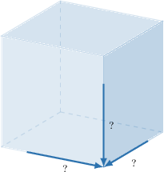
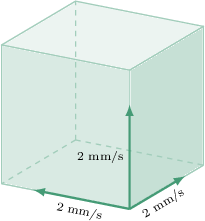
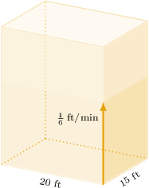

# Calculating Related Rates With Rectangular Solids

Source: https://www.mathacademy.com/topics/365?courseId=21
Topic ID: 365

## Prerequisites

- [Calculating Related Rates With Squares](../ap-calculus-ab/368-calculating-related-rates-with-squares.md)
- [Surface Areas of Rectangular Solids](../../../high-school/traditional/lessons/geometry/674-surface-areas-of-rectangular-solids.md)
- [Volumes of Rectangular Solids](../../../high-school/traditional/lessons/geometry/1753-volumes-of-rectangular-solids.md)

## Lesson

### Introduction

We know how to solve related rates problems in the context of squares. We can use the same methods to solve related rates problems in the context of cubes, too.

In general, to solve a related rates problem, we need to follow three steps:

**Step 1:** Draw a diagram and identify the variables that change with time.

**Step 2:** Write down a relation between the time-dependent variables.

**Step 3:** Differentiate the relation with respect to time and plug in the known values.

Let's see this in action in the next example.

### Example: Calculating the Rate of Change of a Side Given the Rate of Change of the Volume

#### Question

A cube is shrinking uniformly at a rate of $3\,\text{mm}^3/\text{s}.$ How fast is each side of the cube shrinking when the volume of the cube is $27\,\text{mm}^3?$

#### Explanation

Let $x$ be the side of the cube and $V$ be its volume. We are given that

$$

\begin{aligned}\frac{d𝑉}{d𝑡}=−3\,mm^{3}/s.\end{aligned}

$$

We would like to find $\dfrac{\textrm d x}{\textrm dt}$ when $V=27\,\text{mm}^3.$

We start with the formula for the volume of the cube:

$$

V=x^3

$$

Now, we differentiate with respect to time using the chain rule, and we get

$$

\begin{aligned}\frac{d}{d𝑡}𝑉 & =\frac{d}{d𝑡}(𝑥^{3}) \\ \frac{d𝑉}{d𝑡} & =3𝑥^{2}\frac{d𝑥}{d𝑡}.\end{aligned}

$$

Before we plug in the known values, we need to find the value of $x$ when $V = 27\,\text{mm}^3.$ We get

$$

\begin{aligned}𝑉 & =𝑥^{3} \\ 27 & =𝑥^{3} \\ 𝑥 & =3.\end{aligned}

$$

We can now plug $x=3$ and $\dfrac{\textrm d V}{\textrm dt}=-3$ into the expression for $\dfrac{\textrm d x}{\textrm dt}.$ This gives

$$

\begin{aligned}\frac{d𝑉}{d𝑡} & =3𝑥^{2}\frac{d𝑥}{d𝑡} \\ −3 & =3(3)^{2}\frac{d𝑥}{d𝑡}\, \\ \frac{d𝑥}{d𝑡} & =−\frac{1}{9}.\end{aligned}

$$

Therefore, the sides of the cube are shrinking at a rate of $\dfrac{1}{9}\,\text{mm}/\text{s}$ at the moment when $x=3\,\textrm{mm}.$

### Example: Calculating the Rate of Change of the Surface Area Given the Rate of Change of a Side (and Vice Versa)

#### Question

All of the edges of a cube are increasing at a rate of $2\,\text{mm}/\text{s}.$ How fast is the surface area of the cube changing when the volume of the cube is $8\,\text{cm}^3?$

#### Explanation

Let $x$ be the side length of the cube, let $S$ be its surface area, and let $V$ be its volume. All of the variables change with time. In particular, we are given that

$$

\begin{aligned}\frac{d𝑥}{d𝑡}=2\,mm/s.\end{aligned}

$$

We would like to find $\dfrac{\textrm d S}{\textrm dt}$ when $V= 8\,\text{cm}^3.$

We want to find the rate of change of $S$ knowing the rate of change of $x.$ So, we start with the formula for the surface area of the cube:

$$

S= 6x^2

$$

Now, we differentiate with respect to time using the chain rule, and we get

$$

\begin{aligned}\frac{d}{d𝑡}𝑆 & =\frac{d}{d𝑡}(6𝑥^{2}) \\ \frac{d𝑆}{d𝑡} & =12𝑥\frac{d𝑥}{d𝑡}.\end{aligned}

$$

Before we plug in the known values, we need to find the value of $x$ when $V= 8\,\text{cm}^3.$ We get

$$

\begin{aligned}𝑉 & =𝑥^{3} \\ 8 & =𝑥^{3} \\ 𝑥 & =2.\end{aligned}

$$

So $x=2\,\text{cm}=20\,\text{mm}.$

We can now plug the known values into the above expression. This gives

$$

\begin{aligned}\frac{d𝑆}{d𝑡} & =12𝑥\frac{d𝑥}{d𝑡} \\ \frac{d𝑆}{d𝑡} & =12(20)(2) \\ \frac{d𝑆}{d𝑡} & =480.\end{aligned}

$$

Therefore, the cube's surface area is changing at a rate of $480 \,\text{mm}^2/\text{s}.$

### Example: Calculating the Rate of Change of the Volume Given the Rate of Change of a Side

#### Question

Water is being poured into a rectangular prism-shaped tank. The length and width of this tank are $20 \textrm{ft}$ and $15 \textrm{ft},$ respectively. If the height of the water increases at a rate of $\dfrac{1}{6}\,\textrm{ft/min}$, determine the rate at which the volume of stored water increases.

#### Explanation

We define the following variables:

- let $L$ and $W$ be the length and width of the tank, respectively, and

- let $h$ and $V$ be the height and volume of the water in the tank, respectively.

Note that $h$ and $V$ change with time, while $L$ and $W$ are constants.

We are given that

$$

L=20\,\text{ft}, \qquad W=15\,\text{ft}, \qquad \dfrac{\textrm dh}{\textrm dt} = \dfrac{1}{6}\,\text{ft}/\text{min}.

$$

We would like to find $\dfrac{\textrm dV}{\textrm dt}.$

The relation between the two time-dependent variables, $V$ and $h,$ is given by the formula for the volume of the water in the tank:

$$

V = LWh

$$

We differentiate both sides with respect to $t,$ treating both $L$ and $W$ as constants, and we get

$$

\begin{aligned}\frac{d}{d𝑡}(𝑉) & =\frac{d}{d𝑡}(𝐿𝑊ℎ) \\ \frac{d𝑉}{d𝑡} & =𝐿𝑊\frac{dℎ}{d𝑡}.\end{aligned}

$$

Finally, we can plug in the known values and get

$$

\begin{aligned}\frac{d𝑉}{d𝑡} & =(20)(15)\frac{dℎ}{d𝑡} \\ \frac{d𝑉}{d𝑡} & =300⋅\frac{1}{6} \\ \frac{d𝑉}{d𝑡} & =50.\end{aligned}

$$

Therefore, the water level is rising at a rate of $50\,\text{ft}^3\textrm{/min}.$
