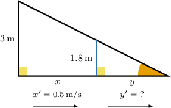
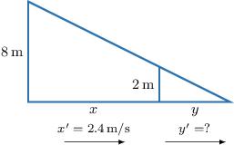
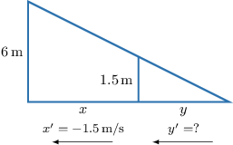

# Calculating Related Rates Using Similar Triangles

Source: https://www.mathacademy.com/topics/367?courseId=21
Topic ID: 367

## Prerequisites

- [The AA Similarity Criterion](../../../high-school/traditional/lessons/geometry/1365-the-aa-similarity-criterion.md)
- [Related Rates With Implicit Functions](../ap-calculus-ab/4059-related-rates-with-implicit-functions.md)

## Lesson

### Introduction

Suppose that Bob, who is tall, stands in front of a street light. How fast does the length of Bob's shadow change if he walks *away* from the street light with a speed of

We can solve problems like this using three simple steps.

**Step 1:** Draw a diagram and identify the variables that change with time.

In the above diagram, we have denoted the following:

- is the distance between Bob and the street light

- is the length of Bob's shadow

Both and change with time as Bob walks away from the light. In particular, we're told that Bob's velocity is given by

Notice that is positive. This is because the distance between Bob and the street light increases as Bob walks away from the light.

Our goal is to calculate

**Step 2:** Write down an equation that relates and

From our simplified diagram, we see that we have two right triangles that share a common angle. Therefore, they are similar by the AA (angle-angle) criterion for similar triangles.

Since the two triangles are similar, the ratios between the corresponding sides are equal. So, we have

**Step 3:** Differentiate with respect to time and plug in the known values.

We use the chain rule to differentiate the above equation with respect to time. This gives

Finally, substituting the known value of gives

Therefore, the length of Bob's shadow increases at a rate of

### Example: Calculating the Rate of Change of a Shadow's Length Using Similar Triangles

#### Question

An $8\,\text{m}$ tall lamppost is casting a shadow of a $2\,\text{m}$ man onto the ground. The man walks away from the lamppost with a speed of $2.4\,\text{m/s}.$ How fast is the length of the man's shadow changing?

#### Explanation

Let's draw a figure according to the given data.

In the figure, $x$ is the man's distance from the lamp, while $y$ is the length of his shadow. Both $x$ and $y$ change with time. In particular, we know that the man's velocity is

$$

\dfrac{\text{d}x}{\text{d}t} = 2.4\,\text{m/s}.

$$

Notice that the man's velocity is ** because he is walking away from the lamp, and therefore, the distance between him and the lamp ** with time.

Since we want to calculate $\dfrac{\text{d}y}{\text{d}t},$ we need to find a relation between $x$ and $y.$ Since the two triangles are similar, the ratios between the corresponding sides are equal, and we have

$$

\begin{aligned}\frac{𝑥+𝑦}{8} & =\frac{𝑦}{2} \\ 2𝑥+2𝑦 & =8𝑦 \\ 2𝑥 & =6𝑦 \\ 𝑦 & =\frac{1}{3}𝑥.\end{aligned}

$$

We differentiate both sides of the above equation with respect to $t$ using the chain rule, and we get

$$

\begin{aligned}\frac{d}{d𝑡}(𝑦) & =\frac{d}{d𝑡}(\frac{1}{3}𝑥) \\ & =\frac{1}{3}⋅\frac{d𝑥}{d𝑡}.\end{aligned}

$$

Finally, substituting $\dfrac{\text{d}x}{\text{d}t} =2.4\,\text{m/s}$ into the above gives

$$

\begin{aligned}\frac{d𝑦}{d𝑡} & =\frac{1}{3}⋅(2.4) \\ & =\frac{2.4}{3} \\ & =0.8\,m/s.\end{aligned}

$$

Therefore, the length of the man's shadow increases at a rate of $0.8\,\text{m/s}.$

### Example: Calculating the Rate of Change of a Shadow's Length Using Similar Triangles and Negative Rates

#### Question

A $6\,\text{m}$ tall street lamp is casting a shadow of a $1.5\,\text{m}$ woman onto the ground. The woman is walking towards the lamppost with a speed of $1.5\,\text{m/s}.$ How fast is the length of the woman's shadow decreasing?

#### Explanation

Let's draw a figure according to the given data.

In the figure, $x$ is the woman's distance from the lamp, while $y$ is the length of her shadow. Both $x$ and $y$ change with time. In particular, we know that the woman's velocity is

$$

\dfrac{\text{d}x}{\text{d}t} = -1.5\,\text{m/s}.

$$

Notice that the woman's velocity is ** because she is walking ** the lamp, and therefore the distance between her and the lamp ** with time.

Since we want to calculate $\dfrac{\text{d}y}{\text{d}t},$ we need to find a relation between $x$ and $y.$ Since the two triangles are similar, the ratios between the corresponding sides are equal, and we have

$$

\begin{aligned}\frac{𝑥+𝑦}{6} & =\frac{𝑦}{1.5} \\ 1.5𝑥+1.5𝑦 & =6𝑦 \\ 1.5𝑥 & =4.5𝑦 \\ 𝑦 & =\frac{1}{3}𝑥.\end{aligned}

$$

We differentiate both sides of the above equation with respect to $t$ using the chain rule, and we get

$$

\begin{aligned}\frac{d}{d𝑡}(𝑦) & =\frac{d}{d𝑡}(\frac{1}{3}𝑥) \\ \frac{d𝑦}{d𝑡} & =\frac{1}{3}⋅\frac{d𝑥}{d𝑡}.\end{aligned}

$$

Finally, substituting $\dfrac{\text{d}x}{\text{d}t} = -1.5\,\text{m/s}$ into the above gives

$$

\dfrac{\text{d}y}{\text{d}t} = \dfrac13 \cdot (-1.5) = -0.5\,\text{m/s}.

$$

Therefore, the length of the woman's shadow is decreasing at $0.5\,\text{m/s}.$
