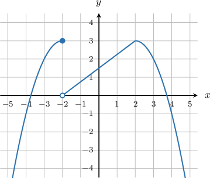
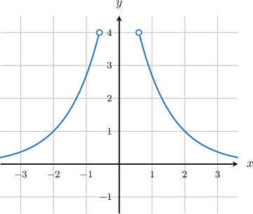

# The Power and Root Rules for Limits

Source: https://www.mathacademy.com/topics/37?courseId=21
Topic ID: 37

## Prerequisites

- [The Product and Quotient Rules for Limits](../ap-calculus-ab/1246-the-product-and-quotient-rules-for-limits.md)
- [Radicals as Fractional Exponents](../../../middle-school/lessons/grade-8/2607-radicals-as-fractional-exponents.md)

## Lesson

### Introduction

The **power rule** states that the limit of a power is the power of the limit. More precisely, if $n$ is any positive integer and $\lim\limits_{x\rightarrow a}f(x)=L,$ then

$$

\begin{aligned}\underset{𝑥→𝑎}{lim}(𝑓(𝑥))^{𝑛}=(\underset{𝑥→𝑎}{lim}𝑓(𝑥))^{𝑛}=𝐿^{𝑛}\,.\end{aligned}

$$

For example, with the power rule, we can evaluate a limit like

$$

\lim\limits_{x\rightarrow 2}(3x-4)^{8}

$$

by evaluating the limit of the expression within parentheses and then taking the power of the result.

$$

\begin{aligned}\underset{𝑥→2}{lim}(3𝑥−4)^{8} & =(\underset{𝑥→2}{lim}(3𝑥−4))^{8} \\ & =(3⋅2−4)^{8} \\ & =2^{8} \\ & =256\,.\end{aligned}

$$

### Example: Applying the Power Rule to Compute a Limit

#### Question

Calculate $\lim\limits_{x\rightarrow 3}\left[(2x-1)^3(x-2)^9\right].$

#### Explanation

Here, we apply the product rule and the power rule to get

$$

\begin{aligned} \lim\limits_{x\rightarrow 3}\left[(2x-1)^3(x-2)^9\right] &= \lim\limits_{x\rightarrow 3}(2x-1)^3\cdot \lim\limits_{x\rightarrow 3}(x-2)^9\\[3pt] &= \left(\lim\limits_{x\rightarrow 3}(2x-1)\right)^3\cdot \left(\lim\limits_{x\rightarrow 3}(x-2)\right)^9\\[3pt] &= (2\cdot 3 -1)^3\cdot (3-2)^9\\[3pt] &= 5^3 \cdot 1^9\\[3pt] & = 125. \end{aligned}

$$

### Example: Applying the Power Rule to Compute a Limit Given a Graph

#### Question

The figure below shows the graph of $f(x).$ Determine $\lim\limits_{x\rightarrow 2} \left(\dfrac{2-7x}{xf(x)+2}\right)^3.$

#### Explanation

From the graph, we find $\lim\limits_{x\rightarrow 2} f(x)=3.$ Therefore, using the power rule, we have

$$

\begin{aligned}\underset{𝑥→2}{lim}(\frac{2−7𝑥}{𝑥𝑓(𝑥)+2})^{3} & =(\underset{𝑥→2}{lim}\frac{2−7𝑥}{𝑥𝑓(𝑥)+2})^{3} \\ & =(\frac{2−7(2)}{(2⋅3)+2})^{3} \\ & =(\frac{−12}{8})^{3} \\ & =(\frac{−3}{2})^{3} \\ & =−\frac{27}{8}.\end{aligned}

$$

### The Root Rule for Limits

The **root rule** states that the limit of a root is the root of the limit (provided that the root exists).

More precisely, if $n$ is any positive integer and $\lim\limits_{x\rightarrow a}f(x)=L,$ then

$$

\begin{aligned}\underset{𝑥→𝑎}{lim}\sqrt[√𝑓(𝑥)]{𝑛}=\sqrt[√\underset{𝑥→𝑎}{lim}𝑓(𝑥)]{𝑛}=\sqrt[√𝐿]{𝑛}\,.\end{aligned}

$$

For example, with the root rule, we can evaluate a limit like

$$

\lim\limits_{x\rightarrow 2}\sqrt{3x-2}

$$

by evaluating the limit of the expression within the root and then taking the root of the result:

$$

\begin{aligned}\underset{𝑥→2}{lim}\sqrt{3𝑥−2} & =\sqrt{\underset{𝑥→2}{lim}(3𝑥−2)} \\ & =\sqrt{3⋅2−2} \\ & =\sqrt{4} \\ & =2\end{aligned}

$$

### Example: Applying the Root Rule to Compute a Limit

#### Question

Find $\lim\limits_{x \to 1} \dfrac{\sqrt{x+8}}{x-2}.$

#### Explanation

Applying the quotient rule, we get

$$

\lim\limits_{x\rightarrow 1} \dfrac{\sqrt{x+8}}{x-2} =\dfrac{\lim\limits_{x\rightarrow 1} \sqrt{x+8}}{\lim\limits_{x\rightarrow 1}(x-2)}.

$$

We calculate the limits of the numerator and denominator, separately.

Applying the root rule in the numerator, we have

$$

\begin{aligned}\underset{𝑥→1}{lim}\sqrt{𝑥+8} & =\sqrt{\underset{𝑥→1}{lim}(𝑥+8)} \\ & =\sqrt{1+8} \\ & =\sqrt{9} \\ & =3.\end{aligned}

$$

For the denominator, we have

$$

\begin{aligned}\underset{𝑥→1}{lim}(𝑥−2) & =1−2 \\ & =−1.\end{aligned}

$$

Consequently,

$$

\begin{aligned}\underset{𝑥→1}{lim}\frac{\sqrt{𝑥+8}}{𝑥−2} & =\frac{3}{(−1)} \\ & =−3\,.\end{aligned}

$$

### Combining Different Rules

If we combine the power rule and the root rule, then we get the following useful generalization: if $\lim\limits_{x\rightarrow a}f(x)=L,$ then for any fraction $p/q,$ we have

$$

\lim\limits_{x\rightarrow a}\left(f(x)\right)^{p/q} = \left(\lim\limits_{x\rightarrow a} f(x)\right)^{p/q} = L^{p/q}

$$

provided that $L^{p/q}$ exists.

For example, we can evaluate a limit like

$$

\lim\limits_{y\rightarrow 64} y^{-1/6}

$$

by evaluating the limit of $y$ and then exponentiating the result to the fractional exponent:

$$

\begin{aligned}\underset{𝑦→64}{lim}𝑦^{−1/6} & =(\underset{𝑦→64}{lim}𝑦)^{−1/6} \\ & =(64)^{−1/6} \\ & =(2^{6})^{−1/6} \\ & =2^{−1} \\ & =\frac{1}{2}\end{aligned}

$$

### Example: Combining Different Rules to Compute a Limit Given a Graph

#### Question

Find $\lim\limits_{x\rightarrow -2}\left(\dfrac{f(x)}{x^2-1}\right)^{2/3}$ for the function $f(x)$ plotted below.

#### Explanation

According to the power rule and the quotient rules,

$$

\begin{aligned}\underset{𝑥→−2}{lim}(\frac{𝑓(𝑥)}{𝑥^{2}−1})^{2/3} & =\frac{\underset{𝑥→−2}{lim}𝑓(𝑥)}{\underset{𝑥→−2}{lim}(𝑥^{2}−1)}^{2/3}.\end{aligned}

$$

We find from the graph that the limit of the numerator is

$$

\lim\limits_{x\rightarrow -2} f(x)=1.

$$

We also calculate the limit of the denominator as

$$

\begin{aligned}\underset{𝑥→−2}{lim}(𝑥^{2}−1) & =(−2)^{2}−1=3.\end{aligned}

$$

So we get

$$

\begin{aligned}\underset{𝑥→−2}{lim}(\frac{𝑓(𝑥)}{𝑥^{2}−1})^{2/3} & =\frac{\underset{𝑥→−2}{lim}𝑓(𝑥)}{\underset{𝑥→−2}{lim}(𝑥^{2}−1)}^{2/3} \\ & =(\frac{1}{3})^{2/3} \\ & =\sqrt[√\frac{1}{9}]{3}.\end{aligned}

$$
